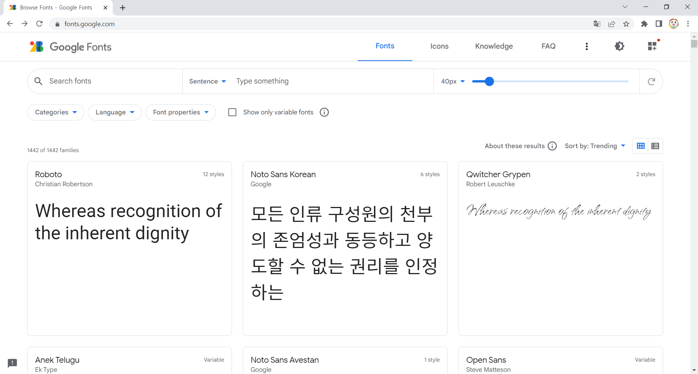
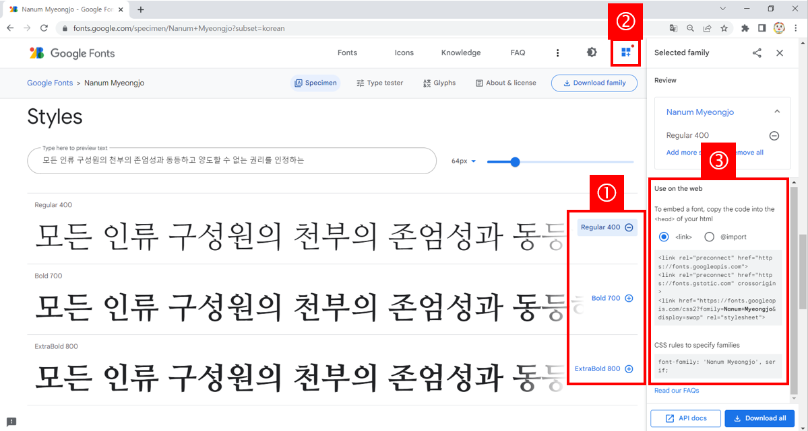
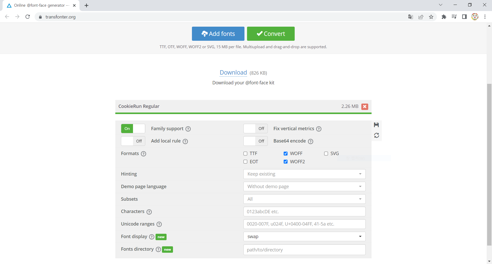
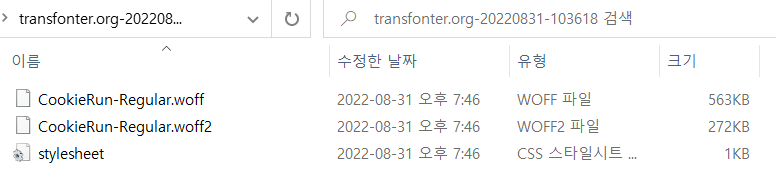

## Web Font

사용자가 가지고 있지 않은 폰트를 웹 페이지에서 사용할 수 있는 방법으로 폰트를 서버에서 다운로드하는 방식이다.

폰트타입은 EOT, TrueType(.ttf), OpenType(.otf), WOFF, SVG 같이 다양하게 존재합니다.
많은 웹 브라우저가 사용할 수 있게 폰트를 제공하기 위해서는 EOT, WOFF, TrueType은 필수입니다.
하지만 대부분의 웹 브라우저는 WOFF를 지원합니다.

### @font-face

웹 브라우저에게 서체 이름과 다운받을 위치를 알리는 지시어 (directive)
여러 유형을 지원하는 브라우저는 자신이 지원하는 유형 중 하나만 골라 다운받기 때문에 @font-face에 명시된 순서가 매우 중요합니다.
서체 파일은 파일 크기 순서대로 .eot, .woff, .ttf, .svg 를 추천합니다.
아래는 @font-face의 기본 구조이며, 실제 적용 사례는 "Webfont Generator 사용"에서 확인 가능합니다.

```CSS
@font-face{
    font-family: {폰트명으로 지정될 이름}
    src: {원격 폰트 파일의 위치를 나타내는 url or 사용자 컴퓨터에 설치될 폰트명 (local("Font Name"))}
    font-weight: {폰트 굵기}
    font-style: {폰트 스타일}
}
```

각종 웹 폰트는 프로젝트 최상단에 폴더를 생성하여 관리 (ex. fonts, \_fonts, webfonts, ...)
**참고로 웹에서의 사용이 금지되는 폰트도 많기 때문에 라이센스를 잘 알아보고 사용해야합니다.**

### Google Fonts 사용

#### Webfont 선택

웹 사이트에 접속하면 아래와 같은 화면이 나옵니다.
좌측 상단 필터로 원하는 폰트를 검색할 수 있고, 여기서 원하는 폰트를 골라서 클릭합니다.



폰트를 클릭하면 상세 화면이 나옵니다.
상세 화면에서 아래로 내리면 다음과 같은 화면이 나오고, 아래 과정을 거쳐 웹 폰트를 사용할 수 있습니다.



- 원하는 폰트 추가
- 우측 상단 버튼 클릭
- link 태그 체크 시 출력되는 코드를 프로젝트에 추가

#### Webfont 적용

```jsx
<!DOCTYPE html>
<html>
    <head>
        <link rel="preconnect" href="https://fonts.googleapis.com">
<link rel="preconnect" href="https://fonts.gstatic.com" crossorigin>
<link href="https://fonts.googleapis.com/css2?family=Nanum+Myeongjo&display=swap" rel="stylesheet">
        <style>
            h1{
                font-family: 'Nanum Myeongjo', serif;
            }
        </style>
    </head>
    <body>
        <h1>Google Fonts 나눔 명조 사용하기</h1>
    </body>
</html>
```

### Webfont Generator 사용

소유하고 있는 .oft, .ttf 등의 폰트를 단독으로 사용하게 되면 이를 지원하지 않는 특정 웹 브라우저에서 적용되지 않는 문제가 발생할 수 있습니다. 따라서 Web Font Generator를 사용하여 다양한 형태의 웹 브라우저에 대응할 수 있는 폰트를 생성합니다.

#### 폰트 파일 준비

#### Webfont Generator 사용

web font generator를 제공하는 서비스는 꽤 있지만, transfonter-Webfont generator을 이용하였습니다.
한글 폰트도 잘 변환되는 웹 사이트로, 해당 웹 사이트에 접속하면 아래와 같은 화면이 나옵니다.
아래 과정을 거쳐 웹 폰트 파일을 얻을 수 있습니다.



- "Add fonts" 버튼을 클릭하여 폰트 파일 업로드
- 생성 type 선택
- "Convert" 버튼을 클릭하여 생성된 웹폰트 파일 다운로드
- 다운로드된 폴더를 압축 해제

#### Webfont 적용

위와 같은 과정을 거쳐 생성된 폴더는 다음과 같습니다. 여기서 폰트 파일만 따로 프로젝트 폴더 내에서 관리하면 됩니다.



stylesheet.css에 작성된 @font-face를 참고하여 내 css 파일에 @font-face를 작성합니다.
복사하여 font-family와 src의 url경로만 수정합니다.

```CSS
@font-face {
    font-family: 'CookieRunRegular';
    src: url('fonts/CookieRunRegular/CookieRun-Regular.woff2') format('woff2'),
    url('fonts/CookieRunRegular/CookieRun-Regular.woff') format('woff');
    font-weight: normal;
    font-style: normal;
    font-display: swap;
}
```

폰트 적용은 font-family로 선언했던 폰트명을 그대로 사용하면 됩니다.

```JSX
<!DOCTYPE html>
<html>
    <head>
        <link rel="stylesheet" href="stylesheet.css"/>
        <style>
            h1{
                font-family: 'CookieRunRegular';
            }
        </style>
    </head>
    <body>
        <h1>쿠키런 킹덤</h1>
    </body>
</html>
```

### 참고자료

- [[CSS] Web Font 사용 방법](https://velog.io/@eunhye094/Web-Font-%EC%82%AC%EC%9A%A9-%EB%B0%A9%EB%B2%95)
