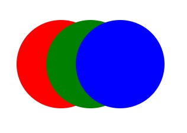
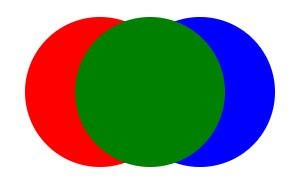
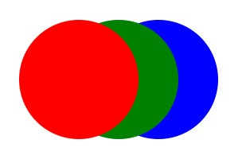
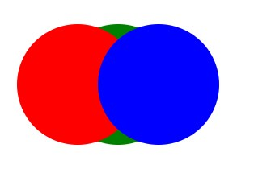

## z-index

"객체를 원하는 순서대로 배치할 수 있는 기능" 입니다.

- z-index는 position 속성이 relative 일때, absolute일때 동작합니다.

- 기본 값은 auto 입니다 음수, 양수 숫자 사용이 가능합니다.

- z-index의 값의 숫자가 높으면 높을수록 최상단에 배치되며 낮으면 낮을수록 멀리 배치됩니다.

- z-index는 동일 선상에 있는 태그값을 확인하게 되지만, 부모 태그의 z-index를 우선시하기 때문에 자식태그의 z-index값이 높더라도 부모태그 값을 더 우선시 하게 됩니다.

- 순서 값이 없을 경우 코드 순서에 따라 쌓이게 됩니다.

### 사용법

```jsx
<!DOCTYPE html>
<html lang="ko">
<head>
	<meta charset="UTF-8">
	<title>z-index뜻 사용방법</title>
    <link rel="stylesheet" href="./css/style.css" media="all">
</head>

<style>

	div {
	position: absolute;
	width: 150px;
	height: 150px;
	border-radius: 100px;
	}

	.name_01 {
		background: red;
		left: 50px;
	}


	.name_02 {
		background: green;
		left: 100px;
	}

	.name_03 {
		background: blue;
		left: 150px;
	}

</style>

<body>
   <div class="name_01"></div>
   <div class="name_02"></div>
   <div class="name_03"></div>
</body>

</html>
```

```css
.name_02 {
  background: green;
  left: 100px;
  z-index: 1;
}
```



도형중에서 초록색 도형이 가장 앞으로 나오게 설정하려면 `z-index: 1;`을 추가해주시면 됩니다.

​

그럼 이렇게 초록색 도형이 가장 앞에 위치한 모습을 확인해보실 수 있습니다.

이제 빨간색 도형을 앞으로 꺼내고 싶을땐 어떻게 해야할까요?

```css
.name_03 {
  background: blue;
  left: 150px;
  z-index: 3;
}
```

`z-index: 2;`를 추가해주시면 됩니다.
초록이 1이였으니까 그보다 높은 2를 설정하면 빨간색 도형이 앞으로 나오게 됩니다.



```css
.name_01 {
  background: red;
  left: 50px;
  z-index: 2;
}
```



마지막으로 파란색까지 3을 적용해서 앞으로 옮겨본 모습입니다.

### z-index 적용되지 않는 이유

앞서 말씀드렸다시피 z-index는 relative일때, absolute일때 동작하게 되는데요 postion 설정이 안 되어있으면 작동하지 않습니다.
또한 위에서 먼저 설정된 z-index가 있는지, 확인해보시기 바랍니다.

css 적용 우선 순위에서 밀렸을 경우(!important, html 문서에서 style 속성을 적용한 경우, #id 기타 등등..)에도 동작되지 않습니다.

부모의 z-index로 인하여 해당 요소에 z-index가 이미 적용되어 있을 수 있습니다.

부모가 이미 z-index를 가지고 있는 경우 자식 요소는 부모 내의 요소에서 z-index 설정할 수 있으며, 부모 밖의 영역에서는 적용 불가능하기 때문입니다.

### 참고자료

- [[html/css] z-index 개념 뜻 사용방법 적용 안될때 해결방법 ](https://m.blog.naver.com/3pmarketer/223103378261)
