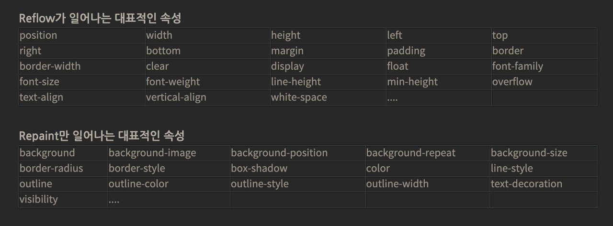

## CSS 애니메이션과 JS 애니메이션

많은 웹사이트에서 애니메이션 효과를 부여할 때 CSS의 transition/animation 속성을 사용할 수 있고,
JavaScript의 setInterval()/requestAnimationFrame()을 사용할 수 있습니다.
하지만 각각을 사용할 때의 특징이 다르고 장단점이 다릅니다.

### CSS 애니메이션

간단하게 처리하는 애니메이션의 경우 CSS로 처리 합니다.
transform 의 translate 를 사용해서 구현할 수 있는 애니메이션을 JavaScript의 style.top과 style.left 속성을 변화 시키게 되면, 브라우저 렌더링 과정에서 layout 이나 paint 단계를 거쳐야 할 경우가 생길 수 있기 때문에 성능 개선에 효율적이지 않을 수 있습니다.

#### CSS 애니메이션 특징

- 외부 라이브러리를 필요로 하지 않습니다.
- 어떤 요소가 애니메이션을 가져야 한다는 직관적인 표현이 가능 합니다.
- 미디어쿼리를 사용해서 반응형으로 애니메이션을 구현 할 수 있습니다.
- **메인 쓰레드가 아닌 별도의 컴포지터 쓰레드(Compositor Thread)에서 그려지기 때문에 메인 쓰레드에서 작업하는 JS보다 효율적**입니다.

### JavaScript 애니메이션

CSS로 처리하기에는 훨씬 복잡하고 무거운 애니메이션 작업들을 효율적이고, 세밀하게 다루기 위해 사용합니다.
바닐라 자바스크립트로 구현할 경우 위에서 살펴본 바와 같이 계속해서 요소의 위치를 재계산하기 때문에 비효율적이고,
사람들의 눈에 가장 부드러운 60fps가 유지되지 않습니다. 이 때문에 RAF(RequestAnimationFrame)가 등장했고 동일한 구현 방식으로 60fps를 달성시킬 수 있었습니다.

또한 외부 라이브러리들로 하여금 성능 좋은 애니메이션을 구현 할 수 있습니다.

#### JavaScript 애니메이션 특징

- 애니메이션을 세밀하게 제어해야 하는 경우 JS를 사용 합니다.
- 크로스 브라우징 측면에서 JS 애니메이션을 사용하는 것이 유리 합니다. (브라우저 호환성이 좋습니다.)
- GPU를 통한 하드웨어 가속을 제어할 수 있습니다. CSS 애니메이션의 경우 특정 속성에 의한 GPU가속이 됨으로서 저사양의 컴퓨팅인 경우에 성능 하락을 발생시킬 수 있으나 이를 막을수 있습니다.

### 애니메이션 최적화

좀 더 나아가서 최적화에 대한 고민을 한다면, CSS 애니메이션에 대해서 최적화를 고려해볼 수 있습니다.
브라우저 렌더링 관점에서 Javascript로 애니메이션을 구현했다면 reflow와 repaint는 피할 수 없을 것입니다.

우리의 목적은 repaint만 일어나거나 둘 다 일어나지 않는 게 목적입니다.

### 참고자료

- [CSS 애니메이션과 JS 애니메이션의 차이점](https://velog.io/@hoho_0815/CSS-%EC%95%A0%EB%8B%88%EB%A9%94%EC%9D%B4%EC%85%98%EA%B3%BC-JS-%EC%95%A0%EB%8B%88%EB%A9%94%EC%9D%B4%EC%85%98%EC%9D%98-%EC%B0%A8%EC%9D%B4%EC%A0%90)
- [CSS 애니메이션과 Javascript 애니메이션의 차이?](https://1yoouoo.tistory.com/8)
