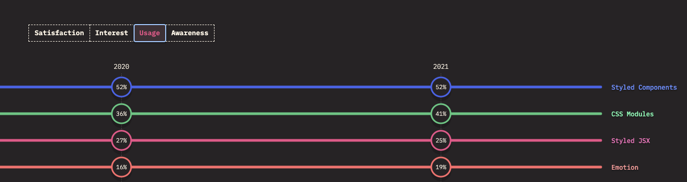
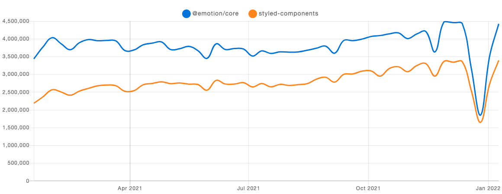
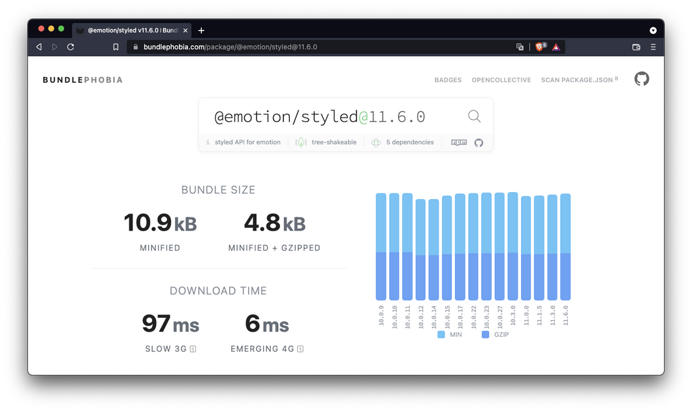
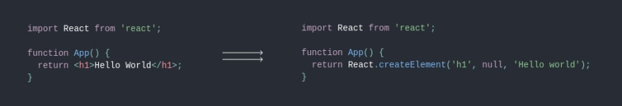

## Emotion, Styled Component

React에서는 보통 CSS-in-JS을 통해 스타일 작업을 진행합니다.
그중에서 styled-components, emotion이 가장 유명하고 많이 사용됩니다.

### 차이점

#### 제공하는 기능 비교

|      library      | Attaching Props | Media Queries | Global Styles | Nested Selectors | Server Side Rendering | Theming Support | Composition |
| :---------------: | :-------------: | :-----------: | :-----------: | :--------------: | :-------------------: | :-------------: | :---------: |
| styled-components |       Yes       |      Yes      |      Yes      |       Yes        |          Yes          |       Yes       |     Yes     |
|      emotion      |       Yes       |      Yes      |      Yes      |       Yes        |          Yes          |       Yes       |     Yes     |

전반적인 스타일 기능은 똑같습니다.
둘다 sass문법을 사용하기에 스타일 문법에도 차이가 없습니다.

#### 사용 트랜드




styled-componets가 더 많이 사용되고 있으나 npm 다운로드 횟수를 보면 emotion이 더 많습니다.

- [기술 사용량](https://2021.stateofcss.com/en-US/technologies/css-in-js/)
- [npm 다운로드](https://www.npmtrends.com/@emotion/core-vs-styled-components)

#### 용량? 성능?

블로그, 사이트들을 참고하면 대게 emotion이 styled-components보다 조금 가볍고 빠르다고 합니다.

먼저 `https://bundlephobia.com/`를 참고해서 최신 라이브러리 번들 사이즈를 살펴봅시다.





보통 emotion을 사용한다면 위 두가지 라이브러리를 모두 사용합니다.

눈대중으로 보면 라이브러리 용량이 비슷해보입니다. (1~2 kb 차이)
다만 @emotion/react만 사용한다면 용량이 1.5배 정도 차이가 납니다.

#### 속도 차이?

다양한 자료를 참고해보면 emotion이 근소하게 더 빠릅니다.

- [참고 1](https://stitches.dev/docs/benchmarks)
- [참고 2](https://dev.to/meetdave3/styled-components-vs-emotion-js-a-performance-perspective-4eia)
- [참고 3](https://github.com/A-gambit/CSS-IN-JS-Benchmarks/blob/master/RESULT.md)

하지만, 여기 [참고](https://medium.com/styled-components/announcing-styled-components-v5-beast-mode-389747abd987)에 따르면 styled-components가 조금 더 빠르다고 합니다.

#### 결론. 성능상 둘은 유의미하게 차이가 나지 않습니다.

emotion의 퍼포먼스가 전반적으로 더 좋게 나오고 있고 라이브러리 버전에 따라서 차이가 발생할 수 있습니다.

### emotion의 차별점

- css props 기능

  인라인 스타일을 작성하지만 클래스가 됩니다.

`<div style={{color: "red"}}/>`
기존 style 속성은 HTML 인라인 스타일로 주입이 됩니다.
스타일 우선순위를 다루기 어렵고 스타일 재활용도 힘듭니다.

```jsx
<div css={{ color: "red" }} />;
{
  /* 혹은 */
}
<div
  css={css`
    color: red;
  `}
/>;
```

emotion jsx에서 제공해주는 css 속성을 활용하면 이를 클래스로 변환해줍니다.
**기존 인라인으로 사용할 수 없었던 media query, pseudo selector, nested selector 등을 사용할 수 있습니다.**

- css props를 결합하여 복잡한 스타일링을 진행할 수 있습니다.

```jsx
<div css={[style, themes[theme], sizes[size]]} />;

const themes = {
  primary: css`
    color: red;
  `,
  secondary: css`
    color: blue;
  `,
};
const sizes = {
  small: css`
    fontsize: 0.75rem;
  `,
  medium: css`
    fontsize: 1rem;
  `,
};
```

위와 같이 css 변수를 조립하여 컴포넌트 스타일링을 진행할 수 있습니다.

```jsx
type ThemeType = keyof typeof themes;
type SizeType = keyof typeof size;
```

typescript로 자동 타입지정까지 할 수 있는 이점이 있습니다.
css override도 가능합니다.

#### SSR

SSR에서 별도의 설정 없이 동작이 됩니다. 참고 [링크](https://emotion.sh/docs/ssr#gatsby-focus-wrapper)
**반면 styled-components 같은 경우 ServerStyleSheet을 설정해야 합니다.**

#### 단점

- 파일마다 /\*_ @jsx jsx _/ 라는 JSX Pragma를 작성해야 하는데, 이는 React의 jsx와 똑같은 원리이다.
- import React from "react"을 해줘야 컴파일이 됩니다.



emotion의 jsx로 변환되어야 emotion의 css props 문법을 사용할 수 있다.
`` → `jsx('img', { src: 'avatar.png' })`

react처럼 webpack단에서 이를 자동으로 주입시킬 수 있습니다.

결국은 유의미한 성능차이가 있는 것이 아니므로, (라이브러리 버전에 따라 달라질 수 있음)
개발팀에서 더 익숙한 것을 사용하면 될 것 같다.

emotion의 css props로 css를 더 활용도 높게 조립할 수 있습니다만, 필수는 아닙니다.
SSR에서는 emotion 세팅시 더 간편합니다.

### 참고자료

- [styled-components 과 emotion, 도대체 차이가 뭔가?](https://velog.io/@bepyan/styled-components-%EA%B3%BC-emotion-%EB%8F%84%EB%8C%80%EC%B2%B4-%EC%B0%A8%EC%9D%B4%EA%B0%80-%EB%AD%94%EA%B0%80)
