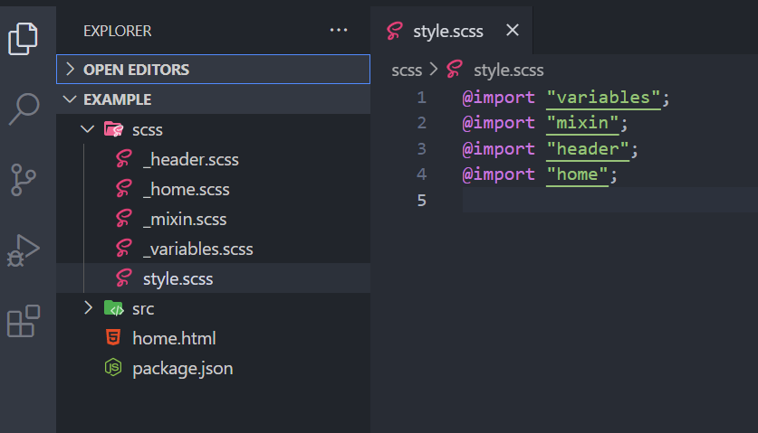

## SCSS

SASS는 CSS로 컴파일 되는 스타일 시트 확장 언어이며 CSS 전처리기의 하나입니다.
기술 방식에는 SASS 와 SCSS 가 있는데 SASS는 우리가 일반적으로 쓰는 CSS 문법과 다르기 때문에 동일하게 중괄호 문법을 사용하는 SCSS 를 주로 사용합니다.

### 파일분리와 Nesting(중첩)

#### 파일분리



- SCSS에서는 여러 파일을 분리햐여 코드를 작성할 수 있습니다.

- **파일명 앞에 언더바를 붙이면 해당 파일은 컴파일 되지 않습니다.** 만약 언더바를 붙이지 않을 경우 다 컴파일 되어서 각각의 CSS 파일이 만들어집니다. 하지만 우리에게 필요한건 저 사진상으로 style.SCSS이므로 나머지에는 \_를 붙여줘야 합니다.

- SASS에게 이 파일이 main파일의 일부분임을 알려줘서 해당 파일은 CSS파일로 컴파일하지 않고 내부에서 @import 형태로 작동합니다.

- CSS는 import할 때 파일 URL을 적어줘야 하지만, SASS에서 import할 때는 확장명을 제외하고 파일명만을 사용할 수 있습니다.

#### Nesting

Nesting(중첩)을 사용하면, HTML의 시각적 계층 방식과 동일하게 CSS를 중첩하여 작성할 수 있습니다.
유지보수 편해지고 구조화되어 가독성이 높아집니다. (하지만 너무 과하게 중첩시키면 오히려 보기 어려워집니다.)

```SCSS
//Scss
//Scss에서도 HTML처럼 계층구조로 스타일을 적용할 수 있다.
nav {
	background : #C39BD3;
	padding : 10px;
	height: 50px;
	ul {
		display: flex;
		list-style : none;
		justify-content: flex-end;
		li {
			color: white;
			margin-right: 10px;
		}
	}
}
```

라는 코드를 CSS로 쓰려면

```CSS
nav {background : #C39BD3;
	padding : 10px;
	height: 50px;}
nav ul {display: flex;
		list-style : none;
		justify-content: flex-end;}
nav ul li { color: white;
			margin-right: 10px;}
```

이렇게 계속 같은 선택자를 반복해서 써야합니다. 중첩을 사용하면 최상위 선택자를 한번만 선언하여도 자식 선택자에게 스타일을 적용할 수 있게 되어 코드 반복을 줄일 수 있습니다.

#### 속성 Nesting

SCSS에서는 무려 속성도 중첩시킬 수 있습니다.

```SCSS
//Scss
.add-icon {
  background : {
    image: url("./assets/arrow-right-solid.svg");
    position: center center;
    repeat: no-repeat;
    size: 14px 14px;
  }
}
```

이렇게 background 속성의 하위 속성들을 쓸 때 일일이 background를 써주지 않아도 됩니다.

```CSS
/_CSS_/
.add-icon {
    background-image: url("./assets/arrow-right-solid.svg");
    background-position: center center;
    background-repeat: no-repeat;
    background-size: 14px 14px;
}
```

CSS였다면 이렇게 일일이 써줘야합니다.

#### & 엠퍼샌드

- "&"는 상위에 있는 부모선택자를 가리킵니다.
- &을 이용하여 after, hover 등의 가상요소, 가상클래스, class나 id 셀렉터 등을 참조할 수 있습니다.
  평소에 CSS에서 가상요소나 가상클래스 사용하려고 한다면,

```CSS
/_CSS_/
.box:focus{} /_ 가상선택자 _/
.box:hover{}
.box:active{}
.box:frist-child{}
.box:nth-child(2){}
.box::after{} /_ 가상요소 _/
.box::before{}
```

이렇게 모든 선택자를 써주고 : 이나 :: 을 해줘야 했습니다.

```CSS
//SCSS
.box {
    &:focus{} // 가상선택자
    &:hover{}
    &:active{}
    &:first-child{}
    &:nth-child(2){}
    &::after{} // 가상요소
    &::before{}
}
```

SCSS에서는 & 를 이용하여 상위선택자 한 번만 쓰면 그 아래에 가상선택자 등등을 써줄 수 있습니다.

```SCSS
//SCSS
ul {
    li {
        &:hover {
        background: white;
        cursor: pointer;
        // 가상요소
        }
        &:last-child {
        border-bottom: 2px solid black;
        // 가상클래스
        }
    }
}
//li 태그의 가상요소와 가상클래스에게 스타일을 적용한 예시
//&을 사용하여 li와 :hover, :last-child를 연결
```

& 를 응용하면 아래 예시와 같이 공통 클래스명을 가진 선택자들을 중첩시킬 수 있습니다.

```SCSS
//SCSS
.box {
    &-yellow {
        background: #ff6347;
    }
    &-red {
        background: #ffd700;
    }
    &-green {
        background: #9acd32;
    }
}
//.box라는 이름이 같기 때문에 &를 사용해 중첩구조로 만들 수 있다
```

이것이 CSS 였다면,

```CSS
/_CSS_/
.box-yellow {
    background: #ff6347;
}
.box-red {
    background: #ffd700;
}
.box-green {
    background: #9acd32;
}
```

#### @at-root

@at-root 키워드를 사용하면 중첩에서 벗어날 수 있습니다.
중첩에서 벗어나고 싶은 선택자 앞에 @at-root를 작성합니다.
컴파일된 CSS 코드에서 @at-root 를 사용한 선택자가 중첩에서 벗어났음을 확인할 수 있습니다.
중첩된 선택자에게만 사용할 수 습니다.

```SCSS
//SCSS
.article {
    display: flex;
    justify-content: space-between;
    align-items: center;
    margin-top: 10px;
    .article-content {
        font-size: 14px;
        opacity: 0.7;
        @at-root i {
            opacity: 0.5;
        }
    }
}
```

### 변수

변수를 씀으로써 값을 일일이 고치지 않아도 되고 유지보수가 쉬워질 수 있습니다.
하지만 충돌할 수도 있기 때문에 적절히 사용해야 합니다.

#### 변수를 사용하는 기준

값이 두 번 이상 반복된다면 미리 변수로 만들어서 값을 기억하지 않고 변수명만을 가지고 스타일
기존의 값을 다른 값으로 변경해야할 경우, 변수의 값만 변경하면 되기 때문에 값이 수정될 가능성이 있다면 변수 생성을 고려

#### 변수 생성

\$ 기호로 변수 만듭니다.

```SCSS
//$변수 : 값
$bgColor : #FFF;
```

```SCSS
//색상
$red: #ee4444;
$black: #222;
$bg-color: #3e5e9e;
$link-color: red;
$p-color: #282A36;
//폰트사이즈
$font-p: 13px;
$font-h1: 28px;
//폰트
$base-font: 'Noto Sans KR', sans-serif;
body {
	background-color : $bg-color;
	font-size : $font-p;
	font-family : $base-font;
}
h1 {
    font-size: $font-h1;
    color: $black;
}
```

변수만 지정해두면 같은 값을 여러번 쓰지 않고 변수만 입력해서 사용할 수 있습니다.

#### 변수 타입

numbers, strings, color, booleans, lists, maps, null이 있습니다.

- numbers : 1, .82, 20px, 2em 등
- strings : "./images/a.png", bold, left, uppercase 등
- colors : green, #FFF, rgba(255,0,0,.5) 등
- booleans : true, false
- null
- lists

#### Lists 와 Maps

##### Lists

- 리스트 = 순서가 있는 값으로, 값마다 인덱스를 가지고 있습니다.
- lists를 만들려면 lists의 요소들을 쉼표나 공백 또는 일관성이 있는 /로 구분하여 생성하고, 다른 타입의 변수들과 다르게 특수 괄호를 사용하지 않아도 lists로 인식합니다.
- 빈 lists를 만들 때나 lists에 들어있는 값이 하나 인 경우 [ ] 나 ( ) 를 사용하여 생성합니다.
- **lists에 들어있는 값의 index는 0이 아니라 1부터 시작**

```SCSS
$sizes: 40px, 50px, 80px;
$valid-sides: top, bottom, left, right;
```

**list 관련 내장함수**
append(list,value,[separator]), index(list,value), nth(list, n) 등이 있습니다.

- append(list,value,[separator]) : lists의 값을 추가하는 함수
- index(list,value) : lists의 값에 대한 인덱스를 리턴하는 함수
- nth(list, n) : lists의 인덱스에 해당하는 값을 리턴하는 함수

```SCSS
// SCSS
$valid-sides: left, center, right;
.screen-box {
	text-align : nth($valid-sides, 1);
}
```

nth(list, n) 이용해서 lists 의 index 값에 해당하는 값 불러오기

##### Maps

- maps는 ( ) 괄호 안에 키:값의 형태로 저장하여 사용합니다.
- 키와 값을 정의할 때, 키는 고유해야 하지만 키에 해당하는 값은 중복이 가능합니다.
- 변수를 각각 선언하는 대신, 관련 있는 변수들을 한번에 모아 maps로 만들어서 사용할 수 있습니다.

### 변수의 scope

변수는 지역변수와 전역변수가 있습니다.

#### 지역변수

지역변수는 자기가 선언한 중괄호 { } 안에서만 사용되며, 하위 단계 중괄호에서도 사용합니다.

```SCSS
.info{
    $line-normal : 1.34; // 지역변수
    font-size : 15px;
    line-height : $line-normal;
    text-align : right;
    span{
        line-height : $line-normal;
    }
}
```

#### 전역변수

전역변수를 가장 윗부분에 정의하면 동일 파일 안에서 어디서든 사용할 수 있습니다.

```SCSS
//SCSS
$font-p : 15px; // 전역변수
.main-box{
    p {
        font-size : $font-p;
    }
    a {
        font-size : $font-p;
        color : blue;
        text-decoration : none;
    }
}
```

!global을 사용하여 local 변수를 global 변수로 만들어 사용할 수도 있지만, 권장하지는 않습니다.

```SCSS
.one {
    $size : 12px !global; // 권하지 않아요
    font-size : $size;
}
```

### 연산자 (Operator)

연산자는 레이아웃을 디테일하게 디자인할 때 유용하게 쓰일 수 있습니다.

|     |        |                                      |
| :-: | :----: | :----------------------------------: |
| \+  | 더하기 |                                      |
| \-  |  빼기  |                                      |
| \*  | 곱하기 | 하나 이상의 값이 반드시 숫자(Number) |
| \/  | 나누기 |   오른쪽 값이 반드시 숫자(Number)    |
| \%  | 나머지 |                                      |

### Mixin

#### Mixin 사용하기

```SCSS
@mixin 이름(매개변수) //생성
@include 이름(인수) //사용
```

앞에 @Mixin을 쓰고 이름을 정해준 후, 중괄호 { } 안에 중복되는 코드를 넣어줍니다.
쓸 때는 @include를 사용하여 스타일 하고자 하는 요소에 포함 시킵니다.

```SCSS
@mixin center-xy{
    display: flex;
    justify-content : center;
    align-items : center;
}
.card{
    @include center-xy;
    // 정의한 center-xy mixin을 사용하여 코드 한줄이면 끝!
}
.aside{
    @include center-xy;
}
```

### Argument (인수)

파선아실 : 파라미터는 선언, 아규먼트는 실제 값(실행)

```SCSS
@mixin image-style($url, $size, $repeat, $positionX, $positionY) {
    background-image: url($url);
    background-size: $size;
    background-repeat: $repeat;
    background-position: $positionX $positionY;
}
//background관련 스타일 코드가 들어있다.
//mixin의 인수에 따라 조금씩 다른 스타일링이 가능하다.
.profile {
    @include image-style("./assets/user.jpg", cover, no-repeat, center, center);
}
.box-one {
    @include image-style("/images/poster1.svg", cover, no-repeat, 40%, 50%);
}
```

@mixin 이름에 인수 넣어놓고 원할 때 @include 로 해당 mixin 가져와서 인수 자리에 값을 넣어줍니다.

```SCSS
// 위에 코드를 가져와서 기본값을 설정해주었다.
@mixin image-style($ul, $size, $repeat, $positionX : 50%, $positionY : 50%) {
    background-image: url($ul);
    background-size: $size;
    background-repeat: $repeat;
    background-position: $positionX $positionY;
}
.profile {
    @include image-style("./assets/user.jpg", cover, no-repeat);
}
// profile과 .box-one은 서로 관계가 없지만,
// 코드가 중복되기 때문에 mixin을 만들어, 각 요소에서 사용합니다.
```

해당 매개변수에 값이 들어오지 않을 때 기본값을 지정할 수 있습니다.

```SCSS
@mixin pri-button_($width:100px, $height:50px, $radius:10px) {
    width: $width;
    height: $height;
    border-radius: $radius;
    background-color: aqua;
}
// 값 비우기
.btn__ {
    @include pri-button_(100px, null, 20px)
}
// 중앙값 주지 않기
.btn__ {
    @include pri-button_(100px, $radius:20px)
}
```

### content

- @content를 사용하면 원하는 부분에 스타일을 추가하여 전달할 수 있습니다.

```SCSS
// 정의하는 곳에서
@mixin sample{
    display: flex;
    justify-content: center;
    align-items: center;
    @content;
}
```

이렇게 정의하고

```SCSS
// 사용하는 곳에서 (추가로 스타일링을 할 수 있음)
a {
    @include sample{
        color: white;
    }
}
```

사용할 때는 @content 자리에 원하는 스타일 추가하면 됩니다.

#### Mixin 사용하는 다양한 예제

```SCSS
$url : './assets/img';
@mixin thumb($total, $img, $type) {
    @for $i from 1 through $total {
        li:nth-child(#{$i}) .thumb {
   		background-image:url(#{$url}
        + #{$img} + #{$i} + '.' + #{$type});
        }
    }
}


@mixin circleBase {
    display: block;
    border-radius: 50%;
    -ms-border-radius: 50%;
    -webkit-border-radius: 50%;
}

@mixin circle($size, $color:null) {
    $size: unitCheck($size);
    @include circleBase;
    width: $size;
    height: $size;
    background-color: $color;
}
```

### Extend

Extend는 연관있는 코드가 중복될 때 사용합니다.
이미 스타일이 작성된 선택자의 클래스를 extend하거나 , %를 사용해서 따로 스타일을 정의한 후 extend하여 원하는 선택자에게 스타일을 적용해 줄 수 있습니다.

#### Mixin 과 Extend 차이점

- mixin는 (관계 없는) 선택자에서 조금 다른 스타일을 적용할 때 사용
- extend는 관계 있는 선택자들의 동일한 소스코드 적용시 사용

#### Class 가져오기

기존에 작성한 클래스 내에 있는 코드 가져오기
@extend에 클래스 명을 함께 적으면, 클래스에 있는 코드 전체가 extend 됩니다.

```SCSS
// Scss
.profile-user {
    background-image: url("../assets/user.jpg");
    background-size: cover;
    background-position : 50% 50%;
    border-radius: 50%;
    width : 50px;
    height : 50px;
}
.comment-user {
    @extend .profile-user;
}
```

#### %placeholder

%로 선택자를 만듭니다.
@extend를 사용해서 앞서 %placeholder 스타일 블럭을 불러오기
그리고 %선택자는 CSS로 컴파일되지 않습니다.

```SCSS
// Scss
%base-button {
    width: 133px;
    height: 44px;
    display: flex;
    justify-content: center;
    align-items: center;
    font-size: 14px;
    border-radius: 10px;
}
.follow-button {
    @extend %base-button;
    background-color: #ffffff;
    color: #ff375f;
    border: 3px solid #ff375f;
}
.message-button {
    @extend %base-button;
    background-color: #ff375f;
    color: white;
}
```

다른 예시

```SCSS
// Scss
%modal {
    position: relative;
    top: 50%;
    left: 50%;
    transform: translate(-50%, -50%);
    background-color: #fff;
    border-radius: 6px;
  }
  .login-modal {
    @extend %modal;
    width: 272px;
    height: 405px;
    padding: 10px 20px;
  }
  .event-modal {
    @extend %modal;
    width: 340px;
    height: 160px;
    padding: 18px;
  }
```

### 조건문, 반복문 , 함수

#### 조건문

조건에 따른 스타일 적용 @if/@else/@elseif

```SCSS
// if문 예시 작성
// Sass 공식문서
// circle이 false면 사각형을, true이면 원형으로 스타일함
@mixin avatar($size, $circle: false) {
    width: $size;
    height: $size;
    @if $circle {
        border-radius: $size / 2;
    }
}
.square-av {
    @include avatar(100px, $circle: false);
}
.circle-av {
    @include avatar(100px, $circle: true);
}
```

circle 이 false 이면 사각형, true 이면 원이니까 .circle-av 에는 border-radius 속성도 적용됩니다.

```SCSS
@use "SASS:math";
$one: 10px;
$two: 100px;
@mixin avatar($size, $circle: false) {
  width: $size;
  height: $size;
  background-color: red;
  @if $circle {
    // border-radius: $size / 2; // step 1
    // border-radius: ($size / 2) + px; // step 2
    // border-radius: ($size / 2) + "px"; // 문자열 "00px"로 들어감

    // 시스템 권고사항
    // math.div($size, 2) or calc($size / 2)
    // border-radius: math.div($size, 2);
} @else {
border-radius: 2px;
}
}
.one {
    @include avatar(10px, true)
}
.two {
    @include avatar(10, true)
}
.three{
    @include avatar(10px, false)
}
.four{
    @include avatar(10px)
}
.five{
    @include avatar(10px, 10 > 100)
}
.six {
    @include avatar(10px, $one > $two)
}
```

#### 반복문

\@for : 정의한 횟수만큼 코드 반복

```
for ($변수) from (시작) through(끝){
	// 반복할 내용
}
```

```SCSS
@for $i from 1 through 5 {
    .photo-box:nth-child(#{$i}) {
        background-image: url("../assets/phoster#{$i}.png");
    }
}
```

```SCSS
@for $jihyun from 1 through 3 {
    .photo-box:nth-child(#{$jihyun}){
        background-image: url('../assets/poster#{$jihyun.png');
    }
}
```

```SCSS
@for $jihyun from 1 through 12 {
    .profile-#{$jihyun}{
        background-color: red;
        font-size: #{$jihyun \* 10}px;
    }
}
```

#### @for 문에서 through와 to의 차이

- through는 마지막 숫자를 포함하고
- to는 마지막 숫자를 포함하지 않습니다.

@each lists나 맵의 각각의 요소마다 코드를 실행해서 스타일을 적용할 수 있게 합니다.

```SCSS
@each ($변수) in (리스트나 맵){
	// 반복할 내용
}
// SASS - each문
// color-palette 리스트에 들어있는 색상을 each문을 사용하여
// background에 색상값을 넣어준다.
$color-palette: #dad5d2 #3a3532 #375945 #5b8767 #a6c198 #dbdfc8;
@each $color in $color-palette {
    $i: index($color-palette, $color); //index는 list의 내장함수
    .color-circle:nth-child(#{$i}) {
        background: $color;
        width: 20px;
        height: 20px;
        border-radius: 50%;
    }
}
```

@while 특정 조건에 충족될 때까지 코드를 무한 반복하며, 조건을 만날 때 while문을 빠져나옵니다.

```SCSS
@while 조건 {
// 반복할 내용
}
// SASS 참고서의 예제
// $hojun: 5;
// @while $hojun > 1 {
//     $hojun: $hojun - 1;
//     .content-#{$hojun} {
// width: 100px;
// height: 100px;
// background-color: red;
// }
//
// 쉬운 예제
$jihyun : 10;
@while $jihyun > 1 {
    $jihyun : $jihyun - 2;
    .content-#{$jihyun}{
        width: 100px;
        height: 100px;
        background: red;
    }
}
```

#### function

@function 키워드를 사용하여 함수를 생성하고 함수이름( ) 형태로 함수를 호출하고 실행합니다.
함수 안에서는 @return 이용해 값을 반환합니다.

##### Mixin 과 function 차이

- mixin은 스타일 코드를 반환하고
- function은 @return 키워드를 사용해서 값 자체를 반환합니다.

```SCSS
@function 함수이름($매개변수) {
	// 실행 코드
	@return 값
}
```

```SCSS
@function sigma($number){
    $result : 0;
    @for $i from 1 to $number {
        $result : $result + $i
    }
    @return $result;
}
.one{
    width: sigma(11)px;
}
```

### 참고자료

- [SASS(SCSS) 정리](https://velog.io/@jhyun_k/SASSSCSS-%EC%A0%95%EB%A6%AC)
