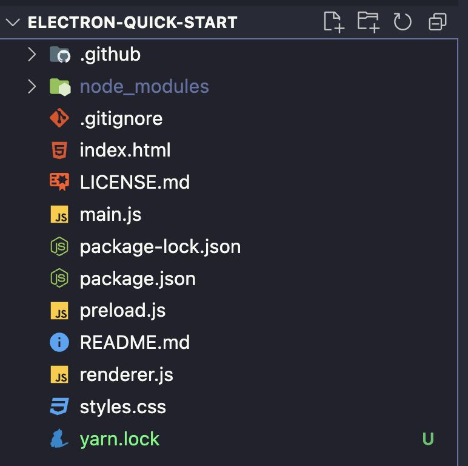
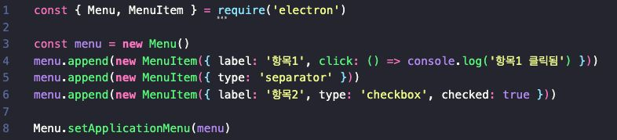
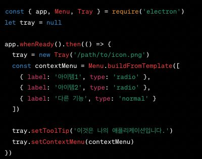
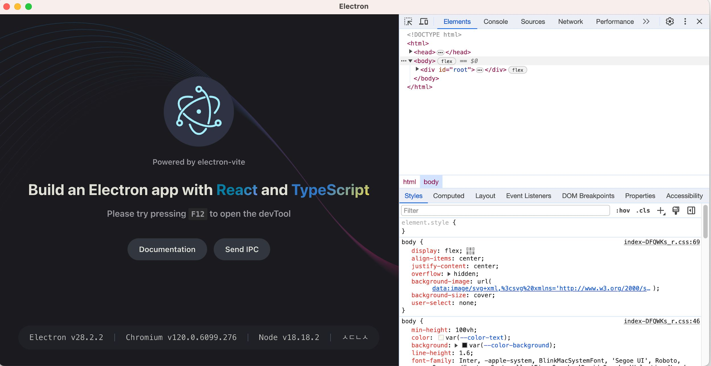
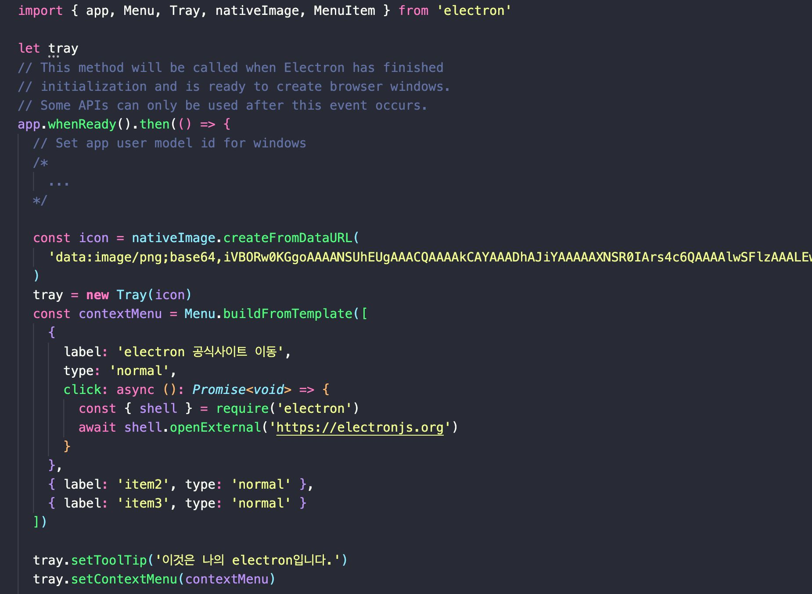
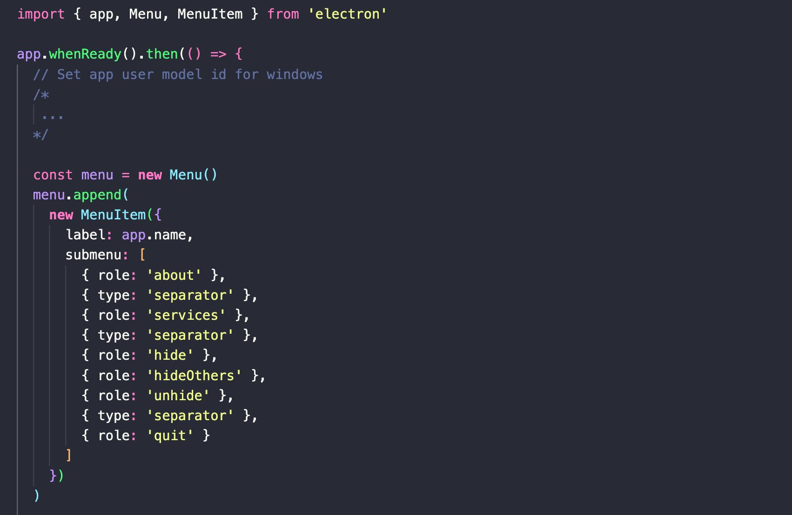
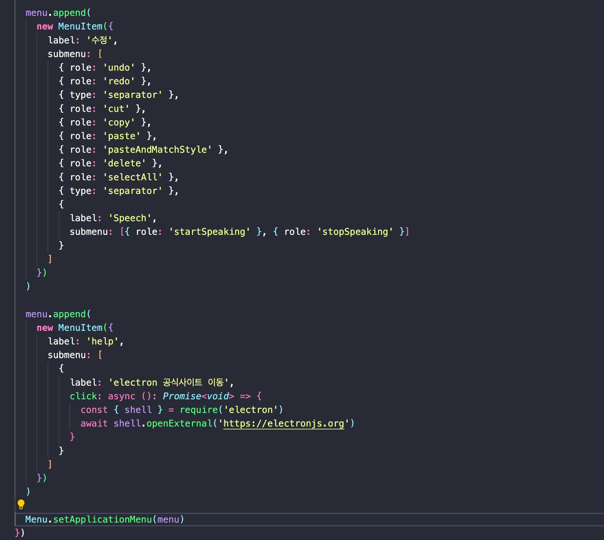
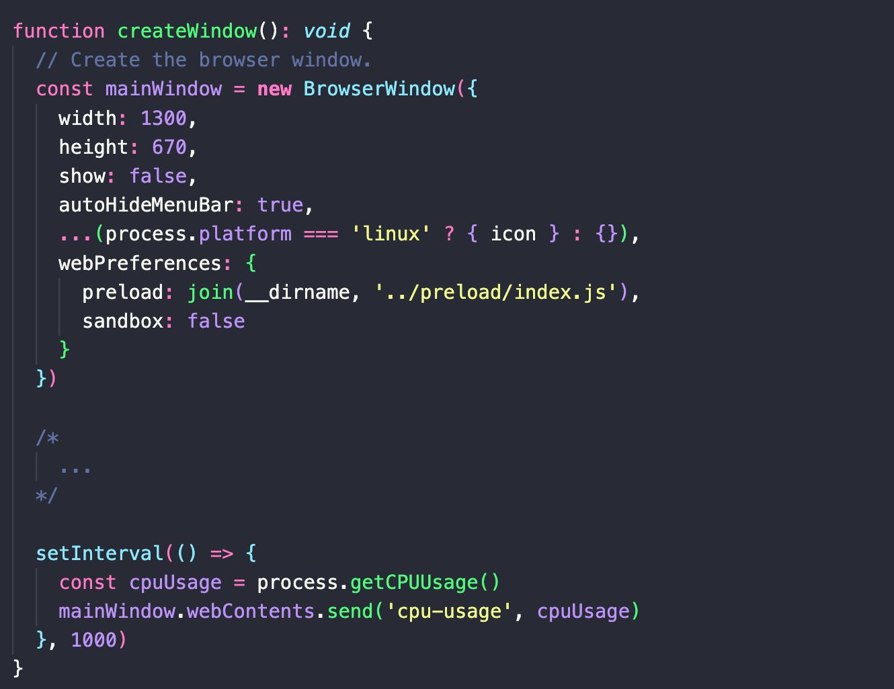
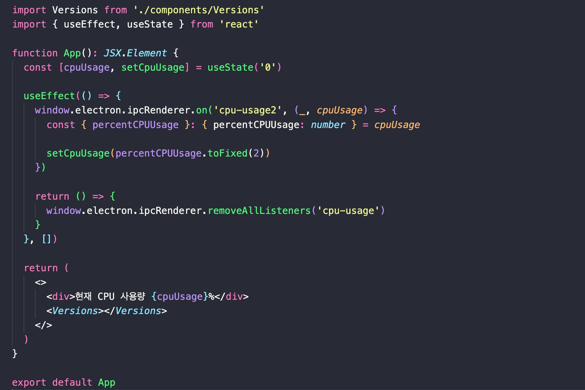

## Electron

- 기본 파일 구조

  - ‘main.js’: 애플리케이션의 진입점
  - ‘index.html’: 첫 번째 렌더러 프로세스의 시작점
  - 참고: https://github.com/electron/electron-quick-start

- 작동 원리의 이해

  - 애플리케이션 초기화와 이벤트 루프
  - 메인 프로세스와 렌더러 프로세스 간의 이벤트 기반 통신

### Electron 아키텍처의 이해

#### 주요 구성요소: 메인 프로세스와 렌더러 프로세스

•메인 프로세스의 역할
• 전체 애플리케이션의 관리자로서의 기능
• 네이티브 OS 기능과의 직접적인 상호작용
•렌더러 프로세스의 상호작용
• 각각의 웹 페이지 또는 웹 앱을 렌더링
• 메인 프로세스와 독립적으로 실행되는 동시에 상호작용

- 메인 프로세스의 역할

  - 애플리케이션 로직과 네이티브 리소스 관리
  - 사용자 인터페이스 창 생성 및 생명주기 제어
  - 글로벌 이벤트 및 서비스 조정

- 렌더러 프로세스의 기능

  - 각 웹 페이지 또는 앱 인터페이스 랜더링
  - DOM조작 및 웹페이지 스크립트 실행
  - 프로세스 간 통신(IPC)을 통한 메인 프로세스와의 데이터 교환

- 프로세스 간의 상호작용과 독립성

  - IPC메커니즘을 통한 메시지 전달과 명령 실행
  - 각 렌더러 프로세스의 독립 실행으로 애플리케이션의 안정성 보장
  - 메인 프로세스와 렌더러 프로세스의 분리로 보안 향상

#### 프로세스 간 통신(IPC)의 역할과 작동 방식

- IPC(Inter-process communication)의 필요성과 목적

  - 데이터와 명령어의 일관된 흐름 유지
  - 사용자 입력에 대한 신속한 반응과 처리
  - 멀티태스킹 및 동시성 관리

- IPC의 구현과 통신 방식

  - ‘ipcMain’과 ‘ipcRenderer’모듈을 통한 구현
  - 비동기식 메시지 전송과 이벤트 기반 통신
  - 효율적인 프로세스 간 데이터 공유와 이벤트 핸들링

- IPC의 사용 사례와 장점

  - 복잡한 작업의 백그라운드 처리
  - 사용자 경험 개선을 위한 인터페이스 반응성 증진
  - 애플리케이션의 확장성 및 유지보수 용이성 향상

#### Electron 애플리케이션의 라이프 사이클 관리

- 애플리케이션시작과 준비

  - ‘app’모듈을 통한 초기 설정과 준비 상태 관리
  - 렌더러 프로세스의 준비와 동기화
  - 시작 시 리소스와 서비스의 로드

- 애플리케이션의활성화 및 유휴 상태관리

  - 사용자의 상호작용에 따른 앱 활성화 처리
  - 시스템 트레이나 도크로의 최소화와 복구
  - 유휴 상태 감지 및 배경 작업 최적화

- 애플리케이션종료 및 세션 종료 처리

  - 모든 윈도우 닫힘 이벤트 감지 및 안전한 종류 수행
  - 세션 데이터의 저장과 복구 메커니즘
  - 사용자에 의한 또는 시스템에 의한 종료 요청 처리

### 네이티브 메뉴와 트레이 아이콘 생성

#### 네이티브 메뉴의 구현

- 사용자 경험 향상을 위한 직관적인 메뉴 제공
- 플랫폼별 일관된 메뉴 구성을 통한 사용자 편의성 증진

#### 트레이 아이콘의 활용

- 상주 애플리케이션의 가시성 유지
- 사용자가 쉽게 접근할 수 있는 시스템 트레이 기능

### 시스템 알림 및 사용자의 데스크톱 환경과의 상호작용

#### 시스템 알림 기능

- 사용자와의 실시간 상호작용 유도
- 중요한 업데이트와 정보를 적시에 전달

#### 데스크톱 환경과의 상호작용

- 운영 체제의 기능을 활용한 향상된 사용자 경험
- 시스템 이벤트와 애플리케이션의 유기적인 통합

### 프로젝트 생성

`npm create @quick-start/electron my-app -- -- template react`
`cd my-app`
`npm install`
`npm run dev`

- 개발자 도구 열기

- Tray 세팅하기

- Menu 세팅하기

- CPU 사용량 확인하기 - 1

- CPU 사용량 확인하기 - 2

### 참고자료

- [원티드 챌린지]()
