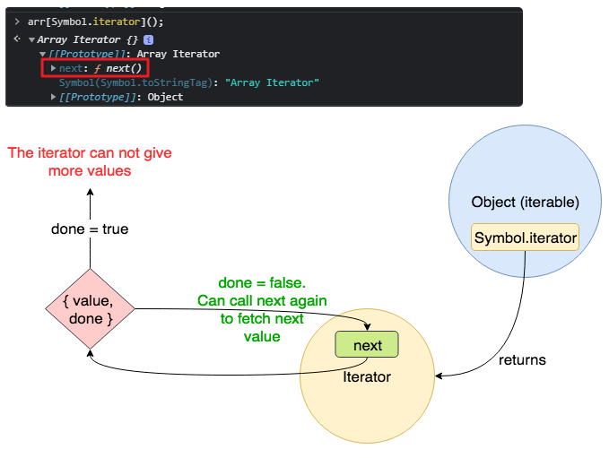

## 이터러블(interable)

자료를 반복할 수 있는 객체를 말하는 것이며, 우리가 흔히 쓰는 배열 역시 이터러블 객체입니다.

### 그럼 만일 이 배열에게 이터러블 표식을 없애버리면 어떻게 될까요?

```jsx
let arr = [1, 2, 3];
for (const a of arr) console.log(a); // 정상작동 1,2,3

arr[Symbol.iterator] = null; // 이렇게 하면 순회가 되지 않는다
for (const a of arr) console.log(a); // Uncaught TypeError: arr is not iterableCopy
```

멀쩡한 배열임에 불구하고 for..of로 순회할수가 없게 되었습니다.

### 이터러블과 이터레이터

`iterable protocol` / `iterator protocol`

이터러블을 [for...of], [전개 연산자], [비구조화] ..등, 이터러블이나 이터레이터 프로토콜을 따르는 연산자들과 함께 동작하도록 하는 약속된 규약을 의미합니다. 그래서 이터러블이란 이터러블 규약을 따르는 객체입니다.
​

- iterable

  이터레이터를 리턴하는 [Symbol.iterator]() 메서드를 가진 객체입니다.
  배열의 경우 Array.prototype의 Symbol.iterator를 상속받기 때문에 이터러블입니다.

- iterator
  `{value : 값 , done : true/false}` 형태의 이터레이터 객체를 리턴하는 next() 메서드를 가진 객체입니다.
  next 메서드로 순환 할 수 있는 객체입니다.
  `[Symbol.iterator]()` 안에 정의 되어 있습니다.

```jsx
const arr = [1,2,3]; // arr는 그냥 평범한 배열입니다.

const iter = arr[Symbol.iterator]();
/_
문법 파헤치기 : key값을 문자열이 아닌 변수로 주기위해 arr[변수] 형태를 가진다.
위 사진에서 보듯이, Symbol.iterator 라는 key값을 가지고 value는 함수이다.
이를 접근해서 함수실행() 시키면 이터레이터 객체가 반환되어 iter에 담기게 된다.
_/

iter.next()
//>{value:1,done: false}
iter.next()
//>{value:2, done: false},
iter.next()
//{value:3, done: false}
iter.next()
//{value: undefined, done: true}Copy
```



### [Symbol.iterator]

직접 이터러블 객체를 만들어 이터러블이라는 개념을 이해해 봅시다.

```jsx
let range = {
  // 1) 객체 생성
  from: 1,
  to: 5,
};

range[Symbol.iterator] = function () {
  // 2) 새로운 키:밸류 를 추가한다. 키는 변수형태, 밸류는 함수이다.

  return {
    // 객체를 리턴한다. 그런데 좀 특벽할 형태의 객체
    current: this.from,
    last: this.to,

    next() {
      // 3) next() 정의
      if (this.current <= this.last) {
        return { done: false, value: this.current++ };
        // 4) {value : 값 , done : true/false} 형태의 이터레이터 객체를 리턴합니다.
      } else {
        return { done: true };
      }
    },
  };
};
```

평범한 range객체를 이터러블 객체로 만드는 과정을 봅시다.

- 평범한 range객체를 만듭니다.
- 우리가 흔히쓰는 객체에 새로운 key:value를 추가하고 싶을때, range[key] = value 를 통해 Symbol.iterator 키값과 밸류는 함수를 지정해 넣었습니다.
- 추가한 함수는 어떠한 특별한 객체를 return하게 되어있고, 이 객체 안에 next()라는 메소드를 정의 하였습니다.
- 최종적으로 {value : 값 , done : true/false} 형태의 이터레이터 객체를 return합니다.

​

### 자, 그럼 이제 무엇이 이터러블 객체이고, 무엇이 이터레이터 일까?

- 이터러블 객체는 range입니다. 왜냐하면 Symbol.iterator메서드를 가지고 있기 떄문입니다.
- 이터레이터 객체는 Symbol.iterator() 메서드에서 리턴한 객체가 바로 이터레이터입니다. 왜냐하면 이 객체 안에는 {value : 값 , done : true/false}를 리턴하는 next()메서드가 있기 때문입니다.

​
이번에는 이터러블 객체가 for..of에서 어떻게 순회하는지 과정을 알아봅시다.

```jsx
let range = {
  // 객체 생성
  from: 1,
  to: 5,
};

// 1. for..of 최초 호출 시, Symbol.iterator가 호출됩니다.
range[Symbol.iterator] = function () {
  // Symbol.iterator는 이터레이터 객체를 반환합니다.
  // 2. 이후 for..of는 반환된 이터레이터 객체만을 대상으로 동작하는데, 이때 다음 값도 정해집니다.
  return {
    current: this.from,
    last: this.to,

    // 3. for..of 반복문에 의해 반복마다 next()가 호출됩니다.
    next() {
      // 4. next()는 값을 객체 {done:.., value :...}형태로 반환해야 합니다.
      if (this.current <= this.last) {
        return { done: false, value: this.current++ }; // 순회 진행
      } else {
        return { done: true }; // 순회 종료
      }
    },
  };
};

// 이제 의도한 대로 동작합니다!
for (let num of range) {
  alert(num); // 1, 2, 3, 4, 5
}
```

- for..of가 시작되자마자 for..of는 Symbol.iterator를 호출합니다.
- 이후 for..of는 반환된 객체(이터레이터)만을 대상으로 동작합니다.
- for..of에 다음 값이 필요하면, for..of는 이터레이터의 next()메서드를 호출합니다.
- next()의 반환 값은 {done: Boolean, value: any}와 같은 형태이어야 합니다. 그래야 순회가 됩니다. done=true는 반복이 종료되었음을 의미합니다. done=false일땐 value에 다음 값이 저장됩니다.

​

### 이터러블 + 이터레이터 구현하기

한 객체에 아예 이터레이터 형식을 정의해하면, range객체는 이터러블 객체이자 이터레이터 객체 역할을 모두 수행할 수 있습니다. 표현만 다를분 실행자체는 위와 차이없습니다.

```jsx
let range = {
  from: 1,
  to: 5,

  [Symbol.iterator]() {
    // 생성자
    this.current = this.from;
    this.last = this.to;
    return this; // 자기 자신을 반환. 자기자신엔 next()메소드가 정의되어있으니, next()메소드
    // 에서의 this는 생성자로 생성된 객체를 가리키게 된다.
  },

  next() {
    // 아예 객체안에 next()메서드를 정의.
    if (this.current <= this.to) {
      return { done: false, value: this.current++ };
    } else {
      return { done: true };
    }
  },
};

for (let num of range) {
  alert(num); // 1, 2, 3, 4, 5
}
```

### 유사배열 vs 이터러블

- ​이터러블(iterable)

  위에서 설명한 바와 같이 메서드 Symbol.iterator가 구현된 객체.

- 유사 배열(array-like)

  인덱스와 length 프로퍼티가 있어서 배열처럼 보이는 객체.

**Map자료형이나 DOM에서 반환하는 배열, arguments배열은 모두 이터러블 작업이 마쳐진 유사배열입니다. 원래 생 유사배열은 순회가 불가능합니다.**

​아래 예시의 객체는 유사 배열 객체이긴 하지만 이터러블 객체가 아니다.

```jsx
let arrayLike = {
  // 인덱스와 length프로퍼티가 있음 => 유사 배열
  0: "Hello",
  1: "World",
  length: 2,
};

for (let item of arrayLike) {
} // Symbol.iterator가 없으므로 에러 발생Copy
```

이터러블과 유사 배열은 배열이 아니기 때문에 push, pop 등의 메서드를 지원하지 않습니다.
이터러블과 유사 배열을 배열처럼 다루고 싶을 때 이런 특징은 불편함을 초래하게 됩니다.
예를들어, range에 배열 메서드를 사용해 무언가를 하고 싶을 때처럼 말입니다.

### 어떻게 하면 이터러블과 유사 배열에 배열 메서드를 적용할 수 있을까?

유사배열을 진짜배기 배열로 변환해주면 됩니다.

- Array.from 메서드

  범용 메서드 Array.from는 이터러블이나 유사 배열을 받아 ‘진짜’ Array를 만들어줍니다.
  이 과정을 거치면 이터러블이나 유사 배열에 배열 메서드를 사용할 수 있습니다.

```jsx
let arrayLike = {
  //유사배열
  0: "Hello",
  1: "World",
  length: 2,
};
Array.from(arrayLike); // ["Hello", "World"]

let arr = Array.from(arrayLike); // ["Hello", "World"] 배열이 됨으로서 이터러블 객체도 된다.
for (let item of arr) {
} // 1,2,3,4,5 (배열-문자열 형 변환이 제대로 동작합니다.)Copy
```

### 문자열도 이터러블

배열과 문자열은 가장 광범위하게 쓰이는 내장 이터러블입니다.

```jsx
for (let char of "test") {
  // 글자 하나당 한 번 실행됩니다(4회 호출).
  alert(char); // t, e, s, t가 차례대로 출력됨
}
```

### Map과 Set 자료형도 이터러블

맵과 셋은 엄밀히 독리된 자료형이지 객체나 배열이 아닙니다.
그럼에도 불구하고 for..of문과 동작하는 이유는 인덱스로 접근하는게 아닌 이터러블 프로토콜을 따르고 있기 떄문입니다.
또한 자체적으로 자체 내장 forEach()메서드를 지원하기도 합니다.

```jsx
const set = new Set([1,2,3])
for (cosnt a of set) console.log(a) // 1,2,3Copy
javascriptconst map = new Map([['a',1],['b',2],['c',3]]);
// Map(3) {"a" => 1, "b" => 2, "c" => 3}

const iter = map[Symbol.itertator](); // 심볼.이터레이터가 자체 내장되었기에 불러오기만 하면
iter.next();
// {value: Array(2), done: false}

for(const a of map)
console.log(a); // ['a',1],['b',2],['c',3]Copy
```

- map.keys()

  value에 key 만 있는 이터레이터를 반환. (순회 가능)

- map.values()

  values에 map의 valuse만 있는 이터레이터 반환

- map.entries()

  key 와 value가 있는 이터레이터를 반환
  `map.keys() // MapIterator {"a", "b", "c"}`

### 참고자료

- [이터러블 & 이터레이터](https://inpa.tistory.com/entry/JS-%F0%9F%93%9A-%EC%9D%B4%ED%84%B0%EB%9F%AC%EB%B8%94-%EC%9D%B4%ED%84%B0%EB%A0%88%EC%9D%B4%ED%84%B0-%F0%9F%92%AF%EC%99%84%EB%B2%BD-%EC%9D%B4%ED%95%B4)
