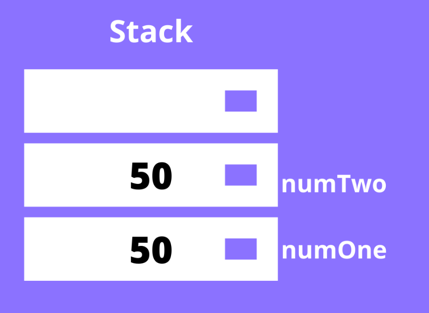
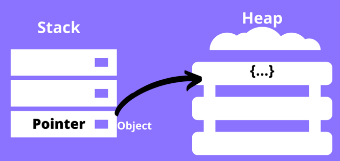

## 자바스크립트 변수와 메모리

자바스크립트 원시 타입은 숫자, 문자열, 불리언, null, undefined, 심볼 이렇게 6개가 있습니다.
원시 타입 데이터은 불변하는 데이터로, 메모리를 한번 할당받으면 값이 변경되지 않습니다.

### Primitive Type

```jsx
let num; // undefined
num = 80;
num = 100;
```

C에서는 변수에 값을 재할당하면, 변수가 가리키고 있는 메모리주소의 값이 바로 변경됩니다.
그러나 자바스크립트에서는 값을 재할당하면 새로운 메모리 공간을 할당받아 값을 넣고, 변수가 가리키는 메모리주소를 변경합니다.
이전 값은 더 이상 사용되지 않으므로 가비지 컬렉션 대상이 됩니다.

#### 원시타입의 작동 원리

자바스크립트에서 원시타입을 선언(declare) 하면, 이는 스택(stack) 에 저장됩니다. 스택이란 LIFO(Last In First Out) 구조를 가진 자료구조(data structure)입니다. 저장된 원시타입은 식별자를 통해 접근할 수 있고, 원시 데이터와 함께 스택에 저장됩니다.

```jsx
const numOne = 50;
const numTwo = 50;
```

위와 같이 같은 값을 가진 두개의 변수가 선언 및 할당되었을 때, numOne 이 값과 함께 스택에 푸쉬되고, 그 위에 numTwo 가 값과 함께 스택에 푸쉬됩니다. 같은 값이 있건 말건 전혀 상관없는 두개의 공간이 생성됩니다.



### Object Type

원시 타입을 제외한 모든 것이 객체 타입으로, 객체, 배열, 함수 등이 모두 객체 타입입니다.
객체 타입을 변수에 할당하면, 변수에는 실제 객체가 저장된 힙 메모리 주소가 저장됩니다.

#### 객체타입의 작동원리



```jsx
const person = {
  name: "Lee",
};
```

객체 타입을 담은 변수를 다른 변수에 할당하면, 메모리 주소를 공유하기 때문에 같은 객체를 가리킵니다.

```jsx
const p1 = person;

p1 === person; // true
```

객체를 복사해서 새로운 변수에 할당하면, 객체의 구성은 같을 수 있어도 메모리 주소가 다르기 때문에 서로 다른 객체입니다.

```jsx
const p2 = { ...person };

p2 === pserson; // false
```

즉, 자바스크립트 객체에 접근하는 방법은 메모리 주소를 통하는 것으로, 일종의 포인터 역할을 합니다.
객체를 가리키는 포인터가 하나도 없으면 객체를 사용할 방법이 없으므로 가비지 컬렉션의 대상이 됩니다.
중요한 점은 "메모리가 더 이상 필요하지 않을 때 해제해야 합니다."

### 참고자료

- [자바스크립트 원시(primitive)타입 vs 참조(reference)타입](https://hwani.dev/js-primitive-reference-types/)
