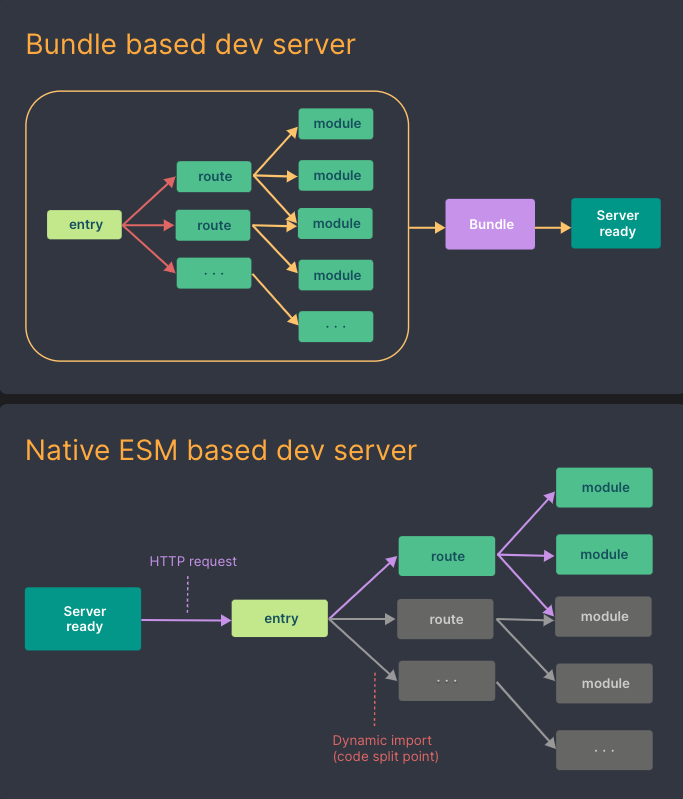

## Vite

Vite는 프론트엔드 개발을 위한 툴로 Vue.js에 종속되어 있는 툴이 아니라 React, Vanilla, Svelte 등 프론트엔드 개발 어디서든 사용될 수 있습니다.

### 기능

- Dev Server : 개발 환경에서 HMR과 같은 기능을 제공하는 개발용 서버 기능
- Build : Production 배포를 위한 소스코드 번들링 기능

기존의 Vue CLI도 같은 역할을 하지만, Vue CLI는 Webpack을 기반으로 합니다. Webpack은 모듈 번들링을 하는 빌드 툴이면서 Dev Server 기능을 제공해주고 있습니다.
Vite는 기존의 이런 빌드 툴들을 한층 더 업그레이한 버전이라고 보면 됩니다.

### Dev Server 속도

Vite의 가장 큰 특징이라고 한다면 Dev Server에서 Native ESM을 사용하여 소스를 제공한다는 점입니다.
**ESM (EcmaScript Modules)**이란 ES6에서 도입되었으며, import/export를 사용하여 모듈을 동적으로 로드할 수 있는 모듈 시스템입니다.

Webpack과 같은 기존의 번들 기반 방식에서는 모든 소스코드가 빌드되어서 한번에 번들링된 형태로 서비스를 제공했다면, Native ESM 기반 방식의 Vite에서는 그럴 필요가 없습니다. 번들링이 필요가 없고 브라우저에서 필요한 모듈의 소소코드를 import할때 이것을 전달만 하면 되는 방식입니다.

이것은 결국 현대 대부분의 브라우저에서 ESM일 지원하기에 가능한 것입니다. ESM이 나오기 전에는 자바스크립트 언어 레벨에서 지원하는 모듈시스템이 없었기 때문에 번들링이 필요했던 것이고, 지금은 자바스크립트 언어 레벨에서 모듈시스템이 들어가 있고 거의 모든 브라우저에서 이것을 지원을 하기 때문에 Vite에서는 ESM을 기반으로 만들 수 있게 된 것입니다.

Webpack에서 Vite로 넘어가야 될 가장 핵심적인 이유가 바로 이 이유고 아래 그림이 이걸 잘 표현합니다.

- Bundle based vs Native ESM based Dev Server

  

**또한 Vite는 개발시 내용이 자주 바뀌지 않을 Dependencies 모듈을 사전 번들링하는데 esbuild를 사용합니다. esbuild는 Go언어로 만들어졌으며 다른 JavaScript기반의 번들러보다 10 ~ 100배 빠른 속도를 가지고 있는 번들러**입니다.

esbuild를 이용한 사전 번들링과 Native ESM 기반의 Dev Server로 인해 서버 구동속도와 HMR 속도가 엄청나게 빨라졌습니다.

### 서버 구동 속도 비교

- Vue2 (Vue CLI) dev server 구동 vs Vue3 (Vite) dev server 구동

  - Vue2 프로젝트에서는 소스코드를 빌드하는 시간이 걸리지만, Vite 기반의 Vue3 프로젝트에서는 거의 바로 실행이 됩니다.

  - 프로젝트 규모가 커지면 Dev Server 구동 속도가 매우 느려서 기다리는 시간이 꽤 길고 지루한 시간이 된다. 이것만으로도 나는 기존의 프로젝트를 Vite로 이전할 이유가 충분하다고 생각합니다.

### HMR (Hot Module Replacement)

Vite도 당연히 HMR 기능을 지원합니다. 개발하면서 소스코드를 수정하면 vite는 수정된 모듈과 관련된 부분만 교체하고 브라우저에 전달합니다. Native ESM을 이용하기 때문에 프로젝트 사이즈가 크더라도 HMR 시간에 영향을 주지 않아서 매우 빠르게 진행이 됩니다.
프론트 개발을 하다보면 HMR 기능을 정말 많이 사용할 수 밖에 없습니다. 보통 프론트 개발작업을 할때 소스코드 에디터, Dev Server, 브라우저 이렇게 3개는 기본적으로 열어놓고 작업을 하는데 소스코드를 수정하면 Dev Server에서 HMR이 일어나고 브라우저에서 변경된 내용을 확인합니다. 그래서 Dev Server 구동보다도 훨씬 더 자주 사용하는 기능이 HMR입니다. 그래서 HMR 속도가 정말 중요하다고 말할 수 밖에 없습니다.

프론트엔드 개발을 하면 소스코드를 계속 갱신하면서 브라우저로 테스트를 해봐야 하기 때문에 Dev Server의 속도가 곧 개발환경의 속도라고 볼 수 있습니다. 그래서 기존의 Webpack 기반의 환경에서는 프로젝트가 커질수록 서버 구동시간과 HMR 시간이 느려지게 되고, 이걸 기다리는 시간은 그냥 낭비되는 시간이었습니다. 이러한 이유로 Vite에서는 Native ESM과 esbuild를 이용하여 빠르게 동작하도록 만드는데 중점을 둔 것입니다. 이것이 곧 프론트엔드 개발에서 생산력을 가장 크게 향상시키는 요인이고 프론트엔드 개발툴이 추구하는 방향인 것입니다.
