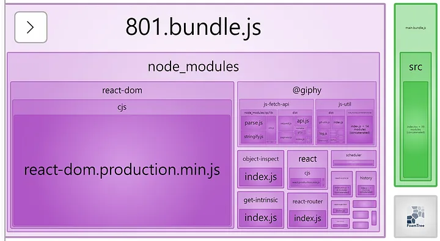
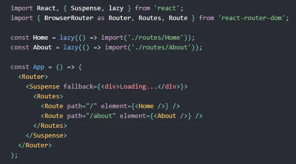

## 번들 크기 줄이기

자바스크립트와 React의 성능을 최적화 하는 방법 중 하나는 Webpack을 통해서 번들 된 자바스크립트 파일의 크기를 최대한 줄이는 것입니다. 그 방법은 여러가지가 있는데, 우선 소스 코드 자체를 최소화 시키고 코드 스플릿팅을 활용해 번들을 하나의 파일이 아닌 여러 파일로 나누는 방법이 있습니다.

### 소스 코드 최소화하기 — minify, uglify

소스 코드를 작성할 때에는 작성자와 다른 사람들이 코드를 해석하고 이해할 수 있도록 적절하게 공백과 개행을 사용하고 변수와 함수의 이름을 그 자체를 보고 역할을 알 수 있도록 하는 것이 필수적입니다. 하지만 컴퓨터에게는 그 부분들, 즉 빈 칸과 긴 변수 명은 불필요하게 데이터의 양을 늘리는 역할 밖에 하지 않습니다. 따라서 소스 코드의 길이를 줄여 최소화하기 위해서는 이 두 요소를 제거해주는 작업이 필요합니다.

- Minify

  압축하기라고 할 수 있는데, 불필요한 모든 공백과 개행을 지우고, 문법적으로 필수가 아닌 (자바스크립트에서는 세미콜론 등)을 제거하는 과정을 일컫습니다.

- Uglify

  난독화라고 번역되는데, 변수 명과 함수 명을 변경해 해석을 어렵게 하는 과정을 의미합니다. 이름을 단축해 불필요한 데이터를 제거하는 것과 더불어서 외부인이 소스 코드를 열어보더라도 그 변수와 함수가 하는 역할을 해석하는 것을 어렵게 하는 효과가 있습니다. 매우 일차적인 수준이긴 하지만 가장 기초적인 보안 효과를 가지고 있습니다.

### 자바스크립트 압축과 난독화

Webpack은 v4 이상의 버전에서는 mode가 production일 때 자동으로 압축과 난독화를 진행합니다. v5에서는 이 과정에서 사용되는 플러그인으로 terser-webpack-plugin을 내장하고 있다. Terser는 동시에 난독화까지 해줍니다.
모종의 이유로 이 과정을 생략하고 싶다면 webpack 설정에 optimization: {minimize: false}를 추가해주면 됩니다.

### CSS 압축

자바스크립트와 마찬가지로 CSS에도 해석에 불필요한 공백이 존재합니다. 이를 제거하기 위해서 Webpack 공식 문서에서 제시하는 방식은 CssMinimizerPlugin을 활용하는 방식입니다. 추가적으로 CSS를 별개의 파일로 분리하기 위해서 MiniCssExtractPlugin을 활용하는 설정을 추천합니다.

```jsx
const MiniCssExtractPlugin = require("mini-css-extract-plugin");
const CssMinimizerPlugin = require("css-minimizer-webpack-plugin");

module.exports = {
  module: {
    rules: [
      {
        test: /.s?css$/,
        use: [MiniCssExtractPlugin.loader, "css-loader", "sass-loader"],
      },
    ],
  },
  optimization: {
    minimizer: [
      // `...`는 기존의 minimizer 옵션을 확장하기 위해서 사용, 생략하면 기본값인 terser plugin 등이 생략되기 때문에 JS의 minify가 되지 않는다.
      `...`,
      new CssMinimizerPlugin(),
    ],
  },
  plugins: [new MiniCssExtractPlugin()],
};
```

위 설정에서 눈 여겨 볼 점은 css의 loader로 style-loader를 설정하고 있지 않다는 점입니다. 둘을 동시에 사용하려고 하면 ‘document is not defined’라는 오류가 발생합니다.

그 이유는 CSS 파일을 분리해주는 MiniCssExtract와 style-loader의 역할이 상충하기 때문입니다. style-loader는 DOM에 바로 CSS를 주입하는 역할을 합니다. 그래서 배열의 가장 마지막 loader부터 실행되는 설정 순서에 가장 먼저 작성하게 됩니다.

MiniCssExtract는 JS 파일 하나 당 다른 CSS 파일을 생성합니다. 즉 후에 설명할 코드 스플릿팅을 통해서 번들이 여러 개 생성 되었을 때 각 파일에 대한 CSS를 별도로 생성한다는 의미입니다. 따라서 이렇게 분리된 파일을 강제로 index.html의 DOM에 주입하는 것은 의미가 없습니다.

두 가지는 각각의 장단점이 있습니다. style-loader를 통해 바로 DOM에 주입을 해버리면 CSS 파일을 받아오기 위한 요청의 개수를 줄일 수 있어 페이지의 로딩 속도를 단축할 수 있습니다. 반면에 현재 페이지에서 불필요한 CSS까지도 주입될 수 있다는 단점을 가집니다.

반면에 MiniCssExtract를 활용하면 별도로 요청을 보내야만 CSS를 불러올 수 있지만, 현재 페이지에서만 사용될 CSS만을 불러오기 때문에 불러올 데이터의 크기가 줄어든다는 장점이 있습니다.

번들을 나누지 않고 하나의 파일로 생성 한다거나, 페이지 간에 공유하는 스타일이 많은 경우에는 전자를, 코드 스플릿팅을 적용해 번들 파일이 여러 개이거나 페이지 별로 공유하고 있는 CSS의 크기가 크지 않다고 가정했을 때는 후자를 선택하는 것이 최선이라고 생각합니다.

### 코드 스플릿팅 (Code Splitting)

모듈을 번들링 하는 것은 모듈마다 별도의 파일로 분리된 경우 요청을 너무 많이 보내야 한다는 단점을 극복하기 위해서입니다. 모듈 간 의존성을 자동으로 분석해 하나의 번들로 만들어주는 번들러를 통해 이 과정을 자동화 할 수 있습니다. 하지만 코드의 양이 너무 많아지는 경우, 하나의 번들 파일이 너무 커져, 그 파일을 불러오고 실행하는데 많은 시간이 소요될 수 있습니다. 그래서 코드 스플릿팅이 필요합니다. **코드 스플릿팅의 장점은 반드시 필요한 코드만 불러오고 요청을 병렬적으로 처리해서 로딩 속도를 개선할 수 있다는 점**입니다.

코드 스플릿팅에는 두 가지 차원이 있습니다. 하나는 webpack의 설정을 활용하는 것이고 두 번째는 React에서 lazy를 활용해서 앱의 일부를 별도의 번들로 나눌 것을 명시하는 것입니다. 전자의 방법으로는 사용하는 외부 패키지 등 여러 청크에서 반복적으로 사용되는 코드를 별도의 번들로 분리하는 것이 용이하고 후자로는 앱에서 특정 페이지에서 필요한 코드만 불러올 수 있도록 번들을 분리하는 것에 용이합니다.

- Webpack 설정

  webpack에서 자동으로 중복되는 코드를 판단해서 별도의 파일로 분리하도록 하는 설정은 아래와 같습니다.

```jsx
output: {
    // 번들에 별도의 이름 => 생성되는 파일 이름 충돌 발생 방지
    filename: '[name].bundle.js',
    path: path.join(\_\_dirname, '/dist'),
    clean: true
},

splitChunks: {
    chunks: 'all'
}
```

위와 같은 설정을 적용하기만 하면 아래와 같이 소스 코드와 패키지들이 분리되는 것을 확인할 수 있습니다.



하지만 위와 같은 방식으로는 모든 페이지에서 동일한 패키지 번들을 불러오게 될 것입니다. 따라서 특정 페이지에서 사용하는 패키지의 코드만 불러오려면 추가 작업이 필요합니다.

- React.lazy를 활용해 페이지를 분리하기

  소스 코드 자체를 분리하는 데에 사용되는 것은 dynamic import입니다. EcmaScript 모듈을 비동기적으로, 동적으로 불러올 수 있도록 해주는 방식입니다. 이를 활용하면 의존하는 모듈을 같은 번들 안에 포함하지 않고, 코드가 실행되며 그 모듈이 필요한 시점이 되었을 때 불러옵니다.

React에서 이 과정을 통해서 동적으로 컴포넌트를 불러올 수 있도록 해주는 기능이 React.lazy입니다. 이와 함께 Suspense를 사용하면 컴포넌트를 불러오는 것을 필요한 시점까지 미뤘다가 성공적으로 불러왔을 때 렌더링 해줄 수 있습니다. 공식 문서에서는 React Router와 함께 사용해 각 루트를 동적으로 불러오는 방법 또한 설명하고 있습니다.



위와 같이 구성한 뒤, webpack으로 번들링을 해보면 해당 루트 별로 별도의 파일이 생성되는 것을 확인할 수 있습니다.

하지만 기본 설정을 통해서 번들을 분리하면 자동으로 생성된 id를 이름으로 하는 번들이 생성된다는 단점을 가집니다. (위 번들 분석 이미지에서 801이 자동 생성된 id를 기반으로 생성된 파일 명입니다.) 유의미한 이름으로 번들 파일의 이름을 부여하고자 하면 추가적인 설정이 필요합니다.

우선 분리된 소스 코드 번들에 이름을 붙이기 위해서는 dynamic import 과정에 특별한 주석을 삽입해야 합니다.

```jsx
// webpack.config.js
output: {
    filename: '[name].bundle.js',
    chunkFilename: '[name].chunk.bundle.js',
    path: path.resolve(\_\_dirname, 'dist'),
}
// App.js
const Home = React.lazy(() => (
    import(/_ webpackChunkName: "home" _/'./routes/home')
))
```

위와 같이 설정하면 웹 팩이 이 모듈을 번들링 하는 시점에 이 모듈의 이름이 home이라는 것을 인식하고 home.bundle.js와 같이 명칭을 붙여 파일을 생성합니다.

여기서 주의해야 할 점은 만약 타입스크립트를 사용한다면, 타입스크립트가 컴파일 되는 과정에서 불필요한 주석이 모두 제거되게 되고, 웹팩이 위 주석을 분석할 기회가 있기 전에 제거되어서 제대로 작동하지 않을 수 있습니다. 이를 방지하기 위해서는 tsconfig에서 주석 제거 설정을 꺼야 합니다. 어차피 웹팩의 minify 과정에서 주석이 제거되므로 꺼도 무방합니다.

```jsx
compilerOptions: {
    "removeComments": false,
    // ...
}
```

추가적으로 외부 패키지도 원하는 대로 분리하고 묶어서 번들을 생성하고, 각 번들마다 이름을 다르게 붙일 수 있습니다.

```jsx
optimization: {
    splitChunks: {
    // ...
        cacheGroups: {
            react: {
                test: /[\\/]node_modules[\\/](react|react-dom)[\\/]/,
                name: 'react',
                chunks: 'all',
            },
        },
    },
},
```

위 설정을 추가하면 react와 react-dom 패키지의 코드는 하나의 청크로 묶여 별도의 번들이 생성되고 그 이름의 react.bundle.js가 됩니다.

### 참고자료

- [성능 최적화 1 — 번들 크기 줄이기 (React, Webpack, Minify, Code Splitting)](https://medium.com/@uk960214/%EC%84%B1%EB%8A%A5-%EC%B5%9C%EC%A0%81%ED%99%94-1-%EB%B2%88%EB%93%A4-%ED%81%AC%EA%B8%B0-%EC%A4%84%EC%9D%B4%EA%B8%B0-react-webpack-minify-code-splitting-e2391e7e5f1b)
