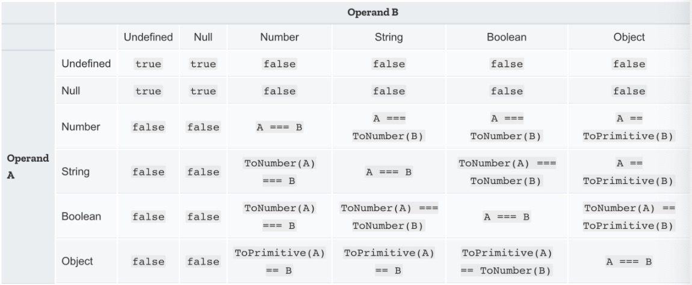

## JavaScript 형변환(Type Casting)

자바스크립트는 타입이 매우 유연한 언어입니다. 때문에 자바스크립트 엔진이 필요에 따라 암시적변환을 혹은 개발자의 의도에 따라 명시적변환을 실행합니다.

### 암시적 형 변환(Implicit type conversion)

암시적 변환이란 **자바스크립트 엔진이 필요에 따라 자동으로 데이터 타입을 변환**시키는 것입니다.

- 산술연산자

  더하기(+) 연산자는 숫자보다 문자열이 우선시 되기 때문에, 숫자형이 문자형을 만나면 문자형으로 변환하여 연산됩니다.

```jsx
number + number // number
number + string // string
string + string // string
string + boolean // string
number + boolean // number
50 + 50; //100
100 + “점”; //”100점”
“100” + “점”; //”100점”
“10” + false; //”100"
99 + true; //100
```

다른 연산자(- \* / %)는 숫자형이 문자형보다 우선시되기 때문에 더하기와 같은 문자형으로의 변환이 일어나지 않습니다.

```jsx
//다른 연산자(-,*,/,%)
string * number // number
string * string // number
number * number // number
string * boolean //number
number * boolean //number
“2” * false; //0
2 * true; //2
```

- 동치비교

  아래 예제는 엄격하지 않은 동치(==)비교이며, 아래의 결과값은 좌우항 변환할 경우 모두 '0==0이기 때문에' 'true'입니다.

```jsx
null == undefined // true 0 == 0
“0” == 0 // true 0 == 0
0 == false // true 0 == 0
“0” == false // true 0 == 0
```

여기서 유의해야할 점은 위의 비교는 엄격하지 않은 동치 비교일 경우이기 때문에, 두 값을 비교할때 데이터타입을 변환하지 않는 엄격한 동치(===)비교와 혼동되지 않도록 합니다.



### 명시적 형 변환(Explicit Type Conversion)

명시적 변환이란 개발자가 의도를 가지고 데이터 타입을 변환시키는 것 입니다.

타입을 변경하는 기본적인 방법은 Object(), Number(), toString(), Boolean() 와 같은 함수를 이용하는데 new 연산자가 없다면 사용한 함수는 타입을 변환하는 함수로써 사용됩니다.

```jsx
var trans = 100; //Number
Object(trans); //100
console.log(typeof trans); //Number
toString(trans); //”100"
console.log(typeof trans); //String
Boolean(trans); //true
console.log(typeof trans); //Bolean
```

### A Type → Number Type

다른 자료형을 숫자타입으로 변형하는 방법은 아래와 같습니다.

- Number()

  Number()는 정수형과 실수형의 숫자로 변환합니다. 보통 문자형을 숫자형으로 변경할때 사용한다. 숫자로 변환되지 않는 경우에는 NaN(Not a Number)을 반환합니다.

```jsx
Number(“12345”); //12345
Number(“2”*2); //4
```

펄시한 값(falsy values : null, false,"빈문자열")에 대해서는 0으로 표현합니다.
트루시한 값(truthy values)에 대해서는 1로 표현합니다.
array의 경우는 Number()함수에서 사용하는 0을 반환합니다.

```jsx
const falsy1 = null;
Number(falsy1); // 0;

const falsy2 = "";
Number(falsy2); // 0;

const falsy3 = false;
Number(falsy3); // 0;

const truthy1 = [];
Number(truthy1); // 0;

const truthy2 = true;
Number(truthy2); // 1;

const truthy3 = {};
Number({}); // NaN;
```

- parseInt()

  parseInt()는 정수형의 숫자로 변환합니다.
  만약 문자열이 '숫자0'으로 시작하면 8진수로 인식하고, '0x, OX'로 시작한다면 해당 문자열을 16진수 숫자로 인식합니다.
  또한 앞부분 빈 공백을 두고 나오는 문자는 모두 무시되어 NaN을 반환합니다.

```jsx
parseInt(“27”) //27
parseInt(0033); //27
parseInt(0x1b); //27
parseInt(“ 2”); //2
parseInt(“ 2ㅎ”); //2
parseInt(“ ㅎ2”); //NaN
```

**parseInt()는 문자열로 된 부분에서 숫자(정수)만 뽑아서 변환해주는것이 특징이고, Number()은 문자열 전체가 숫자일때 소수점까지 숫자타입으로 가져올 수 있습니다.**

- parseFloat()

  parseFloat()는 부동 소수점의 숫자로 변환합니다.
  parseInt()와는 달리 parseFloat()는 항상 10진수를 사용하며 parseFloat() 또한 앞부분 빈 공백을 두고 나오는 문자는 모두 무시되어 NaN을 반환합니다.

```jsx
parseFloat(“!123”); //NaN
parseFloat(“123.123456”); //123.123456
parseInt(“123.123456”); //123
parseFloat(“ 123.123456”); //123.123456
parseFloat(“ a123.123456”); //NaN
```

- 단항연산자(unary-operators)로 숫자형 타입 변경

```jsx
+"1000"; // 1000
+"-1000"; // -1000
+"Infinity"; // Infinity
-"1000"; // -1000
+true; // 1
+[]; /// 0
+false; // 0
+null; // 0
+""; // 0
```

위 예제를 보면 단일 연산자를 이용한 숫자형 변환은 Number와 동일한 동작을 하는 것을 볼 수 있습니다. 단항 연산자는 자바스크립트 함수를 사용하지 않고 타입 변환을 할 수 있는 쉽고 효율적인 방법이다.

### A Type → String Type

다른 자료형을 문자타입으로 변형하는 방법은 아래와 같습니다.

- String()

```jsx
String(123); //”123"
String(123.456); //”123.456"
```

- toString()

  주어진 값을 문자열로 변환 후 반환합니다.
  toString()는 인자로 기수를 선택할 수 있습니다. 인자를 전달하지 않으면 10진수로 변환합니다.

```jsx
var trans = 100;
trans.toString(); //”100"
trans.toString(2); //”1100100"
trans.toString(8); //”144"
var boolT = true;
var boolF = false;
boolT.toString(); //”true”
boolF.toString(); //”false”
```

- toFixed()

  toFixed()의 인자를 넣으면 인자의 소수점까지 반올림하여 표현합니다.

```jsx
var trans = 123.456789;
var roundOff = 99.987654;
trans.toFixed(); //”123"
trans.toFixed(0); //”123"
trans.toFixed(2); //”123.46"
trans.toFixed(8); //”123.45678900"
roundOff.toFixed(2); //”99.99"
roundOff.toFixed(0); //”100"
```

### A Type → Boolean Type

자바스크립트에서는 Boolean타입으로 변경은 Boolean 또는 부정연산자(!)를 사용하여 Boolean값을 만들어냅니다. 부정연산자는 의미그대로 !을 사용하면 Boolean() 반대의 값을 리턴합니다.

다른 자료형을 불린타입으로 변형하는 방법은 아래와 같습니다.

```jsx
Boolean()
Boolean(100); //true
Boolean(“1”); //true
Boolean(true); //true
Boolean(Object); //true
Boolean([]); //true
Boolean(0); //false
Boolean(NaN); //false
Boolean(null); //false
Boolean(undefined); //false
Boolean( ); //false

const numb1 = 0;
Boolean(numb1); // false
!!numb1; // false
!numb1; // true
```

### 참고자료

- [(JS) 자바스크립트의 형변환(Type Casting)](https://velog.io/@yunsungyang-omc/JS-%EC%9E%90%EB%B0%94%EC%8A%A4%ED%81%AC%EB%A6%BD%ED%8A%B8%EC%9D%98-%ED%98%95%EB%B3%80%ED%99%98Type-Casting)
