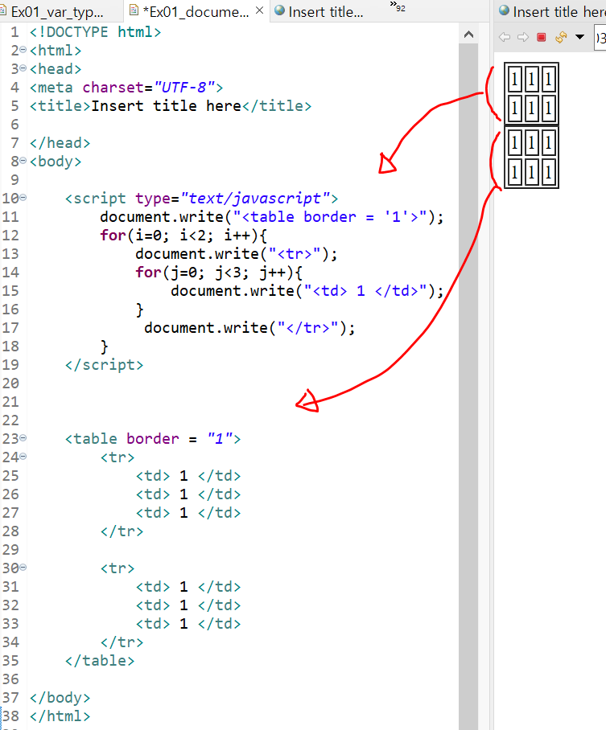

## document.write() 화면에 출력하는 함수

java의 System.out.print()와 비슷한 기능을 하는 함수로
html에서는 화면 영역을 document라고 부르는데 여기에 출력하는 함수입니다.

- 이 함수를 이용해 html의 태그를 출력하면 html을 직접 작성한 것과 같은 효과를 가집니다.

  단순 문자열을 브라우저에 출력하는 것도 가능합니다.

### 참고자료

- [[8주차] 4. 자바스크립트, document.write() 화면출력 함수](https://ldgeao99-developer.tistory.com/316)
