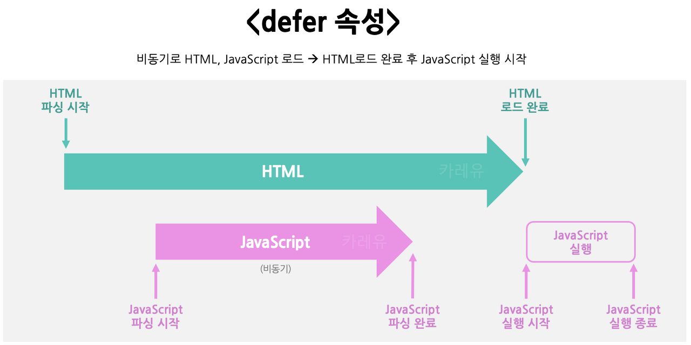
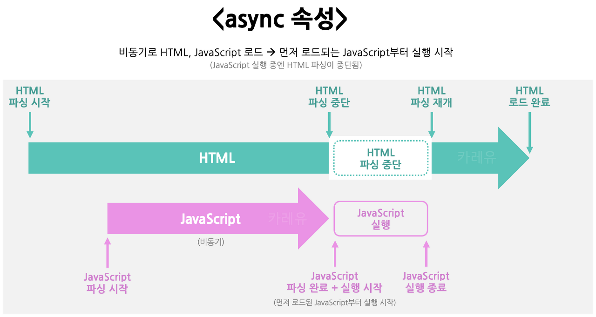

## 스크립트의 로드

### HTML에서 자바스크립트를 사용할 때

- script태그 내부에 JS코드를 작성
- script태그의 src속성을 통해 외부 JS파일 사용

### 기존 JS 로드의 문제점

그런데 브라우저는 HTML, Javascript를 위에서 부터 순차적으로 파싱하는 관계로, HTML이 파싱되지 않은 상태에서 Javascript를 사용할 경우, HTML 엘리먼트를 참조하지 못하는 문제가 발생합니다.

```jsx
<!DOCTYPE html>
<html lang="en">
<head>
    <script>
        document.getElementById("myDiv").innerText = "자바스크립트입니다!";
    </script>
</head>
<body>
	<!-- 이 div는 javascript에 의해 참조되지 못한다. -->
    <div id="myDiv">HTML 입니다.</div>
</body>
</html>
```

### 기존의 JS 로드 문제 해결 방법

- body의 최하단에서 javascript 사용

  HTML이 모두 파싱된 다음 Javascript가 HTML태그를 사용합니다.

```jsx
<!DOCTYPE html>
<html lang="en">
<head>
</head>
<body>
    <div id="myDiv">HTML 입니다.</div>
    <script>
        // html이 파싱된 다음 javascript가 참조한다.
        document.getElementById("myDiv").innerText = "자바스크립트입니다!";
    </script>
</body>
</html>
```

- window.onload 이벤트 리스너 등록

  window 로드가 완료되었다는 이벤트가 발생하면 javascript코드를 수행합니다.

```jsx
<!DOCTYPE html>
<html lang="en">
<head>
    <script>
       // window로드가 완료된 다음 참조한다.
        window.onload = function(){
            document.getElementById("myDiv").innerText = "자바스크립트입니다!";
        }
    </script>
</head>
<body>
    <div id="myDiv">HTML 입니다.</div>
</body>
</html>
```

### 새로운 해결 방법: defer, async 속성

그러나 HTML5부터 defer, async 어트리뷰트를 통해 비동기 JS 파일 로드가 가능해져 이 문제가 근본적으로 해결이 됩니다. 단, src 속성으로 외부 JS 파일을 불러올 때만 사용 가능하다.(인라인 자바스크립트 사용 불가)

아래와 같이 script 태그에 defer나 async 속성을 추가해서 사용합니다.

```jsx
<!DOCTYPE html>
<html lang="en">

<head>
    <!-- 비동기 외부 JS 파일 로드: defer -->
    <script src="JS파일경로" defer></script>

    <!-- 비동기 외부 JS 파일 로드: async -->
    <script src="JS파일경로" async></script>

</head>

<body>
	<!-- HTML 코드 -->
</body>
</html>
```

defer와 async의 상세한 차이점은 아래와 같습니다.

- defer

  - HTML 파싱과 함께, 비동기로 JavaScript 파일을 불러옵니다.
  - HTML 파싱이 완료된 후, JavaScript 코드의 실행이 시작됩니다.



javascript의 로딩은 비동기로 수행되지만, 실행 자체는 HTML로드가 완료된 후에 시작됨을 알 수 있다.

- async

  - HTML 파싱과 함께, 비동기로 JavaScript 파일을 불러옵니다.
  - HTML파싱이 완료되지 않았더라도, 먼저 로딩되는 JavaScript파일부터 실행이 시작됩니다.
    (script 태그 선언 순서 무관)
  - 또한 이 때, HTML 파싱이 중단됩니다.



JS로딩은 비동기로 수행되지만, HTML로드가 되지 않았더라도 먼저 로딩되는 JS부터 실행합니다.
(그리고 그 동안에 HTML의 파싱은 중단됩니다.)

### 참고자료

- [자바스크립트 로드 script 태그: async/defer 비동기 속성](https://curryyou.tistory.com/342)
