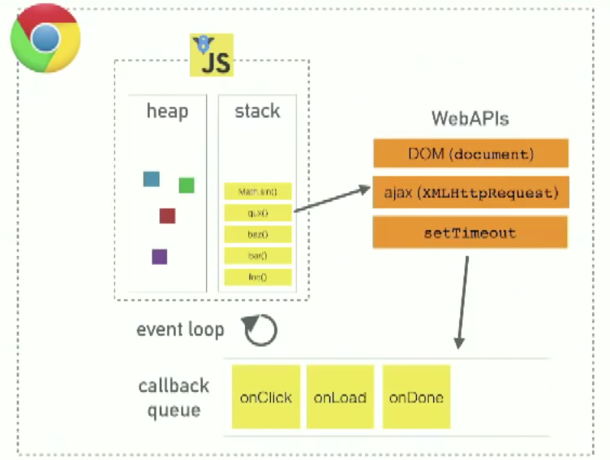
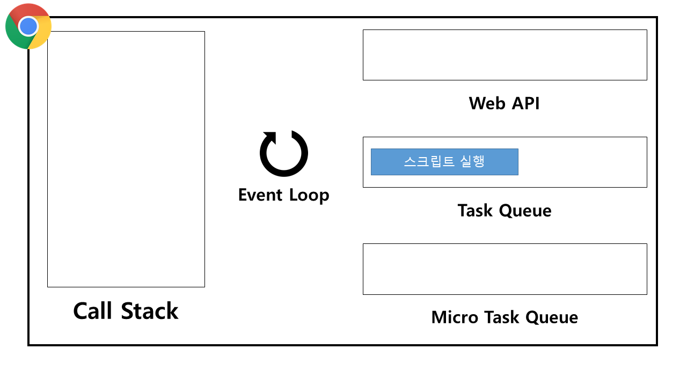
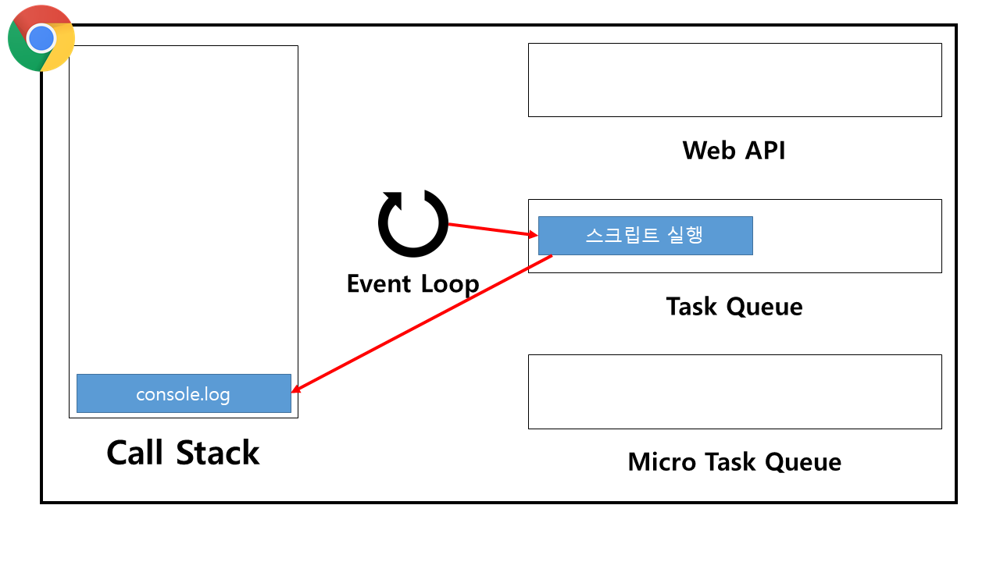
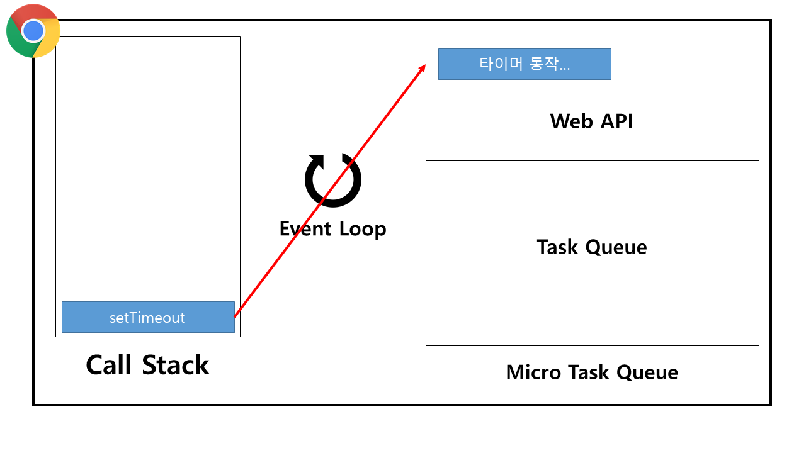
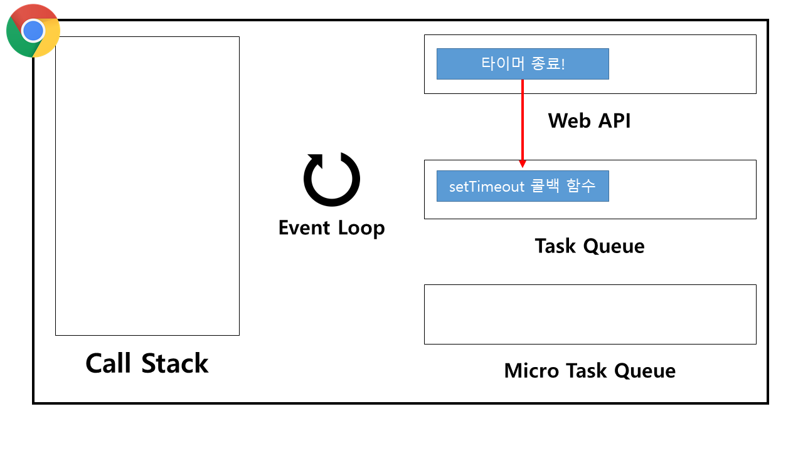
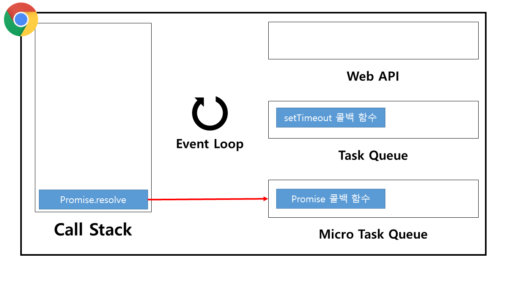
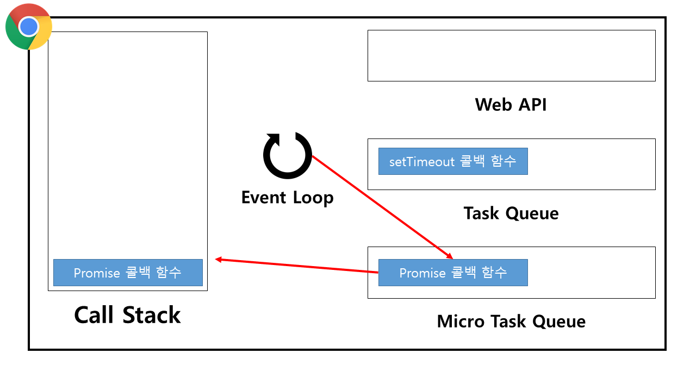
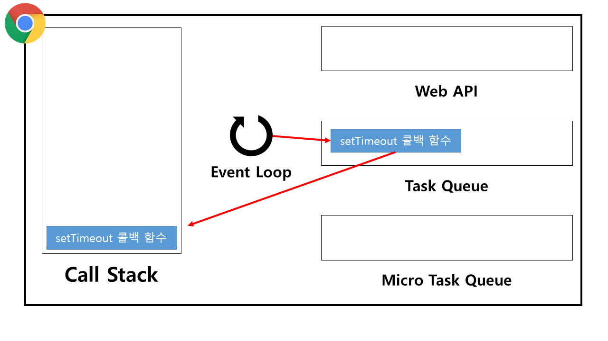
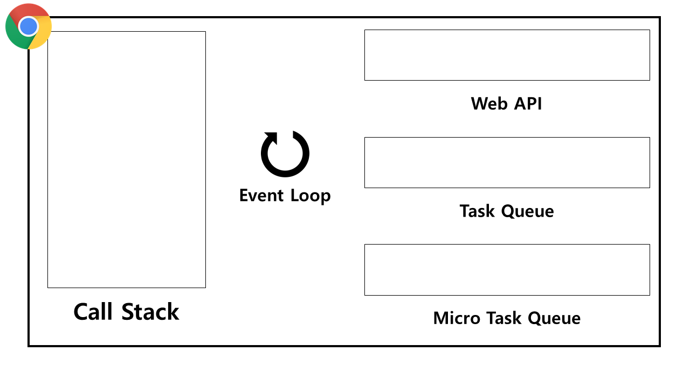

## 이벤트 루프 (Event loop)

**자바스크립트가 싱글 스레드인 이유는 콜 스택이 하나이기 때문이다.**
자바스크립트는 단일 스레드(Single-threaded) 기반 언어로, 자바스크립트 엔진은 단일 콜 스택을 갖습니다. 이 말은 요청이 동기적으로 처리된다는 것을 의미합니다. 그렇다면 비동기 요청은 어떻게 처리될 수 있을까요? 그것은 바로 자바스크립트를 실행하는 환경인 **브라우저나 Node.js가 담당**합니다. 이 브라우저 때문에 싱글 스레드 언어인 자바스크립트가 우리 눈으로 보기엔 동시성을 갖는 작업을 해내는 것으로 보이게 됩니다. 여기서 자바스크립트 엔진과 그 실행 환경을 상호 연동시켜주는 장치가 바로 이벤트 루프입니다. 따라서, 이벤트 루프는 자바스크립트 엔진에 있지 않고 그 환경에 속합니다.



### 브라우저

브라우저는 여러 탭을 동시에 열 수 있습니다.
각 탭은 독립된 환경에서 실행되며, 이를 위해 각 탭은 별도의 프로세스 또는 스레드로 분리될 수 있습니다.

### WebAPIs

브라우저에서 제공하는 인터페이스로, JavaScript가 브라우저 환경에서 동작할 수 있도록 하는 API 집합을 나타냅니다.

setTimeout이나 ajax 같은 비동기 함수가 호출되면, 해당 작업은 브라우저에 내장된 WebAPI에게 넘겨집니다. 그 안에서 타이머가 동작을 하거나 네트워크 통신을 진행하고, 코드가 실행될 준비가 되면 콜백 큐에 해당 작업을 넣어줍니다. 그래서 사실상 비동기 함수가 동기적인 함수들과 '동시'에 동작하는 것처럼 보이지만, 이는 아주 재빠르게 콜 스택에 넘어와 실행되었기 때문입니다.

### 태스크 큐(Task queue)와 마이크로태스크 큐(Microtask queue)

자바스크립트의 실행 환경은 2가지 큐를 가지고 있으며 각각 스크립트 실행, 이벤트 핸들러, 콜백함수 등의 태스크(Task) 담기는 공간이다. 태스크가 콜백함수라면 그 종류에 따라 다른 큐에 담기며 대표적인 예로는 다음과 같은 것들이 있다.

- 태스크 큐

  setTimeout() , setInterval() , UI 렌더링, requestAnimationFrame()

- 마이크로태스크 큐

  Promise, MutationObserver
  이벤트 루프는 2개의 큐를 감시하고 있다가 콜 스택이 비게 되면, 콜백함수를 꺼내와서 실행한다. 이 때 마이크로태스크 큐의 콜백함수가 우선순위를 가지기 때문에 마이크로태스크 큐의 콜백함수를 전부 실행하고 나서 태스크 큐의 콜백함수들을 실행한다. (단, UI 렌더링이 태스크 큐에 속하기 때문에 마이크로태스크 큐의 태스크가 많으면 렌더링이 지연될 수 있다.)

### 예시를 통한 동작방식의 이해

```jsx
console.log("콜 스택!");
setTimeout(() => console.log("태스크 큐!"), 0);
Promise.resolve().then(() => console.log("마이크로태스크 큐!"));
```

결과는 다음과 같다.

```jsx
콜 스택!
마이크로태스크 큐!
태스크 큐!
```

처음 스크립트가 로드될 때 "스크립트 실행" 이라는 태스크가 먼저 태스크 큐에 들어간다. 그리고 나서 이벤트 루프가 태스크 큐에서 해당 태스크를 가져와 콜 스택을 실행하는 것이다. 즉, 콜 스택에는 이미 GEC(Global Execution Context)가 생성되어 있는 상태에서 "스크립트 실행" 이라는 태스크를 실행하게 되면 그제서야 GEC에 속한 코드가 실행되는 방식이다.

그럼 하나하나 어떻게 동작하는지 그림으로 살펴보자.



제일 먼저, "스크립트 실행" 태스크가 태스크 큐에 들어가게 된다.



이후, 이벤트 루프가 그 태스크를 가져와서 로드된 스크립트를 실행시킨다. 따라서 맨 처음에 console.log 가 실행된다.



그 다음, setTimeout() 이 콜 스택으로 가고 브라우저가 이를 받아서 타이머를 동작시킨다.



타이머가 끝나면 setTimeout() 의 콜백함수를 태스크 큐에 넣는다.



Promise 가 콜 스택으로 가고 콜백함수를 마이크로태스크 큐에 넣는다.



이벤트 루프는 마이크로태스크 큐에서 제일 오래된 태스크인 Promise 의 콜백함수를 가져와 콜 스택에 넣는다.



Promise 의 콜백함수가 끝나고 태스크 큐에서 제일 오래된 태스크인 setTimeout() 의 콜백함수를 가져와 콜 스택에 넣는다.



setTimeout() 의 콜백함수가 끝나면 콜 스택이 비게 되고 프로그램이 종료된다.

### 참고자료

- [자바스크립트는 싱글 스레드인데 왜 비동기가 가능할까?](https://stitchcoding.tistory.com/44)
- [[js] js는 싱글스레드언어인데 어떻게 병렬처리가 가능한걸까???](https://coding-lks.tistory.com/174)
