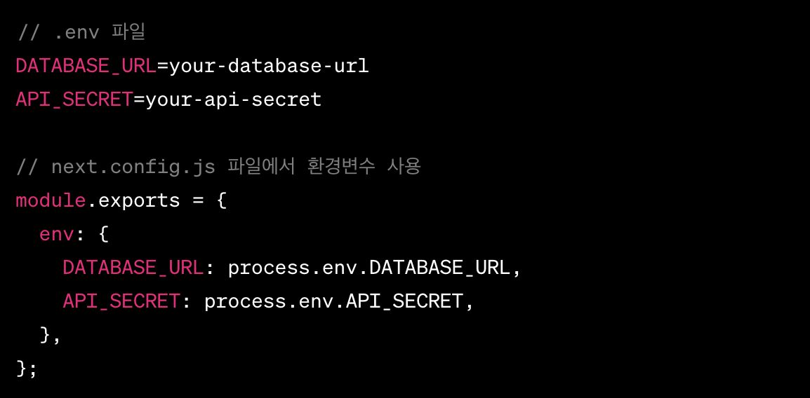

## Next

### API 라우트 및 서버리스 함수

- API 라우트 구현

  - `pages/api` 내에서 API 엔드포인트 생성

  - 간단한 RESTful API 구현 가능

- 서버리스 함수

  - 각 API라우트는 서버리스 함수로 자동 변환

  - 배포 및 확장의 용이성

- 복잡한 백엔드 로직 구현

  - 데이터베이스 연결, 사용자 인증 처리 등

- GraphQL API 지원

  - GraphQL 서버 구축 및 통합 가능

  

### 내장된 성능 최적화 기능과 이미지 최적화

- 자동 코드 분할

  - 페이지 별로 필요한 코드만 로딩하여 성능 향상

- 이미지 최적화

  - `next/image`를 사용한 효율적인 이미지 로딩 및 크기 조정

- 빌드 최적화

  - 빠른 리빌드 시간과 더 작은 번들 크기

- 성능 분석 도구 통합

  - 빌드 시 성능 문제 식별 및 최적화


### 국제화(i18n) 지원

- 다국어 지원

  - 자동 언어 감지 및 라우팅

  - 다양한 언어로의 쉬운 번역

- 지역별 라우팅 설정

  - 지역에 따른 동적 페이지 생성

  - 사용자의 지역에 맞는 콘텐츠 제공

- 다양한 지역 설정

  - 다중 언어 및 지역에 대한 지원

  - 사용자 경험 향상을 위한 맞춤형 콘텐츠


### 환경 설정과 커스터마이징

- 환경변수 설정

  - `.env` 파일을 통한 환경변수 관리

  - 보안 및 구성 관리 용이성

- 사용자 정의 설정

  - `next.config.js`파일을 통한 커스터마이징

  - 웹팩 설정, 플러그인 추가 등.



### 모듈러 스타일링과 CSS-in-JS

- 모듈러 CSS 지원

  - 컴포넌트 별 스타일 적용

  - 스타일 격리 및 관리 용이성

- CSS-in-JS 통합

  - Styled-components, Emotion 등의 라이브러리 지원

  - 동적 스타일링 및 테마 구현 용이


### 빌드 시간 및 배포 복잡성

- 긴 빌드 시간

  - 대규모 프로젝트에서의 빌드 및 배포 시간 증가

  - SSR과 SSG의 복잡한 구성으로 인한 빌드 시간 증가

- 배포 복잡성

  - 다양한 호스팅 환경에 맞는 배포 설정의 복잡성

  - 서버리스 및 정적 호스팅 환경에 대한 이해 필요

### 플러그인 및 커스텀 설정의 한계

- 제한된 플러그인 생태계

  - 다른 프레임워크에 비해 제한적인 플러그인 옵션

  - 특정 기능 추가 시 직접 구현 필요

- 커스텀 설정의 한계

  - 내부 웹팩 구성에 대한 깊은 이해 필요

  - 고급 사용자를 위한 설정 옵션이 제한적

### 알아두면 좋을 내용

- 클라이언트 사이드 렌더링 (Client-Side Rendering, CSR)

  - 웹 애플리케이션의 렌더링을 클라이언트 측에서 처리하는 방식입니다. CSR은 SSR보다 초기 전송되는 페이지의 속도는 빠르지만 서비스에서 필요한 데이터를 클라이언트(브라우저)에서 추가로 요청하여 재구성해야 하기 때문에 전제적인 페이지 완료 시점은 SSR보다 느려집니다.

- SPA

  - Single Page Application 하나의 큰화면을 다가져오고 그 중 일부를 보여주는 것입니다.

- MPA

  - MPA(Multi Page Application) 스프링 방식과 같이 페이지마다 view가 존재하는 것입니다.

- 시멘틱 태그

  - 의미가 있는 태그를 사용하여 검색 엔진에 잘 검색되도록 만들어 주는 것입니다.

  - `<a>`태그는 새로 다운받아서 그려줘라는 기능이 들어 있습니다. CSR `<a>`는 `<Link>`태그라, Next독스에서는넣어 주어 a링크는 기능을 안하는 걸로 사용하는 것을 추천합니다.

  - 위처럼 해주는 까닭은 검색엔진의 최적화(SEO)를 위해서 넣어줍니다.

  - `<div>`요리 보단 `<h1>`요리

- 템플릿 리터럴

  - 감싸주어 사용해야, 해당 값으로 이동하는 링크를 쉽게 구현할 수 있습니다.

  - `/board/${result.data.createBoard.number}`

- 함수가 아닐 때 props를 받는 법

```jsx
export const BlueButton = styled.button`
  background-color: ${(props) => (props.isActive === true ? "yellow" : "")};
`;
```

- map index를 키로 주지 않기

  - 아래 것이 삭제 되면서 위로 올라가서 삭제가 안 된 상태로 인식 할 수 있습니다. 유일하지 않은 값이라서 발생하는 문제로 uuid라이브러리를 이용하여 난수를 생성하는 식으로 해결할 수 있습니다.

- uuid

  - Universally Unique Identifier(범용 고유 식별자)를 생성하기 위해 사용되는 라이브러리입니다.

    - v1 (타임스탬프와 랜덤 정보)

      - UUID 버전 1은 현재 시간과 MAC 주소 등을 결합하여 생성됩니다. 이로 인해 생성 시간을 기반으로 한 순차적인 UUID가 생성됩니다. 그러나 MAC 주소를 사용하므로 개인 정보 보호 문제가 있을 수 있습니다.

    - v2 (DCE 보안)

      - UUID 버전 2도 시간 기반이지만 DCE(Distributed Computing Environment) 보안 모델을 따릅니다. 잘 사용되지 않습니다.

    - v3 (이름 기반)

      U- UID 버전 3은 명시적으로 지정된 이름(문자열)과 네임스페이스를 사용하여 생성됩니다. 이를 해시화하여 UUID를 생성합니다. 동일한 이름과 네임스페이스로 생성되는 UUID는 항상 동일합니다.

    - v4 (랜덤)

      - UUID 버전 4는 완전한 랜덤성을 가지며, 난수 생성기를 사용하여 생성됩니다. 보통 가장 많이 사용되며, 사생활 문제가 없습니다. 따라서 대부분의 용도에 적합한 UUID 버전입니다.

    - v5 (이름 기반)

      - UUID 버전 5는 v3와 유사하지만 해시 함수로 SHA-1을 사용합니다. v3보다 더 강력한 보안을 제공합니다.

- Frangment

div가 필요할 때만 div로 그리고 아닌 것 들은 무의미한 div 사용을 지양하는 것이 좋습니다. 성능상의 문제가 조금이라도 발생할 수 있기 때문입니다.

### 참고자료

- [[Next.js] 기본 개념 : Next.js 란? Next.js를 왜 사용할까? Next.js의 장점은?](https://velog.io/@syoung125/Next.js-%EA%B8%B0%EB%B3%B8-%EA%B0%9C%EB%85%90-1-Next.js-%EB%9E%80-Next.js%EB%A5%BC-%EC%99%9C-%EC%82%AC%EC%9A%A9%ED%95%A0%EA%B9%8C-Next.js%EC%9D%98-%EC%9E%A5%EC%A0%90%EC%9D%80)
