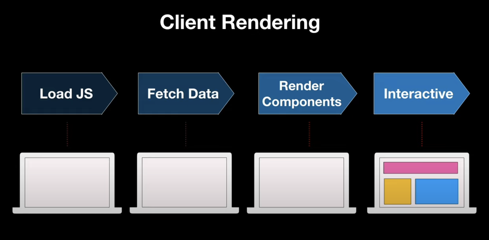
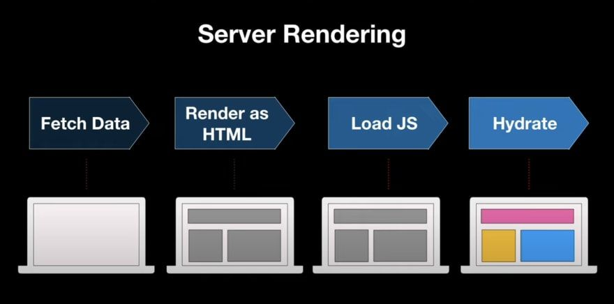

## RSC vs SSR(Server Side Rendering)

‘컴포넌트가 서버에서 해석되어 클라이언트로 전달되는게 바로 SSR아니야?’라고 생각될 수 있으나, 실제로 RSC와 SSR은 서버에서 처리한다는 공통점 외에는 각각 해결하고자하는 목표도 다르고, 일어나는 시점과 최종 산출물도 다른 완전히 별개의 개념입니다. 따라서 반드시 둘 중 하나를 선택할 필요도 없고 필요에 따라 RSC와 SSR을 함께 사용하면 큰 시너지를 낼 수도 있습니다.

우리가 작성한 소스코드가 브라우저에 보여지기 위해서는 우선 컴포넌트가 실행되어 데이터가 해석되어야하고, 그 해석된 데이터가 다시 html로 변환하는 과정을 거쳐야합니다. **RSC는 이중 전자에 해당하는 단계에 관여하고, SSR은 후자에 관여합니다.**

RSC와 SSR는 공존할 수 있다고 했는데, RSC를 쓰든 RCC를 쓰든 SSR을 적용하면 클라이언트가 받는 최종 산출물은 html로 동일한거 아닌가? 그러면 SSR을 채택했을 때 RSC의 이점은 어디에 있는걸까?

이 의문에 답을 하기 위해서는 next에서 ssr을 어떻게 사용하고 있는지 이해해야합니다.

### Next.js의 SSR

#### CSR vs SSR

Client Side Rendering은 말 그대로 클라이언트에서 컴포넌트를 렌더링하는 것을 의미합니다. 서버에서 빈 html과 js bundle을 다운로드 받고, 이 js 소스코드를 클라이언트에서 해석해서 처음부터 그려나가게 됩니다. 때문에 초기 로딩속도가 느리지만, 스크린간 이동이나 인터렉션에 강점이 있습니다.

반면 Server Side Rendering은 서버에서 컴포넌트를 해석하여 최종 결과물인 html 파일을 내려주는 것을 의미합니다. CSR과는 반대로 초기 로딩속도가 빠르지만, 페이지를 이동할때마다 새로운 html을 요청해서 받는 시간이 필요하고, 현재 화면에서도 작은 변경사항이 발생하면 처음부터 html을 다시 로드해야하기 때문에 스크린간 이동이나 인터렉션에 약점이 있습니다.



사실 next js에서 우리가 사용하는 ssr은 전통적인 의미의 ssr은 아닙니다. ssr과 csr의 장점만을 취하기 위해 일종의 절충점을 찾은 형태라고 할 수 있습니다. 즉, 초기 로딩속도가 느리다는 CSR의 단점을 보완하기 위해 초기 로딩시에는 html파일을 SSR을 통해 빠르게 받아오고, 이와 병렬적으로 js번들도 함께 가져와서 미리 받아온 html과 병합하는 hydration과정을 거치는 것입니다. 그 결과 빠른 로딩에 강점이 있는 SSR과 인터렉션에 강점이 있는 CSR의 장점을 모두 취할 수 있게 됩니다.



즉 Next js의 SSR 뿐만 아니라 CSR의 특징도 많이 가지고 있으므로 RSC를 함께 사용했을 때 그 이점이 더욱 크게 극대화될 수 있습니다.

### RSC의 장점

#### Zero Bundle Size

RSC는 서버에서 이미 모두 실행된 후 직렬화된 JSON 형태로 전달되기 때문에 어떠한 bundle도 필요하지 않습니다. 즉, RSC의 컴포넌트 소스파일 뿐만아니라, **RSC에서만 사용하는 외부 라이브러리의 경우에도 번들에 포함될 필요가 없기 때문에 번들사이즈를 획기적으로 감량할 수 있습니다.**

이러한 부분은 Next의 TTI(Time To Interactive) 개선에 크게 기여할 수 있는데, 이전에 살펴봤듯이 Next에서 SSR을 사용한다고 하더라도 초기 로딩속도에 이점이 있을 뿐 CSR과 동일한 사이즈의 js 번들을 다운받아야하기 때문에 TTI는 여전히 CSR 대비 큰 메리트가 없었기 때문입니다. 하지만 RSC를 도입하면 다운받아야하는 번들 사이즈가 줄어들게 되므로, TTI에 개선에 기여할 수 있습니다.

#### No More getServerSideProps / getStaticProps (app directory)

기존 next에서는 getServerSideProps / getStaticProps라는 함수를 이용해서 서버에 접근했었습니다. 때문에, Data fetch등을 수행 할때는 반드시 getServerSideProps(or getStaticProps)함수를 page 최상단에서 수행하고, 이를 page에 prop으로 넘겨서 사용했어야 했습니다.

하지만 이 과정은 순수 React와는 괴리가 있어 처음 next를 사용하는 사람들에게 낯설 뿐만 아니라, 무조건 최상단에서 fetch 후 page에 prop으로 넘겨줄 수밖에 없는 구조 때문에, 실제 data를 사용하는 하위 컴포넌트의 depth까지 props drilling이 불가피했습니다.

반면 RSC는 그 자체가 서버에서 렌더링되므로, 컴포넌트 내부에서 Data Fetch를 실행해도 무방합니다. 즉, data가 필요한 컴포넌트에서 직접 data fetch가 가능해졌고, next13의 app directory에서는 **기본적으로 모든 컴포넌트가 RSC이기 때문에 더이상 getServerSideProps / getStaticProps는 불필요한 함수가 되었다.**

#### Automatic Code Splitting

본래 code splitting을 하기 위해서는 React.Lazy나 dynamic import를 사용했어야했다.

```jsx
import dynamic from "next/dynamic";

const DynamicComponent = dynamic(() => import("../components/hello"));
```

하지만 RSC에서 RCC를 import하는 케이스에서는 **자동적으로 RCC를 dynamic import가 적용됩니다.** 이 장점은 어떻게 보면 굉장히 당연한 사실인데, 서버에서 RSC가 렌더링될 때 RCC는 실행되지 않기 때문에 굳이 RCC를 즉시 import 할 필요가 없기 때문입니다.

#### Progressive Rendering

next13부터는 컴포넌트가 서버에서 한차례 렌더링 되며, 그 결과물로 직렬화된 JSON이 생성됩니다. 그리고 client는 그 결과물을 스트림의 형태로 수신합니다.

```jsx
// Tweets.server.js
import { fetch } from 'react-fetch' // React's Suspense-aware fetch()
import Tweet from './Tweet.client'
export default function Tweets() {
const tweets = fetch(`/tweets`).json()
return (

 <ul>
   {tweets.slice(0, 2).map((tweet) => (
     <li>
       <Tweet tweet={tweet} />
     </li>
   ))}
 </ul>
)
}

// Tweet.client.js
export default function Tweet({ tweet }) {
return <div onClick={() => alert(`Written by ${tweet.username}`)}>{tweet.body}</div>
}

// OuterServerComponent.server.js
export default function OuterServerComponent() {
return (
<ClientComponent>
<ServerComponent />
<Suspense fallback={'Loading tweets...'}>
<Tweets />
</Suspense>
</ClientComponent>
)
}
```

```
M1:{"id":"./src/ClientComponent.client.js","chunks":["client1"],"name":""}
S2:"react.suspense"
J0:["$","@1",null,{"children":[["$","span",null,{"children":"Hello from server land"}],["$","$2",null,{"fallback":"Loading tweets...","children":"@3"}]]}]
M4:{"id":"./src/Tweet.client.js","chunks":["client8"],"name":""}
J3:["$","ul",null,{"children":[["$","li",null,{"children":["$","@4",null,{"tweet":{...}}}]}],["$","li",null,{"children":["$","@4",null,{"tweet":{...}}}]}]]}]
```

위 문자열은 클라이언트가 수신하는 스트림의 한 예시를 나타낸 것입니다. 여기서 짚고 넘어갈 부분은 데이터가 ‘스트림’ 형태로 전달된다는 사실입니다. 즉, 스크린의 모든 화면정보를 수신할 때까지 기다릴 필요 없이, 클라이언트는 먼저 수신된 부분부터 반영하기 시작하여 화면에 띄워줄 수 있게 됩니다.

위 스트림 문자열을 보면 S2 지점에 suspense가 서술되어 있습니다. 그리고 J0를 보면 뒤쪽에 children으로 “@3”이 참조되어 있는 것을 볼 수 있습니다. 하지만 스트림의 어디를 봐도 “@3”에 대한 정의는 나와있지 않습니다. 이는, 아직 data fetch가 완료되지 않았기 때문에 fallback이 보여지는 상황이기 때문에, @3를 placeholder로 사용하고 있기 때문입니다.

만약 data fetch가 완료되면 “@3”이 “J3”로 대체되고, “J3”는 참조하고 있던 “M4”에 해당하는 client component에 data를 넘겨주면서 화면에 보여지게 됩니다. 따라서 RSC를 React.Suspense와 함께 사용한다면 모든 데이터를 기다릴 필요 없이 먼저 그릴 수 있는 부분을 반영하여 뷰를 로드한 뒤, data fetch가 완료되면 그 결과가 즉각적으로 스트림에 반영됨을 알 수 있습니다.

#### 컴포넌트 단위 refetch

전통적인 SSR의 경우 완성된 html파일을 내려주기 때문에 작은 변경사항이 발생하더라도 전체 페이지를 전부 새로 그려서 받아와야 했습니다. 하지만 직전에 설명했듯이 RSC는 그 최종 결과물이 html이 아니라 직렬화된 스트림 형태로 데이터를 받아오기때문에, 클라이언트에서 스트림을 해석하여 virtualDOM을 형성하고, Reconciliation을 통해 뷰를 갱신하는 과정을 거치게 됩니다. 즉, 화면에 변경사항이 생겨서 서버에서 새로운 정보를 받아와야하는 상황이 생기더라도, 새로운 스크린으로 갈아끼우는 것이 아니라 기존 화면의 state등 context를 유지한채로 변경된 사항만 선택적으로 반영할 수 있게 됩니다.

### 참고자료

- [Next) 서버 컴포넌트(React Server Component)에 대한 고찰](https://velog.io/@2ast/React-%EC%84%9C%EB%B2%84-%EC%BB%B4%ED%8F%AC%EB%84%8C%ED%8A%B8React-Server-Component%EC%97%90-%EB%8C%80%ED%95%9C-%EA%B3%A0%EC%B0%B0)
  $$
