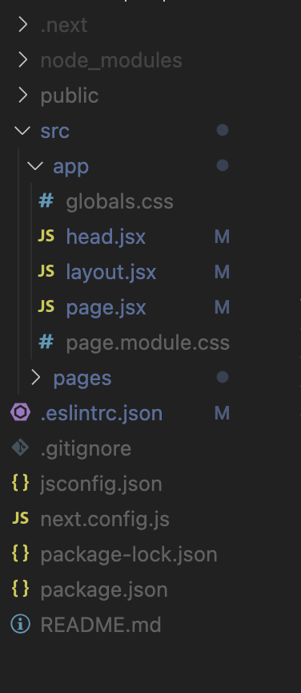
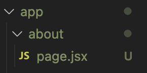
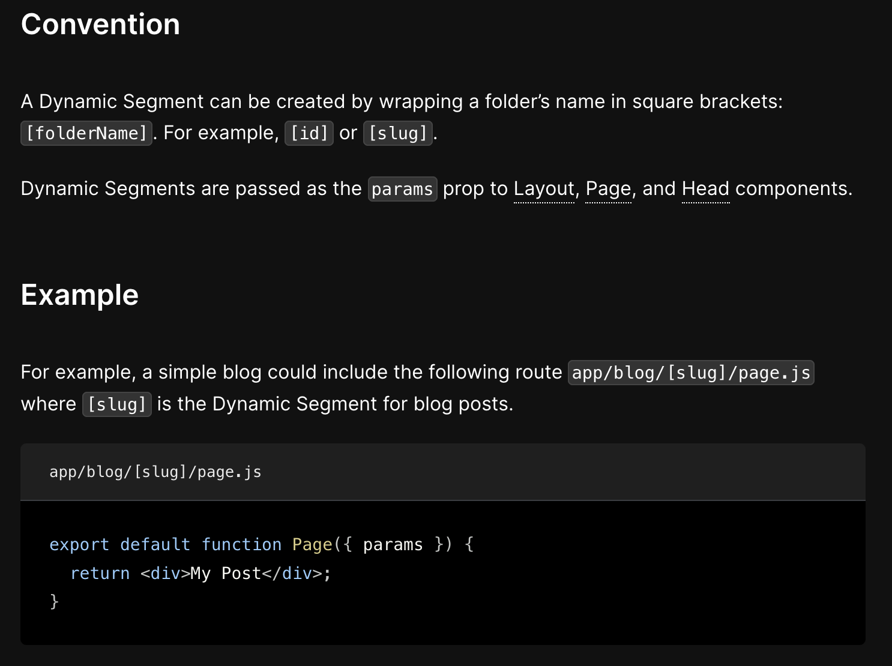
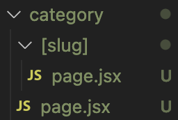
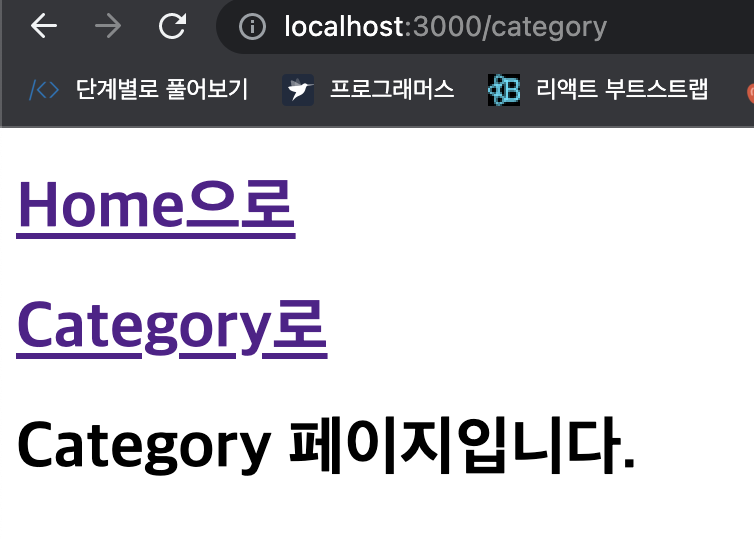
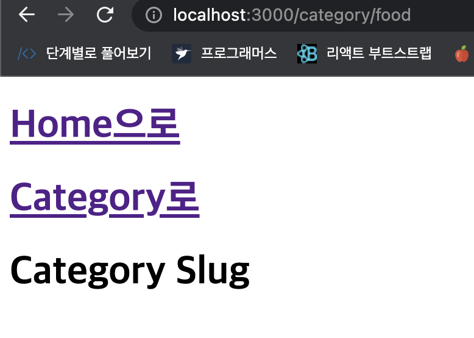
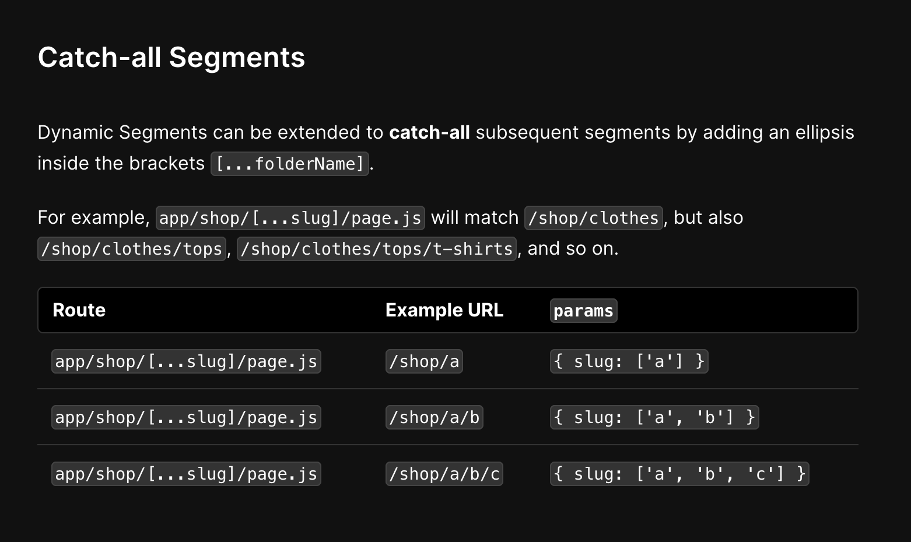
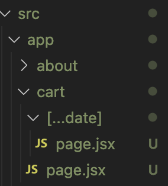
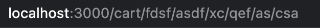

## App Routing

Next.js 13에서는 app 경로를 이용해서 페이지 구성과 라우팅 기능을 구현할 수 있습니다.

app directory와 관련해서 우리가 집중할 부분은 app directory내부에서는 모든 컴포넌트가 기본적으로 서버컴포넌트로 동작한다는 사실입니다. 만약 app directory 내부에서 클라이언트 컴포넌트를 사용하고 싶다면 파일 최상단에 use client라는 directive를 명시해주면 됩니다.



- layout.jsx

```jsx
export default function RootLayout({ children }) {
  return (
    <html>
      <head>
        <title>Next.js 공부중</title>
      </head>

      <body>
        <nav>Nav 입니다.</nav>
        {children}
      </body>
    </html>
  );
}
```

layout.jsx 에서는 해당 페이지의 레이아웃을 구성할 수 있는데, 여기서 `{children}` 안에 들어가는 내용들이 page.jsx 안의 내용들로 들어가고, 저 nav 태그 안에 있는건 라우팅이 되어도 바뀌지 않습니다.

- page.jsx

```jsx
import Page2 from "./about/page";
import Link from "next/link";

export default function Home() {
  return (
    <>
      <h1>Pagejsx입니다.</h1>
      <Link href="/about">
        <h1>About</h1>
      </Link>
    </>
  );
}
```



Next.js에서는 파일 구조로 라우팅을 관리할 수 있습니다.

app 경로를 기준으로 app/about 폴더가 있다면 브라우저 상에서 /about 페이지로 들어가면 about폴더 안에 있는 page.jsx 안에 있는 내용이 나타납니다.

- app/about/page.jsx

```jsx
export default function about() {
  return <h1>About 페이지입니다.</h1>;
}
```

폴더명을 기준으로 라우팅을 하는것이기때문에 function명은 상관없습니다.

```jsx
export default function djqkdnt() {
  return <h1>About 페이지입니다.</h1>;
}
```

이렇게 작명을해도 라우팅은 잘 동작합니다.
하지만 저 app/layout.jsx 안에 있는 nav 태그는 라우팅 되어도 고정되어있습니다.

### Next.js 13 동적 라우팅



동적인 부분들은 폴더명을 대괄호로 감싸줌으로써 가능합니다. `[id]` 나 `[slug]` 처럼 동적인 부분들은 Layout 과 Page나 Head 컴포넌트들에게 params prop으로 전달 되어집니다.
예를들어서, 간단한 블로그는 `[slug]`가 블로그 게시글들의 동적인 부분들이 있는 app/blog/[slug]/page.js 경로를 포함합니다.



- category/page.jsx

```jsx
export default function page() {
  return <h1>Category 페이지입니다.</h1>;
}
```



- category/[slug]/page.jsx

```jsx
export default function page() {
  return <h1>Category Slug</h1>;
}
```



category/ 다음에 무엇을 입력하던 Category Slug 코드안의 내용이 띄워집니다.



- 모든 segments

  동적인 segments 들은 대괄호안에 ...을 붙임으로써 모든 후속 segments들을 확장시킬 수 있습니다.
  예를 들어서 app/shop/[...slug]/page.js는 /shop/clothes, /shop/clothes/tops , /shop/clothes/tops/t-shirts 등등 모든 주소와 매치됩니다.



- cart/page.jsx

```jsx
export default function page() {
  return <h1>CartPage 입니다.</h1>;
}
```

- cart/[...date]/page.jsx

```jsx
export default function page() {
  return <h1>Cart Date Slug</h1>;
}
```



브라우저창에 아무 문자를 입력해도 [...date]/page.jsx 코드 안의 내용이 실행됩니다.

### 참고자료

- [Next.js 13 라우팅](https://velog.io/@brgndy/Next.js-13-%EB%9D%BC%EC%9A%B0%ED%8C%85)
- [Next) 서버 컴포넌트(React Server Component)에 대한 고찰](https://velog.io/@2ast/React-%EC%84%9C%EB%B2%84-%EC%BB%B4%ED%8F%AC%EB%84%8C%ED%8A%B8React-Server-Component%EC%97%90-%EB%8C%80%ED%95%9C-%EA%B3%A0%EC%B0%B0)
