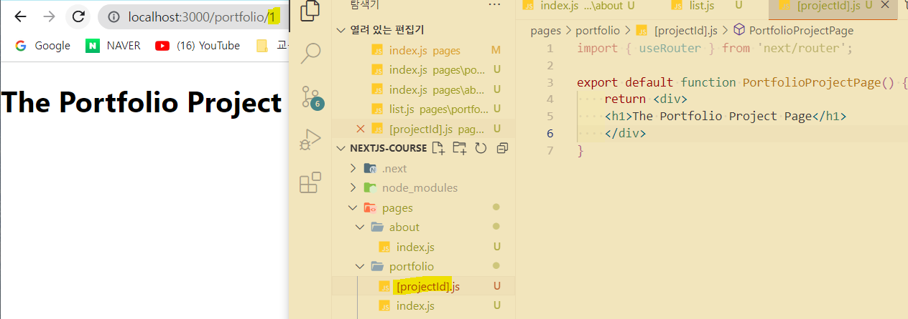

## Routing 차이점

### React.js의 Routing

React 공식문서의 Next.js 소개를 보면 기본적으로 스타일링과 "라우팅 해결책"을 가지고 있다고 설명되어 있습니다.

- 라우팅 해결책

  우선 React는 SPA(Single Page Application)이란 것을 알아야 합니다. 라우팅은 본래 서버에서 담당했지만, SPA가 등장하며 라우팅을 클라이언트가 담당하게 되었습니다.

  서버에서 담당했던 라우팅은 애플리케이션의 규모가 커지고 사용자와의 상호 작용이 많아질수록 데이터 전송 과부화로 인한 속도 저하의 문제가 생기게 되었습니다.

  SPA는 이러한 점을 해결하여 뷰 렌더링을 웹 브라우저가 담당하게 된 것입니다. 단일 페이지(Single Page)로 구성되어있지만 여러 화면을 라우팅 하며 보여주는 것입니다. 모든 정적 리소스를 최초 접근 한 번만 다운로드하고 그 후에는 전체 페이지를 리 렌더링 하지 않고 변경되는 부분만 갱신해주는데(React의 Virtual DOM), 사용자 경험이 뛰어납니다.

- 단점

  앱의 규모가 커질수록 JavaScript 파일이 커져 초기 구동 속도가 느려지는데, 대부분의 리소스를 처음에 다운로드하기 때문입니다.
  이를 해결하기 위해 `Code Splitting`(라이브러리나 컴포넌트가 실제로 필요해질 때 불러오는 것, 대표적으로 `Webpack`을 씁니다.)을 하게 됩니다.

  SEO(Search Engine Optimization, 검색 엔진 최적화)에 취약합니다.
  구글, 네이버 같은 검색 엔진은 사이트의 내용물을 훑어 그 내용에 인덱스를 만들어 검색 결과를 보여줍니다. 사이트를 크롤링할 때 정보를 잘 가져갈 수 있도록 도와주는 과정입니다. React는 HTML 파일이 1개(index.html)이고 렌더링이 되기 전(app.js를 요청하기 전)에는 빈 페이지로 존재합니다. 이를 해결하기 위해 빌드할 때 미리 특정 페이지를 렌더링 해서 HTML 파일을 만들어 두는 pre-rendering, 기존 CSR 방식이 아닌 SSR 방식을 사용하는 것 등이 있습니다. 서버에서 보여질 페이지를 정적 렌더링 하여 전해주기 때문에 미리 태그들이 정의되어 있습니다.

  네트워크 속도가 매우 느리다면 사용자가 빈 페이지를 오래 볼 경우가 생깁니다.
  많은 데이터를 다룬다면 사용자가 모든 데이터를 보기까지 시간이 오래 걸립니다. 이를 해결하기 위해 `Lazy Loading`(지연 로딩)을 사용합니다. 처음 보여지는 이미지만 로드를 하고 다른 데이터들은 사용자가 일정 지점 스크롤링을 하면 추가적으로 로드를 해주는 것입니다.

- React Router
  useState hook으로 어떤 컴포넌트가 렌더링 되어야 하는지를 상태로 관리할 수는 있으나, 이는 주소 부분에 아무런 변화가 없어 뒤로 가기, 즐겨찾기가 불가능하다.

  React Router를 사용하면 앱에서 발생하는 라우팅이 location, history 같은 Web API와 연동됩니다. 그 외에도 다음과 같은 컴포넌트를 제공합니다.

- `<Router>` : Route, Link 컴포넌트를 연결시켜주는 컴포넌트이다. Router 컴포넌트를 상위 컴포넌트로 가져야 합니다.
  - `<BrowserRouter>` : HTML5의 history API를 활용한 라우터이다. 주로 사용됩니다.
  - `<HashRouter>` : 주소창에 #(Hash)가 붙고, 검색 엔진이 읽지 못합니다. 거의 사용되지 않습니다.
- <Route> : URL 경로와 연결된 컴포넌트를 보여줍니다. props로 path(매치 경로)와 component(보여줄 컴포넌트)를 받습니다.

- `<Link>` : `<a>` 태그와 역할이 동일한데, 새로고침이 되지 않는다는 것이 차이점입니다. `props`로 `to`(이동할 경로)를 받습니다.

### Next.js의 Routing

Next.js는 SPA인 React에서 SSR(Server Side Rendering)을 쉽게 구현할 수 있도록 도와주는 프레임워크입니다.

**An intuitive page-based routing system : 직관적인 페이지 기반 라우팅 시스템**

Next.js는 file-system을 기반으로 페이지를 관리합니다. React에서는 별도의 react-router-dom 패키지를 설치했다면 Next.js는 해당 과정이 필요 없습니다. 프로젝트의 pages 폴더의 이름과 깊이로 라우팅 처리를 해줍니다. 또한 pages 폴더의 컴포넌트 파일을 실행하여 첫 렌더링 결과물을 빈 HTML이 아닌 콘텐츠로 채워진 문서로 pre-rendering합니다.

pages안의 폴더와 파일 기준으로 라우팅이 됩니다. portfolio 폴더 안의 index.js가 `/portfolio`의 대표 페이지가 됩니다.

동적 라우팅의 경우에는 [ ]를 사용해서 해당 값을 넘겨주면 됩니다.

### 참고자료

- [[Next.js] React와의 Routing 차이점](https://youngju-js.tistory.com/22)
