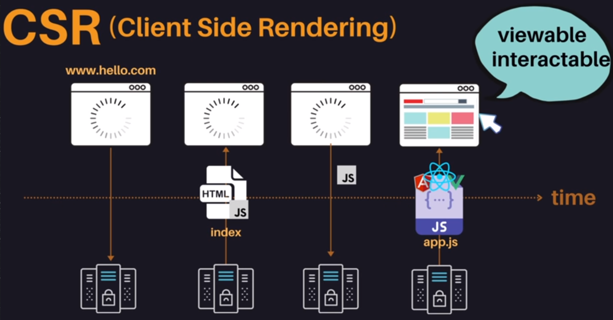
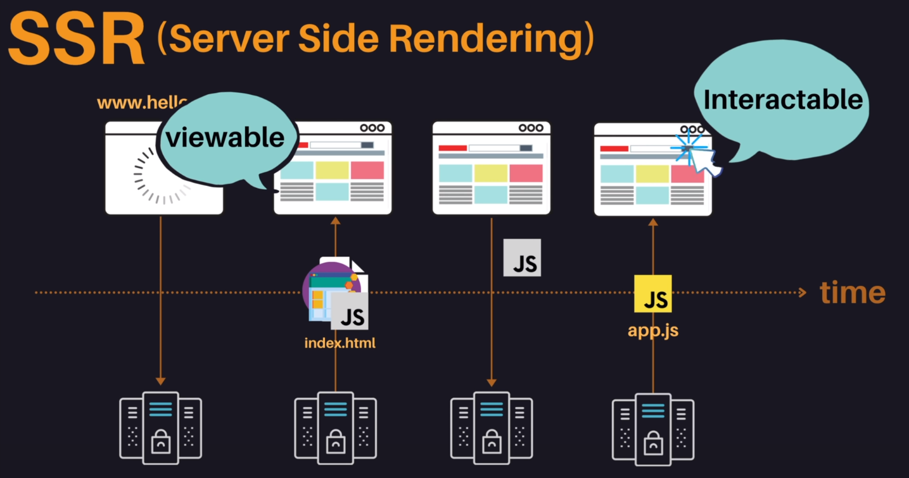

## TTV, TTI

- TTV (Time to View)

  사용자가 웹 브라우저에서 내용을 볼 수 있는 시점을 의미합니다.

- TTI (Time to Interact)

  사용자가 웹 브라우저에서 내용을 인터랙션을 할 수 있는 시점을 의미합니다.

### CSR의 TTV와 TTI

- 사이트에 접속을 합니다.

- CSR은 사이트에 접속하게 되면 서버에서 index.html 파일을 받아옵니다. 이 index.html 파일은 텅텅 비어져있기 때문에 사용자에게는 아무것도 보여지지 않습니다.

- 그리고 index.html파일의 `<script>` 태그로 명시되어 있는 JS파일을 요청합니다.

- 최종적으로 동적으로 HTML을 생성할 수 있는 어플리케이션 로직과 라이브러리가 담긴 JS파일을 받아오게 됩니다. 이 순간부터 사이트가 사용자에게 보여지게 되고, 클릭등의 인터랙션도 가능하게됩니다. (TTV, TTI)

**즉 CSR은 TTV와 TTI가 같습니다.**

### SSR의 TTV와 TTI

- 사이트에 접속을 합니다.

- 서버에서 이미 잘 만들어진 index.html파일을 받아와 사용자가 웹사이트를 볼 수 있습니다.(TTV)
  하지만 아직 동적으로 제어할 수 있는 JS파일을 받아오지 않았으므로 사용자가 클릭을 아무것도 처리할 수 없습니다.

- JS파일을 요청합니다.

- JS파일을 받아오게 되면 그때부터 사용자 인터랙션이 가능해집니다. (TTI)

**즉 SSR은 TTV와 TTI가 다릅니다.**

### 참고자료

- [TTV, TTI로 보는 CSR과 SSR의 차이](https://velog.io/@bcl0206/TTV%EC%99%80-TTI%EC%9D%98-%EA%B0%9C%EB%85%90%EA%B3%BC-CSR-SSR%EC%97%90%EC%84%9C-%EB%B9%84%EA%B5%90)
