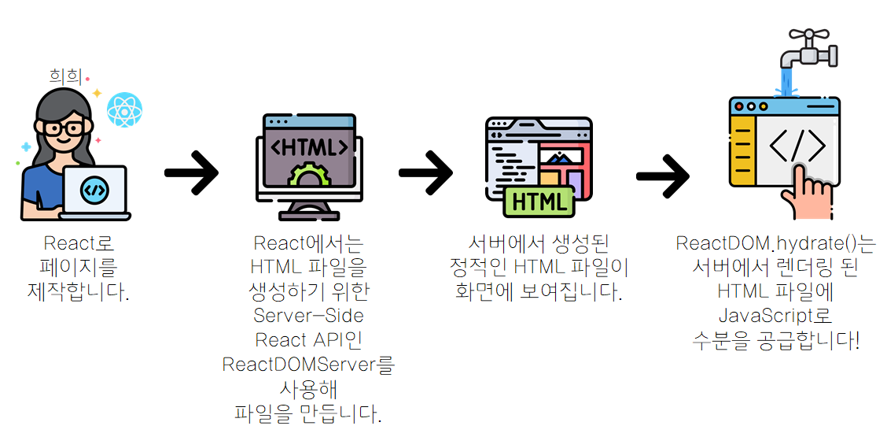

## Hydration

Server-Side에서 렌더링 된 정적 페이지(HTML)와 번들링 된 JS 파일을 클라이언트에게 보내면, Client-Side에서 HTML 코드와 JS(React) 코드를 서로 매칭시키는 과정으로 Hydration은 수분 공급이라는 의미를 갖습니다.

JS 코드들이 DOM 요소 위에 물을 채우듯 필요로 하던 요소들을 채운다하여 붙여진 이름이라고 합니다.

### Hydration의 진행 과정



- React로 페이지를 제작합니다.
- Next.js나 Gatsby와 같은 프레임워크는 React에서 HTML 파일을 생성하기 위한 React Server-Side API인 ReactDOMServer을 사용해 제작된 사이트의 프로덕션 단계 파일을 생성합니다.
- 만약 이때 웹 페이지를 보게 된다면, 서버로부터 생성된 정적인 HTML 파일을 보게 될 것입니다.
- 페이지 첫 로딩 이후 JS가 로드 되고, ReactDOM.hydrate() API는 JS와 함께 서버에서 렌더링되었던 HTML 페이지에 수분을 공급합니다.
- Hydration 이후, React reconciler API가 자리를 대체하고, 사이트는 상호작용이 가능해집니다.
- hydration이 적용되면 클릭 등의 이벤트나 모듈들이 적용되어 사용자 조작이 가능해집니다.

**사용자는 SSR을 통해 UI를 미리 보고, Hydration을 통해 페이지 조작이 가능해지는 것입니다.**

#### 두 번의 렌더링

Server-Side에서 Pre-Rendering 된 문서는 모든 JS 요소들이 배제된 굉장히 가벼운 파일이므로 사용자에게 빠르게 로드되는 웹 페이지를 제공할 수 있습니다.
**이는 같은 화면에 두 번 렌더링이 발생한다는 단점을 충분히 보완할 수 있는 장점입니다.**
더 나아가, Client-Side에서 JS 파일이 렌더링 될 때, 단지 각 DOM 요소에 JS 속성을 매칭시킬 뿐 실제 웹 페이지를 다시 그리는 `paint()` 함수까지 호출하지는 않습니다.

#### Hydration은 Next.js에서만 발생?

**Hydration은 Next.js만의 특별한 동작이 아니라 ReactDOM 함수입니다.**

- React: View를 만들기 위한 라이브러리
- ReactDOM
  - UI를 실제로 브라우저에 렌더링할 때 사용되는 라이브러리
  - 최상위 app에서 사용할 수 있는 DOM 관련 메서드를 제공

#### ReactDOM.hydrate()

`ReactDOM.render()`

- ReactDOM.render(element, container, [callback]);
- ReactDOM.render() 함수는 특정 컴포넌트를 두 번째 인자로 지정된 DOM 요소에 하위로 주입하여 렌더링을 처리해주는 함수입니다.
- 제공된 container에 element를 렌더링하고, component에 대한 참조를 반환합니다.
- 만약 이전에 element가 container에 렌더링 됐었다면, ReactDOM을 업데이트하고, 최종 React element의 반영이 필요할 때에만 DOM을 변경합니다.
- 렌더링이 완료되면 특정 이벤트를 처리하는 콜백 함수를 세 번째 인자로 넘겨줄 수 있습니다.
- container node를 수정하지 않고 자식만 수정합니다.
- 기존 자식을 덮어쓰지 않고 구성 요소를 삽입합니다.

`ReactDOM.hydrate()`

- ReactDOM.hydrate(element, container, [callback]);
- render() 메서드와 동일하지만 ReactDOMServer에서 HTML 컨텐츠를 렌더링한 container를 hydrate하기 위해 사용됩니다.
- SSR을 통해 이미 마크업이 채워져 있는 경우 다시 렌더링할 필요가 없으므로 hydrate를 통해 기존 마크업에 이벤트 리스너 등만 추가합니다.
- 특정 컴포넌트를 두 번째 인자로 지정된 DOM 요소에 하위로 hydrate 처리합니다.
- 렌더링을 통해 새로운 웹 페이지를 구성할 DOM을 생성하지 않습니다.
- 대신, 기존 DOM tree에서 해당되는 DOM 컴포넌트를 찾아 정해진 JS 속성(예: eventListener)만 부착시킵니다.

#### 동작 과정

- 서버에서 받아온 DOM tree와 자체적으로 렌더링한 tree를 비교합니다.
- 두 tree 사이의 차이점을 얻은 후, 자체적으로 Client-Side-Rendering한 tree와 비교하며 어떤 DOM과 매칭되는지 이해합니다.
- 이해한 내용에 따라 클라이언트 렌더링 동작을 진행합니다.

### SSR과 Hydration의 문제점

- 보여주기 전 모든 것을 다 가져와야 합니다.

  SSR은 컴포넌트가 데이터가 기다리는 것을 허용하지 않습니다.
  이는 곧 현재 제공되는 API를 사용하기 위해서는 HTML에 렌더링할 때 서버 측에서 컴포넌트에 필요한 데이터를 모두 준비해두어야 함을 의미합니다.
  클라이언트에 HTML 파일을 보내기 전 Server-Side에서 모든 데이터를 모아두어야 하는 것은 매우 비효율적입니다.

  예를 들어, 댓글이 있는 글을 렌더링한다고 가정해봅시다.
  댓글은 처음부터 보여질 필요가 있으므로, Server-Side HTML 출력물에 포함하려 합니다.
  하지만 DB나 API의 응답 속도를 조절할 수 없는 상황에서, 개발자는 두 가지 중 하나를 선택해야 합니다.
  HTML 출력물에서 제외시킬 경우 사용자는 JS 파일이 완전히 불러와지기 전까지는 댓글을 볼 수 없습니다.
  HTML 출력물에 포함시킬 경우 댓글이 불러와지고 전체 tree가 렌더링될 떄까지 사용자는 나머지 HTML 파일까지 전송받지 못합니다.

- Hydration을 위해서는 모든 것을 다 불러와야 합니다.

  React는 컴포넌트를 렌더링하는 과정에서 Server-Side에서 생성된 HTML 파일을 순회하며 이벤트 핸들러를 부착시킵니다.
  이게 동작하기 위해서는 브라우저에서 컴포넌트를 기반으로 생성한 tree가 서버에서 생성한 tree와 일치해야 합니다.
  Hydration은 단일 작업만 가능하므로, 따로 로드하려 할 경우 React는 HTML 코드의 일부분만으로는 무엇을 해야 할지 알 수 없어 Hydration에서 해당 코드를 삭제하게 됩니다.

  위의 예시에서, 페이지에는 댓글 부분말고도 Nav Bar, Side Bar 등에 사용된 JS 코드들이 존재할 것입니다.
  하지만 댓글에 대한 코드가 불러와지기 전까지는 다른 부분에 대해서도 Hydration을 진행할 수 없습니다.

- 상호작용을 하기 전 모든 항목에 대한 Hydration이 필요합니다.

  React는 한 번의 작업을 통해 tree에 대한 Hydration을 진행합니다.
  다시 말해, 컴포넌트 함수를 호출하는 과정이 한 번 시작되면 React는 전체 tree에 대해 이 과정을 완료하기 전까지 멈추지 않습니다.
  따라서 컴포넌트 중 어느 하나라도 상호 작용이 가능해지기 위해서는 모든 컴포넌트에 대한 Hydration이 완료되어야 합니다.
  한 번 Hydration이 시작되면, 전체 tree에 대해 Hydration이 완료되기 전까지 사용자는 다른 모든 기능(Nav Bar, Side Bar, ...)과도 상호작용할 수 없습니다.
  Nav Bar의 경우 페이지 자체의 이동에 필요한 기능인데 Hydration이 진행 중이면, 떠나고 싶은 페이지에 계속 남아있어야 하고, 이는 UX에 좋지 않습니다.

#### 해결방법

문제가 발생하는 이유는 모든 단계가 연결되어 진행되기 때문입니다.
데이터 가져오기(서버) => HTML로 렌더링(서버) => 코드 불러오기(클라이언트) => Hydration(클라이언트)
모든 과정에서 이전 단계가 끝날 때까지 전체 애플리케이션에서 다음 단계를 실행할 수 없습니다.
이를 해결하기 위해서는 작업을 분할하여 전체 애플리케이션이 아닌 각각의 부분들에 대한 작업 수행이 가능해져야 합니다.

- React 18: Streaming HTML && Selective Hydration

  **React18에서는 suspense를 사용해 두 개의 주요 SSR 기능을 추가했습니다.**

  - Streaming HTML

    서버에서 HTML 파일을 스트리밍의 형식으로 전달합니다.
    `renderToString` => `renderToPipeableStream`

  - Selective Hydration

    클라이언트에서 선택적으로 Hydration을 진행합니다.
    이를 위해 Client-Side에서 createRoot로 바꾼 뒤 애플리케이션의 부분부분을 Suspense로 감싸주어야 합니다.

**보여주기 전에 서버에서 다 가져와야 하는 문제를 해결합니다.**

```jsx
<Layout>
  <NavBar />
  <Sidebar />
  <RightPane>
    <Post />
    <Suspense fallback={<Spinner />}>
      <Comments />
    </Suspense>
  </RightPane>
</Layout>
```

댓글 부분을 Suspense로 감싸고, React로 하여금 준비되기 전까지 placeholder에 해당하는 컴포넌트를 보여줄 수 있게 합니다.
이를 통해 댓글 부분의 data fetching을 기다리지 않고 나머지 페이지에 대한 HTML을 스트리밍할 수 있습니다.
최초의 HTML에서는 댓글 관련 컴포넌트에 대한 코드가 사라집니다.

```html
<div hidden id="comments">
  <!-- Comments -->
  <p>First comment</p>
  <p>Second comment</p>
</div>
<script>
  document
    .getElementById("sections-spinner")
    .replaceChildren(document.getElementById("comments"));
</script>
```

서버 측에서 댓글에 해당되는 데이터가 준비되면, React에서는 동일한 스트림에 추가되는 HTML과 올바른 장소에 HTML을 위치시키기 위한 인라인 script 태그를 전송합니다.
클라이언트에서 React 자체가 불러와지기도 전에 늦게 도착한 댓글 부분의 HTML이 삽입됩니다.
이를 통해 화면 일부분에 대한 SSR을 포기하지 않고도 화면의 일부분만 선택하여 HTML 스트리밍 상에 나중에 들어오게 할 수 있습니다.
또한 이 덕분에 tree 상에서 더 먼 곳에 위치하는 컴포넌트의 렌더링이 이미 데이터가 전송된 다음에도 이루어질 수 있습니다.
따라서 전통적인 HTML 스트리밍 방식과 달리 위에서 아래로 내려가는 순서를 지킬 필요도 없습니다.

**Hydration을 위해서는 모두 불러와야 하는 문제를 해결합니다.**

```jsx
import { lazy } from "react";

const Comments = lazy(() => import("./Comments.js"));

// ...

<Suspense fallback={<Spinner />}>
  <Comments />
</Suspense>;
```

댓글을 위한 코드가 로딩되기 전 클라이언트 측에서 애플리케이션을 Hydration 할 수 없는 문제는 Code Splitting을 통해 해결하였습니다.
특정 코드 부분이 동기적으로 로드될 필요가 없음을 명시해줌으로써 큰 번들 사이즈를 피할 수 있습니다.
lazy를 사용하여 메인 번들에서 분리시킬 수 있습니다.
번들러는 이를 별도의 script 태그로 분리해줍니다.
이를 통해 위의 예시에서 댓글에 대한 UI가 아직 보이지 않더라도 다른 부분의 이벤트를 먼저 사용할 수 있게 됩니다.

**상호작용을 하기 전 모두 Hydration을 해야 하는 문제를 해결합니다.**

```jsx
<Layout>
  <NavBar />
  <Suspense fallback={<Spinner />}>
    <Sidebar />
  </Suspense>
  <RightPane>
    <Post />
    <Suspense fallback={<Spinner />}>
      <Comments />
    </Suspense>
  </RightPane>
</Layout>
```

위의 코드에서 NavBar와 Post만 Hydration이 완료 되고, SideBar와 Comments 컴포넌트는 HTML 스트리밍만 완료된 상태라고 합시다.
SideBar와 Comments 코드를 가지고 있는 번들이 불러와지고, React는 tree 상에서 먼저 발견되는 컴포넌트인 SideBar에 대한 Hydration을 먼저 진행하게 됩니다.
만약 이때 사용자가 댓글 부분을 클릭할 경우, React는 해당 클릭을 기록해두었다가 Comments 컴포넌트에 대한 Hydration에 우선순위를 부여합니다.
React는 이제 원래 수행하려 했던 SideBar에 대한 Hydration 대신 Comments 컴포넌트에 대한 Hydration을 먼저 진행합니다.
이를 통해 React는 최대한 빠르게 모든 것에 대한 Hydration을 완료하면서도 사용자의 동작에 기반해 화면 상에서 가장 급한 부분에 우선 순위를 부여합니다.

이제 서버 상에서 HTML을 보내기 전 모든 데이터가 불러와지기를 기다리지 않을 수 있습니다.
또한 Hydration을 시작하기 전 모든 JS 코드가 불러와지기를 기다리지 않아도 되고, 페이지 상의 상호 작용을 위해 모든 컴포넌트에 대한 Hydration이 완료되기를 기다리지 않아도 됩니다.

### 참고자료

- [[Next.js] Hydration](https://velog.io/@hamjw0122/Next.js-Hydration)
