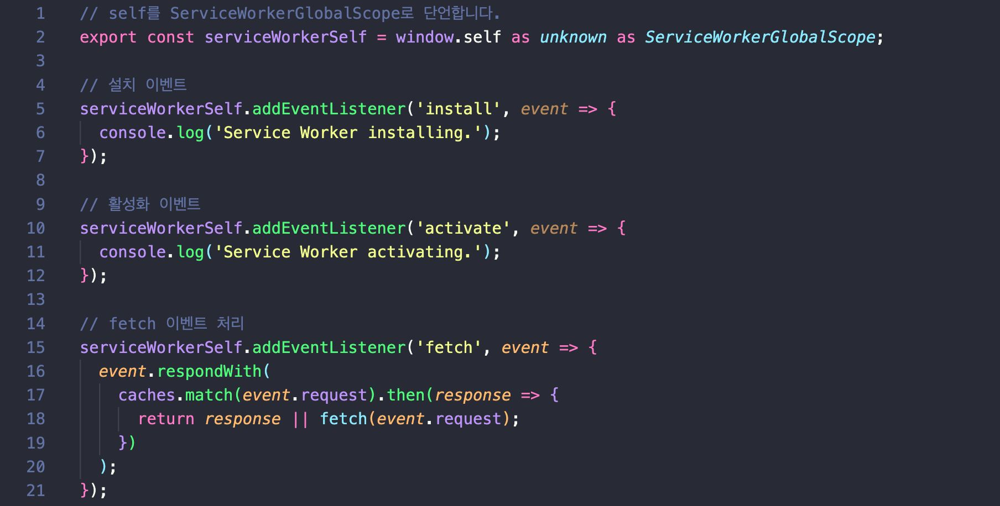
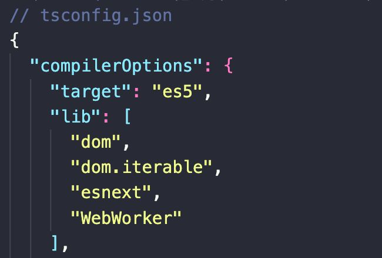
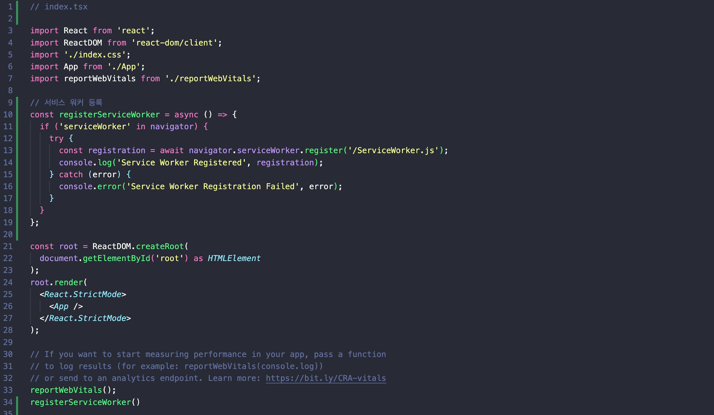
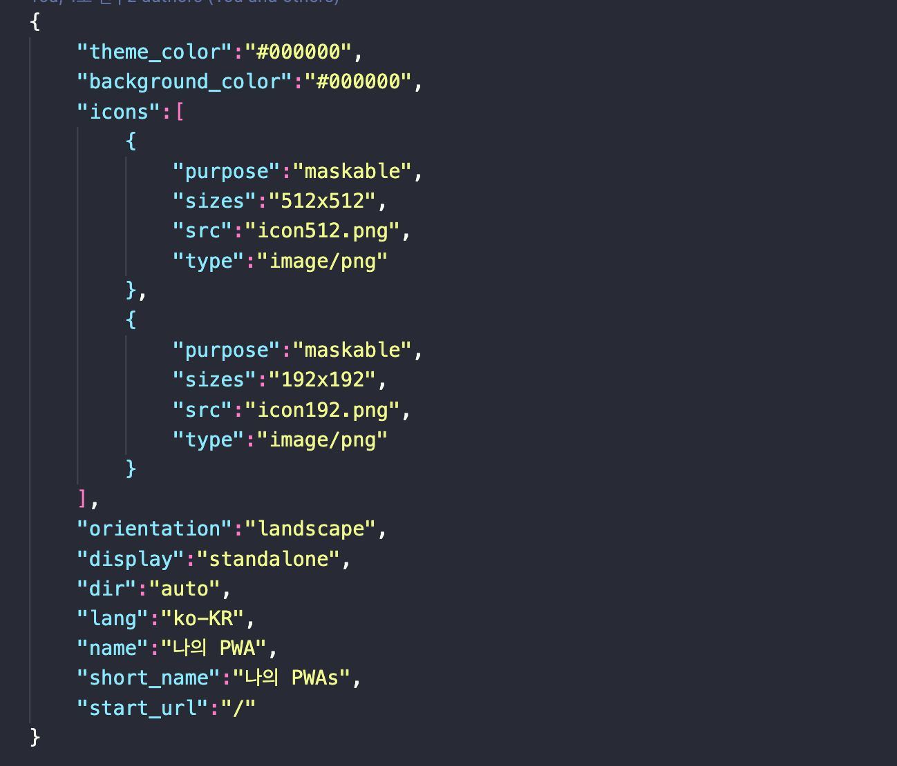
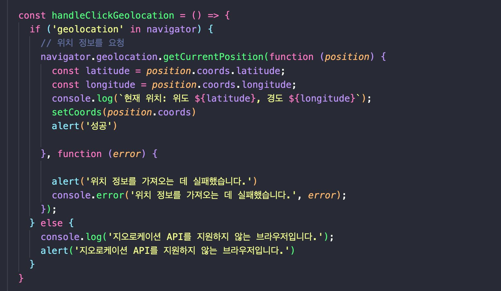

## PWA (Progressive Web App)

- 웹과 네이티브 앱의 장점을 결합한 애플리케이션

- 사용자에게 일관된 경험 제공을 목표로 하는 웹 기술

- 빠른 로딩, 푸시 알림, **오프라인 사용 가능한 ‘앱 같은’ 사용자 경험 제공**

- 서비스 워커

  - 네트워크 요청을 가로채고 캐싱하여 오프라인 사용지원

  - 앱 로딩 속도 향상 및 백그라운드 데이터 동기화

  - 푸시 알림: 사용자 참여 증대를 위한 메시지 전송

  - 오프라인 애셋 캐싱: 정적 자산을 브라우저 캐시에 저장하여 빠른 로딩 지원

- 웹 앱 매니페스트

  - 앱 아이콘, 시작 화면, 배경 색상 등의 사용자 인터페이스 설정

  - 사용자의 홈 화면에 앱 추가 기능 제공

  - 디스플레이 유형 (전체 화면, 스탠드얼론 등)

  - 시작 URL 및 네비게이션 범위 설정

- 장점

  - 모든 브라우저 및 장치에서 접근 가능

  - 별도의 앱 스토어 다운로드 없이 URL 접근으로 사용자 편의성 증대

  - **검색 엔진 최적화(SEO)를 통한 가시성 향상**

  - 서비스 워커를 통해 네트워크 연결 없이도 콘텐츠 접근 가능

  - 저속 연결 또는 오프라인 상황에서도 사용자 경험 유지

  - 비용 및 시간 효율성

  - 하나의 코드 베이스로 다양한 플랫폼에서 실행

  - 개발 및 유지보수 비용 절감

  - 빠른 설치와 즉각적인 업데이트 제공

- 단점

  - **네이티브 앱에 비해 일부 고급 기능 및 하드웨어 접근 제한**

  - 플랫폼별 최적화 기능 부족

  - 사용자 인식 부족

  - PWA에 대한 일반 사용자의 인식 및 이해도 낮음

  - 전통적인 앱 다운로드 경험과의 차이로 인한 초기 수용도 저하

  - 사용자 대상 및 애플리케이션의목적 이해 필요

  - 기존 네이티브 앱과의 경쟁 및 시장 포지셔닝 고려

  - **모든 브라우저에서 PWA기능의 일관된 지원 부족**

  - 일부 기능은 특정 브라우저에서만 제한적으로 사용 가능

### 다양한 캐싱 전략과 적용 사례

- 캐싱 전략의 종류

  - `Cache First`

    네트워크 요청 전 캐시 확인

  - `Network First`

    먼저 네트워크 요청, 실패 시 캐시 사용

- 각 캐싱 전략의 특징

  - `Cache First`

    빠른 로딩을 위해 적합

  - `Network First`

    항상 최신 콘텐츠 제공에 적합

- 적용 사례

  - 뉴스 웹사이트에서 `Network First`전략 사용으로 최신 뉴스 제공

  - 오프라인 블로그 플랫폼에서 `Cache First`전략 사용으로 빠른 로딩 제공

### 모바일 앱과 웹 애플리케이션의 경계 모호화

- PWA는 네이티브 앱과 유사한 사용자 경험 제공 (홈화면 아이콘, 전체 화면 등)

- 사용자가 웹과 앱 간 경계를 느끼지 못할 정도로 유사한 인터페이스와 기능 제공

#### 웹과 앱의 경계 모호화의 장단점

- 웹 기술의 발전으로 모바일 앱의 기능을 웹에서도 구현 가능

- 웹 애플리케이션의 접근성 향상과 배포 용이성, 그러나 기능 제한, 설치 측면에서의 고려 사항

### PWA 적용에 적합 및 비적합한 시나리오

#### 적합한 시나리오

- 뉴스 사이트, 블로그, 전자상거래 플랫폼 등 다양한 장치에서 접근이 필요한 서비스

- 주로 정보 제공 및 라이트 유저 인터랙션을 목적으로 하는 애플리케이션

#### 비적합한 시나리오

- 고급 그래픽 및 복잡한 하드웨어 기능이 필요한 게임 및 전문적 애플리케이션

- 특정 모바일 OS 기능에 의존하는 서비스

### 적용하기

- service-worker.ts

- tsconfig 설정

- service-worker 등록

- manifest.json

### API 적용해보기

- geolocation

### 참고자료

- [원티드 챌린지]()
