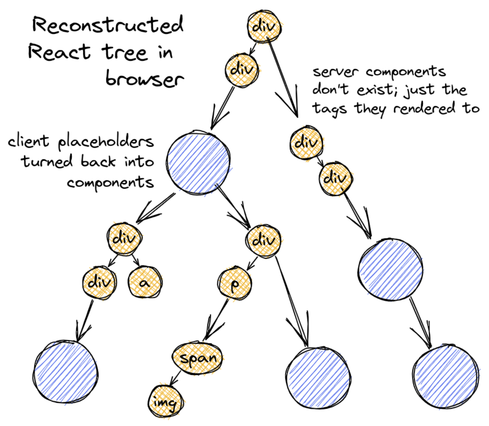

## RSC(React Server Component) vs RCC(React Client Component)

React Server Component(줄여서 RSC)는 React18부터 도입된 개념으로, 말 그대로 서버에서 동작하는 컴포넌트를 가리킵니다. 이전 버전에서 우리가 사용하던 모든 컴포넌트가 바로 클라이언트 컴포넌트입니다.

방금 언급했듯이 서버 컴포넌트와 클라이언트 컴포넌트의 **가장 큰 차이점은 컴포넌트가 렌더링되는 장소가 서버냐 클라이언트냐의 차이입니다.** 서버 컴포넌트는 서버에서 한차례 해석된 이후 클라이언트로 전달되고, 클라이언트 컴포넌트는 클라이언트가 js 번들을 다운로드 받은 후 해석하게 됩니다.


위 표에서 볼 수 있듯, RSC와 RCC는 렌더링되는 위치가 다르기 때문에 각각 할수있는 역할이 명확하게 구분되어 있습니다. “즉 RSC가 새로나온 개념이니까 RCC보다 무조건 좋겠지?”라는 접근이 아니라 RSC와 RCC를 적재적소에 배치하여 개발하려는 접근이 필수적이라고 할 수 있습니다.

### RSC의 동작 방식

RSC의 특징을 이해하고 RSC와 RCC를 적재적소에 배치하기 위해서는 실제로 RSC가 어떻게 렌더링되는지 이해할 필요가 있다. 아래와 같이 RSC와 RCC를 적절하게 혼합하여 구성한 스크린이 있다고 가정해 봅시다.


사용자는 해당 페이지를 띄우기 위해 서버로 요청을 날립니다.
그러면 서버는 이때부터 컴포넌트 트리를 root부터 실행하며 직렬화된 json형태로 재구성하기 시작합니다.

#### 직렬화 (serialization)

직렬화란 데이터 스토리지 문맥에서 데이터 구조나 오브젝트 상태를 동일하거나 다른 컴퓨터 환경에 저장(이를테면 파일이나 메모리 버퍼에서, 또는 네트워크 연결 링크 간 전송)하고 나중에 재구성할 수 있는 포맷으로 변환하는 과정입니다.

쉽게 말해서 특정 개체를 다른 컴퓨터 환경으로 전송하고 재구성할 수 있는 형태로 바꾸는 과정이라고 할 수 있다. 우리가 흔히 사용하는 JSON.stringify함수가 바로 직렬화를 수행하는 함수이며, JSON.parse가 역직렬화를 수행하는 함수다. 주의할점은 모든 객체를 직렬화할 수는 없다는 것이다.

대표적으로 function은 직렬화가 불가능한 객체입니다. function이 실행코드와 실행 컨텍스트를 모두 포함하는 개념이기 때문인데, 함수는 자신이 선언된 스코프에 대한 참조를 유지하고, 그 시점의 외부 변수에 대한 참조를 기억하고 있습니다. js의 클로저가 바로 이런 현상을 가리키는 용어이기도 합니다.

```jsx
const a = 100;

const sample = () => {
  console.log(a);
};

sample(); //100
```

이처럼 함수의 실행 컨텍스트, 스코프, 클로저까지 직렬화할 수는 없기 때문에 function은 직렬화가 불가능한 객체로 분류되는 것입니다.

직렬화 과정은 모든 서버 컴포넌트에서 실행하여 json 객체 형태의 트리로 재구성할 때까지 진행됩니다. 예를들면 다음과 같습니다.

```jsx
<div style={{backgroundColor:'green'}}>hello world</div> //JSX 코드는 createElement의 syntax sugar다.

> React.createElement(div,{style:{backgroundColor:'green'}},"hello world")

> {

$$
typeof: Symbol(react.element),
type: "div",
props: { style:{backgroundColor:"green"}, children:"hello world" },
...
} //이런 형태로 모든 컴포넌트를 순차적으로 실행한다.
```

다만 이 과정을 모든 컴포넌트에 대하여 진행하는게 아니라, RCC일 경우 건너뛰게 됩니다. 하지만 RCC를 서버에서 해석하지 않고 건너 뛴다고해서 비워 둔다면 실제 컴포넌트 트리와 괴리가 생기게 됩니다. 따라서 RCC의 경우 직접 해석하는 것이 아니라 “이곳은 RCC가 렌더링되는 위치입니다”라는 placeholder를 대신 배치해줍니다.

```jsx
{
$$typeof: Symbol(react.element),
type: {
  $$typeof: Symbol(react.module.reference),
  name: "default", //export default를 의미
  filename: "./src/ClientComponent.js" //파일 경로
},
props: { children: "some children" },
}
```

아까도 언급했듯이 RCC는 곧 함수이므로, 직렬화를 할 수 없습니다. 따라서 함수를 직접 참조하는 것이 아니라 “module reference” 라고 하는 새로운 타입을 적용하고, 해당 컴포넌트의 경로를 명시함으로써 직렬화를 우회하고 있습니다.

이러한 직렬화 작업을 마친 후 생성된 JSON Tree를 도식화하면 다음과 같은 형태를 띠고 있습니다.


이제 이렇게 도출된 결과물을 Stream 형태로 클라이언트가 전달받게 되고, 함께 다운로드한 js bundle을 참조하여, module reference 타입이 등장할 때마다 RCC를 렌더링해서 빈 공간을 채워놓은 뒤, DOM에 반영하면 실제 화면에 스크린이 보여지게 되는 것입니다.



#### RSC의 제약사항

이 일련의 과정으로부터 우리는 RSC와 RCC를 함께 사용할 때 몇가지 제약사항을 도출해낼 수 있습니다.

- RSC에서 RCC로 function과 같이 직렬화 불가능한 객체를 prop으로 넘겨줄 수 없습니다.

  - RSC는 서버에서 해석되어 직렬화된 JSON 형태로 변환됩니다. 그 때문에 서버컴포넌트를 설명하는 모든 요소는 ‘직렬화 가능해야 한다’는 전제조건이 붙습니다. 만약 RSC가 child에게 function을 prop으로 넘겨주면 위와같이 JSON에 이 사실이 명시되어야 하므로, 에러가 발생할 수 있습니다.

```jsx
{
$$typeof: Symbol(react.element),
type: "div",
props: {
		children: {
		  $$typeof: Symbol(react.element),
        type: {
          $$typeof: Symbol(react.module.reference),
          name: "default",
          filename: "./src/ClientComponent.js"
        },
		  props: {callback:function}, // 이처럼 JSON에 function이 명시되어야만 한다.
		  ...
		}
	},
...
}
```

정정 추가) 하지만 RSC에서 다른 RSC로 function을 넘기는건 아무 문제 없이 가능합니다. 정확한 이유는 모르겠지만 어차피 서버에서 렌더링되는 RSC간의 함수 전달을 굳이 client로 넘기는 스트림에 서술할 필요가 없기 때문에 생략하거나 placeholder로 대신한게 아닐까 하고 짐작하고 있습니다.
또한, next의 server action을 사용하면 RSC에서 RCC로 함수를 전달할 수도 있는데, 아래와 같이 RSC에서 'use server' directive와 함께 함수를 정의하면 RCC로 넘겨줄 수 있습니다.

```jsx
const ServerComponent = () => {
  const add = async (a: number, b: number) => {
    "use server";
    return a + b;
  };

  return (
    <div>
      <ClientComponent addFunc={add} />
    </div>
  );
};
```

다만, 해당 function의 params와 return은 모두 직렬화 가능해야한다는 조건이 붙습니다. server action으로 선언한 함수를 RSC에서 RCC로 넘겨줄 때는 function 자체를 넘겨준다기보다, api의 명세를 넘겨주고, 함수를 호출하면 서버에 api를 호출하고 그 결과값을 받아오는 것처럼 동작하여 제약사항을 우회하는 것이 아닌가 추측하고 있습니다. 자세한 내용은 [Next 공식 문서의 server action](https://nextjs.org/docs/app/building-your-application/data-fetching/server-actions-and-mutations)을 살펴보길 바랍니다.

- RCC는 RSC를 직접 return해줄 수 없으며, 반드시 children prop의 형태로 넘겨주어야 합니다.

  - 서버에서 모든 RSC가 순차적으로 실행되며, 중간에 RCC를 만나면 placeholder로 표시해두고 넘어간다고 했습니다. 즉, RCC는 실행되지 않기 때문에 RCC 내부에서 반환되는 RSC또한 (서버 컴포넌트임에도 불구하고) 서버에서 실행되지 못합니다. 이러한 경우 해당 RSC는 RCC와 동일하게 클라이언트에서 동작하게 됩니다.

  - 하지만 children prop을 통해 RSC를 넘기게 되면, 사실상 공통 부모가 렌더링 되는 시점에 RSC가 실행이 되고, 그 결과값을 children으로 전달할 수 있습니다.

```jsx
function ParentClientComponent({children}) {
...
return <div onChange={...}>{children}</div>;
}

function ChildServerComponent() {
...
return <div>server component</div>;
}

function ContainerServerComponent() {
return <ParentClientComponent>
<ChildServerComponent/>
</ParentClientComponent>;
}
```

위와 같이 “ChildServerComponent”는 “ParentClientComponent”의 자식 컴포넌트이지만, 사실상 “ContainerServerComponent”를 공통부모로 갖고 있기 때문에 “ContainerServerComponent”가 렌더링되는 시점에 “ChildServerComponent”도 함께 렌더링되어 그 결과값이 “ParentClientComponent”에 넘겨지고 있습니다.

```jsx
{
// The ClientComponent element placeholder with "module reference"

$$typeof: Symbol(react.element),
type: {
 $$typeof: Symbol(react.module.reference),
 name: "default",
 filename: "./src/ParentClientComponent.js"
},
props: {
 children: {
   $$typeof: Symbol(react.element),
   type: "div",
   props: {
     children: "server component"
   }
 }
}
}
```

### 참고자료

- [Next) 서버 컴포넌트(React Server Component)에 대한 고찰](https://velog.io/@2ast/React-%EC%84%9C%EB%B2%84-%EC%BB%B4%ED%8F%AC%EB%84%8C%ED%8A%B8React-Server-Component%EC%97%90-%EB%8C%80%ED%95%9C-%EA%B3%A0%EC%B0%B0)
  $$
