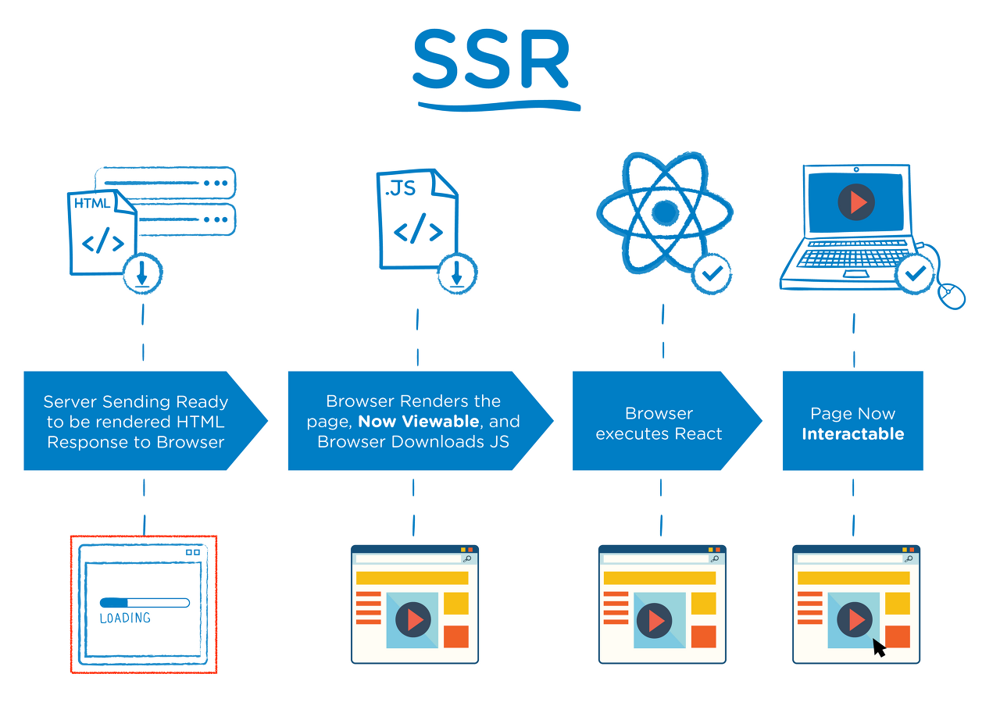
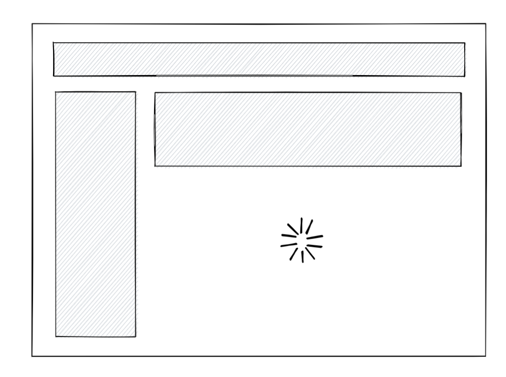

## React의 SSR

SSR(Server Side Rendering)은 서버에서 사용자에게 보여줄 페이지를 모두 구성하여 사용자에게 페이지를 보여주는 방식으로, 서버를 이용해서 페이지를 구성하기 때문에 클라이언트에서 구성하는 CSR(Client Side Rendering)보다 페이지를 구성하는 속도는 늦어지지만 전체적으로 사용자에게 보여주는 콘텐츠 구성이 완료되는 시점은 빨라집니다. 더불어 SEO(search engine optimization) 또한 쉽게 구성할 수 있습니다.

### SSR + SPA = Universal SSR



React에서 말하는 SSR은 SPA(Single Page Application)까지 접목된 Universal SSR입니다.
첫 요청에만 SSR을 수행하고 그 이후에 SPA로 동작합니다.

- 장점

  SSR로 완성된 HTML을 내려줌으로써 SEO와 빠른 초기 렌더링
  SPA의 장점인 페이지 이동 시 빠른 렌더 속도

### React에서 SSR하기

SSR 순서

- 서버에서 전체 앱 데이터를 가져옵니다.
- 서버에서 앱 전체를 HTML로 렌더링하고 응답으로 보냅니다.
- 클라이언트에서 전체 앱에 대한 JS코드를 로드합니다.
- 클라이언트에서 JS로직을 전체 앱에 연결합니다. (hydration)

**요약하자면, 서버에서 React Component를 렌더링하고, 서버렌더링 결과물을 클라이언트 결과물에 Hydrate하면 됩니다.**

#### v 18 Suspense SSR Architecture



- v 18 이전

  위의 SSR순서를 지켜야만 했지만, 이전 단계가 완료되지 않으면 다음 단계로 진행하지 못했습니다.
  모든 곳에 hydration를 끝내야 인터렉션이 가능했습니다.
  따라서, 기존 waterful 방식의 SSR을 개선해야만 했었습니다.

- v 18 이후

  앱을 작은 유닛으로 분할하여 독립적으로 단계를 거치게 됩니다.
  Suspense를 사용하여 각 Component의 로딩상태가 분리되며, 로딩이 끝난 컴포넌트들은 그 다음 단계 (html streaming, hydrating)를 진행됩니다.

### SSR 메서드

- `renderToPipeableStream`
- `renderToReadableStream`
- `renderToString`
- `renderToStaticMarkup`

총 이 4가지 메서드들 중 하나를 이용하여 SSR을 할 수 있습니다.
이 중 `renderToString`과 `renderToStaticMarkup`은 v 0.14.3부터 추가가 되어졌으며, `renderToPipeableStream`과 `renderToReadableStream`은 v 18.0.0부터 추가가 되어졌습니다.

#### renderToPipeableStream

Node.js 환경에서 구동되는 메서드로, React Element를 초기 HTML로 렌더링됩니다. 출력 처리할 pipe(res) 메서드와 이를 중단하는 abort() 메서드가 있는 스트림을 반환합니다. 나중에 `<script>` 태그를 통해 HTML의 Suspense와 스트리밍을 지원합니다.

```jsx
let didError = false;
const stream = renderToPipeableStream(<App />, {
  onShellReady() {
    // The content above all Suspense boundaries is ready.
    // If something errored before we started streaming, we set the error code appropriately.
    res.statusCode = didError ? 500 : 200;
    res.setHeader("Content-type", "text/html");
    stream.pipe(res);
  },
  onShellError(error) {
    // Something errored before we could complete the shell so we emit an alternative shell.
    res.statusCode = 500;
    res.send(
      '<!doctype html><p>Loading...</p><script src="clientrender.js"></script>'
    );
  },
  onAllReady() {
    // If you don't want streaming, use this instead of onShellReady.
    // This will fire after the entire page content is ready.
    // You can use this for crawlers or static generation.
    // res.statusCode = didError ? 500 : 200;
    // res.setHeader('Content-type', 'text/html');
    // stream.pipe(res);
  },
  onError(err) {
    didError = true;
    console.error(err);
  },
});
```

#### renderToReadableStream

Web Stream(즉, 브라우저) 환경에서 구동되는 메서드로, React 요소를 초기 HTML로 스트리밍합니다.
readable stream으로 해결되는 Promise를 반환하고, Suspense와 HTML Streaming을 완전히 지원합니다.

```jsx
let controller = new AbortController();
let didError = false;
try {
  let stream = await renderToReadableStream(
    <html>
      <body>Success</body>
    </html>,
    {
      signal: controller.signal,
      onError(error) {
        didError = true;
        console.error(error);
      },
    }
  );

  // This is to wait for all Suspense boundaries to be ready. You can uncomment
  // this line if you want to buffer the entire HTML instead of streaming it.
  // You can use this for crawlers or static generation:

  // await stream.allReady;

  return new Response(stream, {
    status: didError ? 500 : 200,
    headers: { "Content-Type": "text/html" },
  });
} catch (error) {
  return new Response(
    '<!doctype html><p>Loading...</p><script src="clientrender.js"></script>',
    {
      status: 500,
      headers: { "Content-Type": "text/html" },
    }
  );
}
```

#### renderToString

스트림을 지원하지 않는 환경에서도 쓸 수 있고, React Element를 초기 HTML로 렌더링합니다. HTML 문자열을 반환합니다.

v 18기준으로 Suspense 지원이 제한적이며, 서버에서 렌더링이 일시 중단될 때 더이상 오류가 발생되지 않습니다. 대신 가장 가까운 Suspense에 대한 대체 HTML을 내보낸 다음 클라이언트에서 동일한 컨텐츠 렌더링 시도합니다.

#### renderToStaticMarkup

스트림을 지원하지 않는 환경에서도 쓸 수 있습니다. renderToString과 유사하지만, data-reactroot와 같이 React가 내부적으로 사용하는 추가 DOM 특성이 생성되지 않습니다. 이 기능은 React를 단순한 정적 페이지 생성기로 사용할 때 유용합니다. 추가 속성을 제거하면 바이트를 절약할 수 있기 때문입니다. 클라이언트에서 리액트를 사용하여 마크업을 인터랙티브하게 할 계획이라면 이 방법을 사용하면 안됩니다.

v 18기준으로 Suspense 지원이 제한적이며, 서버에서 렌더링이 일시 중단될 때 더이상 오류가 발생되지 않습니다. 대신 가장 가까운 Suspense에 대한 대체 HTML을 내보낸 다음 클라이언트에서 동일한 컨텐츠 렌더링 시도합니다.

- `data-reactroot`

리액트 컴포넌트의 루트 엘리먼트를 식별해주는 속성입니다.

### renderToString ⇒ renderToPipeableStream

앞서 말했듯이 React에서는 renderToString에서 renderToPipeableStream으로 교체할 것을 권장하고 있습니다.

- renderToString에서는 서버 렌더링 오류가 발생하면 렌더링을 클라이언트에게 넘기기 때문에, 초기 컨텐츠가 비어있을 수 있습니다.
- Suspense 기능이 완전히 지원됩니다.
- lazy HTML Streaming이 적용됩니다.

### 참고자료

- [Next.js 아닌 React SSR에 대하여](https://cheri.tistory.com/298)
