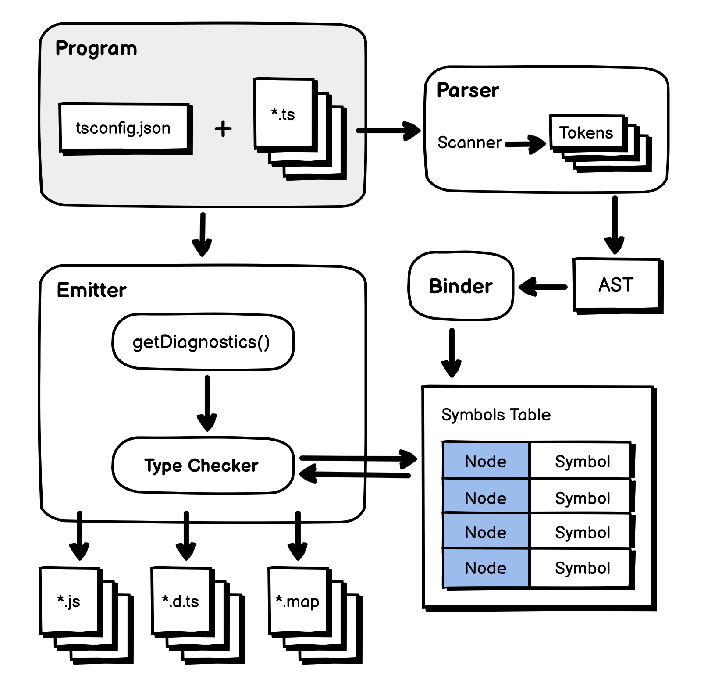
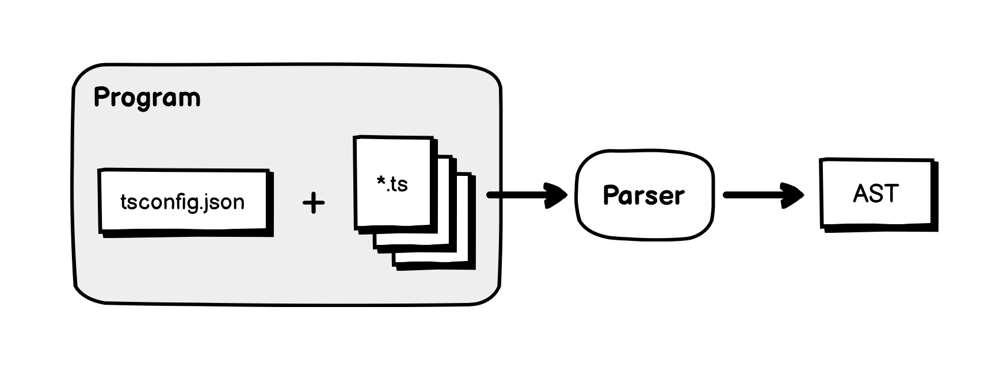
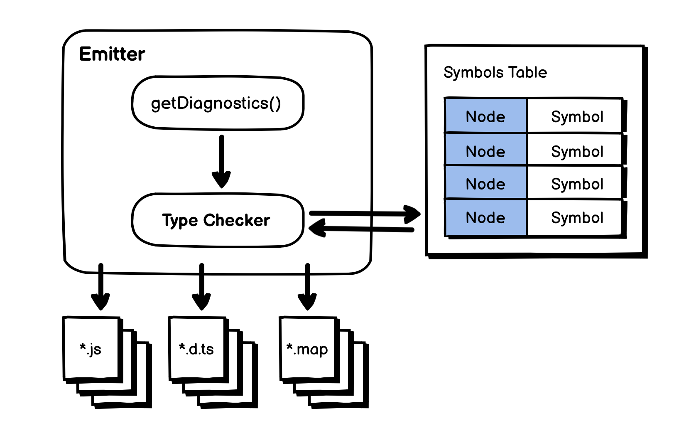

## Typescript의 컴파일 과정


타입스크립트 컴파일러는 타입스크립트 코드를 분석하여 타입 정의 파일(.d.ts) 또는 소스 맵(.js.map)과 함께 자바스크립트(\*.js)로 컴파일하는 도구입니다.

만약 소스 파일에 문제가 있다면, 타입스크립트 컴파일러는 문제를 진단하여 우리에게 무엇이 잘못되었고 어떻게 고칠 수 있는지를 알려줍니다.

### 컴파일 과정

컴파일은 내부적으로 많은 부분이 관여하는 복잡한 과정입니다. 다음은 컴파일 과정에 대한 모식도입니다.



tsc 명령어를 입력하면 컴파일 과정이 시작됩니다. 이를 실행하려면 타입스크립트 컴파일러는 tsconfig.json 파일이 필요합니다. 이 파일은 핵심적인 두 부분인 Compiler Options와 Input Files 를 정의합니다.

```json
{
    "files": [
        "src/*.ts"
    ],
    "compilerOptions": {
        ...
    }
}
```

컴파일 컨텍스트는 src/compiler/program.ts 파일에 정의되어있는 Program 객체로 생성됩니다. 생성된 후에는 모든 입력 파일과 import를 로드합니다. 그리고 각각의 파일을 AST(Abstract Syntax Tree)로 변환하기 위해 Parser(src/compiler/parser.ts에 정의)를 호출합니다.



내부적으로 Parser는 Scanner(src/compiler/scanner.ts에 정의) 인스턴스를 생성합니다. 이 인스턴스는 소스 코드를 스캔하고 SyntaxKind 토큰 스트림을 생성합니다.

파싱 과정은 여기서 끝나지 않습니다. 이후 Binder(src/compiler/binder.ts에 정의)는 AST를 제공받아 AST Node와 Symbol 사이에 맵을 생성합니다.


Symbol은 각 Node의 타입 정보를 저장하는 추가적인 메타데이터입니다. Binder는 타입 검사와 같이 나중 단계에서 활용될 Symbol Table을 생성합니다.

이후 Program.emit이 호출되면 AST를 자바스크립트 소스 코드 및 기타 항목의 문자열로 변환하기 위해 Emit Worker가 생성됩니다. Emitter에는 2가지 종류가 있습니다.

- 자바스크립트 Emitter

  src/compiler/emitter.ts에 정의되어있고, 자바스크립트 소스 코드와 소스 맵을 생성합니다.

- 타입 정의 Emitter

  src/compiler/definitionEmitter.ts에 정의되어있고, 타입 정의 파일을 생성합니다.
  Emitter가 실행될 때, Type Checker(src/compiler/checker.ts에 정의)를 생성하기 위해 getDiagnostics() 함수를 호출합니다. 그런 뒤 Emitter는 각각의 Node를 처리하기 위해 AST를 순회합니다.

각 Node에서 Symbols Table의 타입 데이터를 이용하여 코드를 분석하고, 모든 과정이 잘 진행되었다면 마지막으로 자바스크립트 소스가 생성됩니다.



### 에러 보고

컴파일러가 오류를 어느 단계에서 발견했는지에 따라서 컴파일 과정에서 여러 종류의 에러가 반환됩니다.

```jsx
enum BuildResultFlags {
None = 0,
Success = 1 << 0,
DeclarationOutputUnchanged = 1 << 1,

    ConfigFileErrors = 1 << 2,
    SyntaxErrors = 1 << 3,
    TypeErrors = 1 << 4,
    DeclarationEmitErrors = 1 << 5,
    EmitErrors = 1 << 6,

    AnyErrors = ConfigFileErrors | SyntaxErrors | TypeErrors | DeclarationEmitErrors | EmitErrors

}
```

예를 들어, tsconfig.json 파일에 에러가 있다면 ConfigFileErrors가 반환될 것입니다.

만약 Scanner에 의해 에러가 발견되었다면, SyntaxErrors가 반환될 것입니다. 때때로 코드가 올바른 구문으로 작성되었지만 의미상으로 올바르지 않은 경우가 있습니다. 이 경우 대부분 TypeErrors가 발생합니다. 이는 Parser 또는 Type Checker에 의해 발견됩니다. TypeErrors 에러가 발생하는 예시는 아래와 같습니다.

```jsx
let a: number = "hello";
```

이 코드는 올바른 구문으로 작성되었지만, 숫자 타입 변수에 문자열을 할당할 수 없으므로 의미상 올바르지 않습니다.

### 참고자료

- [(번역) 타입스크립트 컴파일러가 컴파일하는 방법](https://velog.io/@sehyunny/how-ts-compiler-compiles)
