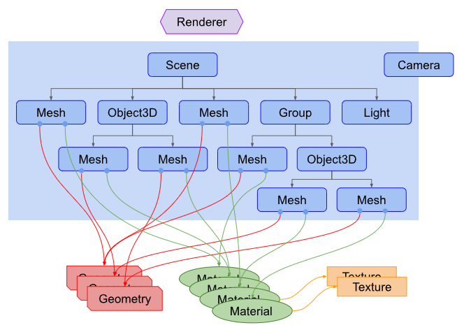
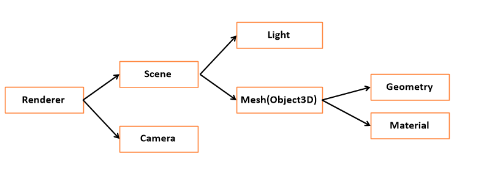

## Three.js

Three.js의 기본개념은, Scene을 만들어 그 안에 3D 객체를 넣고, 그걸 Camera로 비추는 것 그리고 그 전체를 Renderer를 통해 HTML Canvas안에 Rendering하여 보여주는 것입니다.

Three.js 앱의 구조부터 간략히 살펴보면 다음과 같습니다. Three.js 앱을 만들려면 다양한 객체를 생성해 연결해야 합니다. 아래는 Three.js 앱의 구조를 도식화한 것입니다.



아래는 자주 쓰는 것들을 단순하게 도식화 한 것입니다.



- Renderer

  Scene과 Camera객체를 넘겨 받아 카메라의 절두체 안의 3D Scene의 일부를 2차원 평면 이미지로 렌더링합니다.

- Scene

  Scene은 광원인 Light와 Mesh로 구성됩니다.
  Scene graph는 Scene 또는 다수의 Mesh, Light, Group, Object3D, Camera로 이루어진 트리구조입니다. 
  Scene은 Graph의 최상위 노드로 Backgroun color, fog등의 요소를 포함합니다.

- Camera

  Camera는 Scene 그래프에 포함되지 않습니다.

- Light

  여러 종류의 광원있으며, 다양한 객체가 있습니다.

- Mesh(Object3D)

  Mesh는 형상을 정의하는 Geometry와 색상과 투명도를 정의하는 Material로 정의된다.  
  Material과 Gemoetry는 재사용이 가능해 여러개의 Mesh가 하나의 Material과 Gemoetry를 동시 참조가 가능하다.

- Geometry

  구, 정육면체 면, 등등 다양한 것이 될 수 있으며 내장 객체를 통해 만들수도 있고, 파일을 통해 가져와 형상을 만들 수 있습니다.

- Material

  표면 속성으로 색상, 투명도, 질감등을 사용합니다.

### 사용법

```html
<!DOCTYPE html>
<html>
  <head>
    <meta charset="utf-8" />
    <meta http-equiv="X-UA-Compatible" content="IE=edge" />
    <title>Page Title</title>
    <meta name="viewport" content="width=device-width, initial-scale=1" />
    <link rel="stylesheet" type="text/css" media="screen" href="01-basic.css" />
    <script src="01-basic.js" type="module" defer></script>
  </head>
  <body>
    <!--3차원 그래픽 캔버스 요소가 추가될 예정.-->
    <div id="webgl-container"></div>
  </body>
</html>
```

```css
css * {
  outline: none;
  margin: 0;
}

body {
  overflow: hidden;
}

#webgl-container {
  position: absolute;
  top: 0;
  left: 0;
  width: 100%;
  height: 100%;
}
```

```jsx
import * as THREE from "/node_modules/three/build/three.module.js";

console.log(THREE);

/*

 '_' 로 시작하는 Method와 Field는 Private 이라고 보면됨.
 JS는 private 성격을 부여할 수 있는 기능이 없어, _로 약속을 정의함.

*/

class App {
  constructor() {
    const divContainer = document.querySelector("#webgl-container");
    this._divContainer = divContainer; //다른 메서드에서 참조 할 수 있도록 함.

    // [STEP 1] Renderer 세팅
    const renderer = new THREE.WebGLRenderer({
      // 생성할때 다양한 옵션을 설정할 수 있음.
      antialias: true, // antialias : true => 경계선의 계단현상을 없애줌
    });
    // renderer의 PixelRatio값을 device값을 받아 세팅
    renderer.setPixelRatio(window.devicePiexelRatio);

    // div컨테이너의 자식에 추가
    divContainer.appendChild(renderer.domElement); //canvas타입의 DOM 객체

    this._renderer = renderer; // renderer를 다른 메서드에서 참조 할 수 있도록 정의

    // [STEP 2] Scene 객체 생성
    const scene = new THREE.Scene();
    this._scene = scene; // scene을 다른 메서드에서 참조 할 수 있도록 정의

    // [STEP 3] Camera 객체 생성
    this._setupCamera();

    // [STEP 4] Ligth 객체 생성
    this._setupLight();

    // [STEP 5] 3차원 모델 객체 생성
    this._setupModel();

    //[STEP 6] resize check

    // 창크기가 변경할때 발생하는 이벤트
    // -> Renderer와 Camera는 창이 변할때 설정값을 재설정 해줘야 하기 때문에 필요함.
    // bind를 사용하는 이유 : this가 App객체 되기 위함.
    window.onresize = this.resize.bind(this);
    this.resize(); //생성자에서 무조건 실행함으로써 재설정.

    // render 메서드는 3차원 그래픽 을 만들어주는 메서드
    // 최대한 빠르게 render메서드를 호출해줌.
    requestAnimationFrame(this.render.bind(this));
  }

  _setupCamera() {
    // 크기를 얻어옴.
    const width = this._divContainer.clientWidth;
    const height = this._divContainer.clientHeight;

    const camera = new THREE.PerspectiveCamera(75, width / height, 0.1, 100);

    camera.position.z = 2;
    this._camera = camera;
  }

  _setupLight() {
    //광원의 색상, 광원의 세기값이 필요함
    const color = 0xffffff; //색상
    const intensity = 1; //세기값

    const light = new THREE.DirectionalLight(color, intensity);

    //광원의 위치
    light.position.set(-1, 2, 4);

    //scene에 구성요소로 Light를 넣어줌.
    this._scene.add(light);
  }

  _setupModel() {
    // 정육면체를 생성하는 코드.
    // Mesh 엔 Geometry, Material
    const geometry = new THREE.BoxGeometry(1, 1, 1); //가로 세로 깊이
    const material = new THREE.MeshPhongMaterial({
      color: 0x44a88, // 파란색
    });

    // Mesh가 생성
    const cube = new THREE.Mesh(geometry, material);

    // Scene에 담음.
    this._scene.add(cube);
    this._cube = cube;
  }

  //창크기가 변경될때 발생하는 메서드
  resize() {
    // divContainer의 크기를 얻어옴.
    const width = this._divContainer.clientWidth;
    const height = this._divContainer.clientHeight;

    // 카메라의 속성값을 설정해줌
    this._camera.aspect = width / height;
    this._camera.updateProjectionMatrix();

    // 렌더러를 속성값을 설정
    this._renderer.setSize(width, height);
  }

  // 장면의 Animation에 이용
  render(time) {
    // 렌더링 하라
    this._renderer.render(this._scene, this._camera);

    // update메서드 안에서 속성값을 변경하여 애니메이션 효과를 발생시킴.
    this.update(time);

    // 생성자에서 호출했던 코드와 동일
    requestAnimationFrame(this.render.bind(this));
  }

  update(time) {
    time *= 0.001; // second 단위로 변경
    this._cube.rotation.x = time; // x축 변경
    this._cube.rotation.y = time; // y축 변경
  }
}

window.onload = function () {
  new App();
};
```

js코드는  class 키워드를 사용하여 객체지향 방식으로 예제 코드를 작성
되어 있습니다. 앞서 도식화된 구조가 코드에서 잘보여집니다.

Renderer에는 Scene과 Camera가 들어가고
`this.\_renderer.render(this.\_scene, this.\_camera);`

Scene에 Light와 Mesh가 들어가고,
`this.\_scene.add(cube);` `this.\_scene.add(light);`

Mesh에는 Geometry와 Material이 들어가고
`const cube = new THREE.Mesh(geometry,material);`
이러한 도식화된 그림이 코드에서 잘 나타나는 것을 알 수 있습니다.

### 참고자료

- [[Three.js] Three.js 기본개념](https://zeroco.tistory.com/122)
