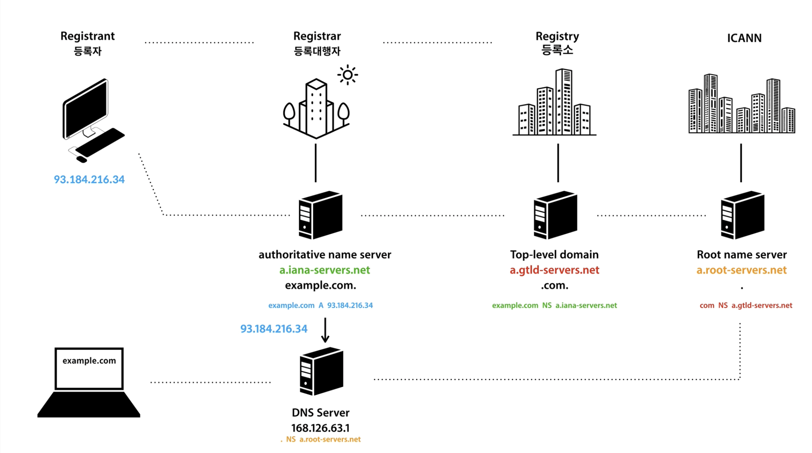

## DNS 서버

DNS 서버는 사람이 읽을 수 있는 도메인 이름을 IP 주소로 변환할 수 있게 해주는 인터넷의 핵심 구성 요소입니다. 사용자가 URL을 입력하거나 링크를 클릭할 때 장치와 컴퓨터가 올바른 웹사이트나 서비스를 찾을 수 있도록 도와주는 인터넷 전화번호부 역할을 합니다.

웹 브라우저에 도메인 이름을 입력하면 컴퓨터는 해당 IP 주소를 얻기 위해 DNS 서버에 요청을 보냅니다. 그러면 DNS 서버는 데이터베이스를 검색하거나 다른 DNS 서버에 연결하여 도메인 이름과 연결된 IP 주소를 찾습니다. IP 주소를 찾으면 컴퓨터로 반환되어 요청된 웹사이트 또는 서비스에 연결할 수 있습니다.

### Caching DNS

웹 브라우저는 DNS 서버에 검색하기 전에 캐싱된 DNS 기록들을 먼저 확인한다.

도메인 이름에 맞는 IP 주소가 존재하면, DNS 서버에 해당 도메인 이름에 해당하는 IP주소를 요청하지 않고 캐싱된 IP주소를 바로 반환하지만, 일치하는 IP주소가 존재하지 않는다면, 다음 과정인 DNS 서버 요청으로 넘어간다.

### DNS 서버의 역할 2가지

- DNS 서버의 역할

  도메인 등록: DNS 서버는 도메인 이름과 관련된 IP 주소, 메일 서버(MX) 레코드, 네임 서버(NS) 레코드 등을 관리하고 제공합니다. 이 정보는 도메인을 사용하여 특정 서버에 액세스할 때 필요합니다.
  도메인 이름 해석: DNS 서버는 사용자가 도메인 이름을 입력하면 해당 도메인의 IP 주소를 찾아서 응답하여, 컴퓨터가 실제로 서버에 연결할 수 있도록 합니다.

- 클라이언트와 서버의 역할

  클라이언트(컴퓨터): 사용자가 웹 브라우저에서 도메인 이름을 입력하면, 컴퓨터(클라이언트)는 DNS 서버에 해당 도메인의 IP 주소를 문의하여 얻습니다.
  서버(도메인의 DNS 서버): DNS 서버는 클라이언트의 요청에 대해 도메인의 등록 정보를 확인하고 해당 도메인의 IP 주소를 클라이언트에게 제공합니다.

- DHCP

  네트워크에서 컴퓨터나 다른 네트워크 장치에 자동으로 IP 주소와 관련된 구성 정보를 제공하기 위한 프로토콜입니다. DHCP는 네트워크에서 IP 주소 할당 및 관련 설정을 간편하게 관리할 수 있도록 도와주는 중요한 역할을 합니다.

  - 자동 IP 할당

    DHCP는 네트워크에 연결된 디바이스에 대해 자동으로 IP 주소를 할당합니다. 이를 통해 수동으로 IP 주소를 설정하거나 충돌을 방지하며, 네트워크 관리를 간편하게 합니다.

  - IP 주소 재사용

    DHCP는 IP 주소를 동적으로 할당하므로 네트워크에 연결된 디바이스가 변경되거나 새로운 디바이스가 추가되더라도 자동으로 IP 주소를 관리합니다.

  - 구성 정보 제공

    DHCP는 IP 주소 외에도 서브넷 마스크, 기본 게이트웨이, DNS 서버 등과 같은 네트워크 구성 정보를 클라이언트에게 제공합니다. 이를 통해 클라이언트는 네트워크에서 필요한 모든 정보를 자동으로 받아 사용할 수 있습니다.

- hosts

  운영 체제에서 사용되는 텍스트 파일로, 도메인 이름과 해당 도메인에 대응하는 IP 주소를 저장합니다. 이 파일은 특정 도메인 이름을 IP 주소로 매핑하여 호스트 이름을 해석하는 데 사용됩니다. 주로 DNS(Domain Name System)를 통한 도메인 이름 해석이 이루어지기 전에 사용되며, 특정 IP 주소에 대한 호스트 이름을 지정할 수 있습니다.

**파일구조**

```
# 주석은 '#'으로 시작합니다.

# 예시: 도메인 이름과 IP 주소의 매핑
127.0.0.1       localhost
192.168.0.1     example.com
```

### 전체 흐름



등록자는 example.com NS(name server) a.iana-servers.net이라고 등록대행자를 통해 등록소에 전달한다.

authroitative name server에게 example.com A(address) 93.184.216.34 전달. 각 도메인서버 / 네임서버는 바로 이 record type(NS, A 등)을 가지고 기억하고 관리하는 것이다.

- DNS internal
  도메인 이름은 아래와 같이 구성되어 있는데, 각 파트를 관리하는 domain server가 존재한다.
  blog(sub).example(second-level).com(top-level).(root, 생략가능)
  특정 도메인 이름을 요청하면, Root name server > Top-level > Second-level > Sub
  순으로 해당하는 ip주소를 찾아 응답한다.

- DNS record & CNAME
  : A, NS 등 존재
  : CNAME 또한 DNS record 중 하나 (canonical name record, 별명 같은 것)
  A 즉 ip주소로 갈 수 있도록 (리다이렉팅처럼) 안내해줌
