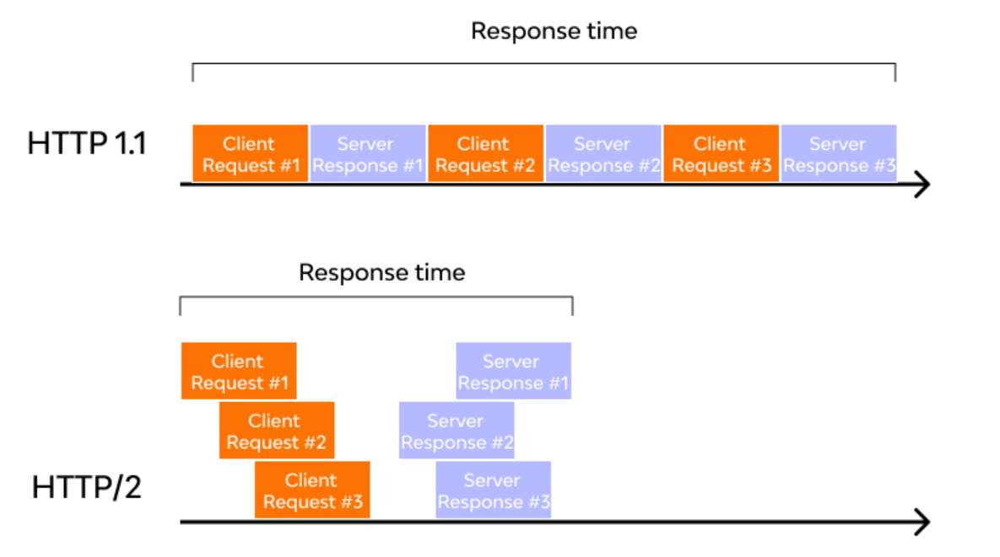
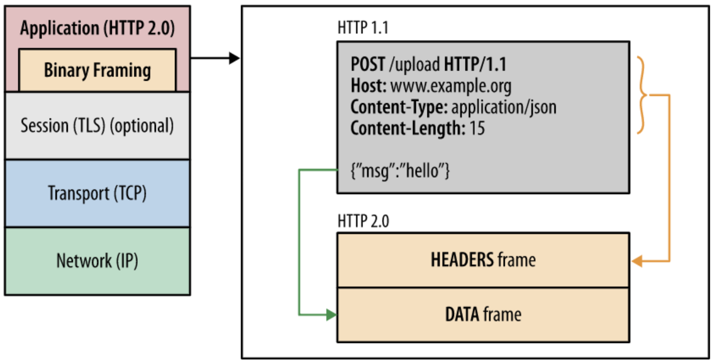
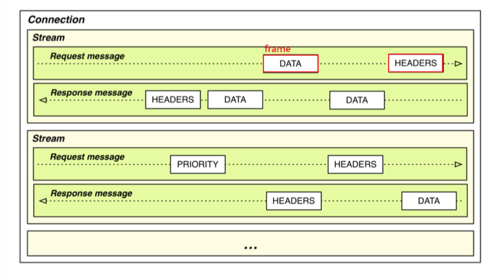

## HTTP/1.1과 HTTP/2의 차이점

이제까지 전통적인 웹 브라우저와 웹 서버와의 통신 프로토콜은 HTTP/1.1 기준으로 동작했는데, 많은 문제점들과 개선할 부분들이 있었기 때문에 2015년에 HTTP/2가 등장하게 되었습니다.

### HTTP/1.1의 문제점

- HOLB(Head Of Line Blocking)

  HTTP 요청을 할 때는 요청을 하고 나서 응답이 와야 다음 요청을 할 수 있었는데 HTTP/1.1에 들어오면서 파이프라이닝(Pipelining) 기법을 통해 응답을 받지 않고도 여러개의 요청을 연속적으로 할 수 있게 되었습니다. 하지만 이 또한 처음의 요청에 대한 응답이 오래 걸리는 경우, 그 다음 응답까지의 시간이 지연되는 현상이 발생합니다. **이렇게 파이프라이닝 기법은 심각한 문제를 안고 있었으며 이를 Head of Line Blocking 문제라고 부릅니다.**

- 무겁고 중복 많은 헤더 구조

  요청을 할 때 요청헤더에 메타정보를 넣어서 보내게 되는데, 매 요청마다 보내는 정보가 많아져서 헤더가 무거워지고 쿠키 같은 경우는 계속 보내게 되기 때문에 중복도 많아지는 문제가 있습니다.

- HTTP/2가 나오기 전의 개선방법들

  CSS/JavaScript/이미지 압축
  Data URI 스키마(이미지를 이진 파일로 바꿔 HTML에 넣어놓는 기법)
  Image Sprite(여러개의 작은 이미지들을 1번의 요청으로 받아오는 기법)
  도메인 샤딩(1개의 도메인을 여러개의 서브도메인으로 나눠서 병렬 요청하는 기법)
  스크립트 파일을 `</body>` 직전에 배치해서 HTML/CSS 파싱 중단 안되게 설정

### HTTP/2의 개선방법들

- 멀티플렉싱(Multiplexing)과 스트리밍(Streaming)

  HTTP 요청 데이터는 헤더와 본문으로 구성되는데 이를 각각 프레임(Frame)이라는 단위로 지정하고 스트림(Stream)이라는 연결단위를 통해 헤더 프레임 혹은 본문 프레임을 보내도록 그 방식을 바꿨습니다. 하나의 스트림은 요청/응답으로 구성되고 여러개의 스트림을 생성할 수 있습니다. 바로 이것이 스트리밍을 통한 멀티플렉싱입니다. 이를 통해 기존의 HTTP/1.1의 문제점인 HLOB를 해결할 수 있게 됩니다. 또한 요청한 리소스간의 우선순위를 설정하기 때문에 스트림 별로 가중치가 매겨지고 브라우저가 리소스들을 수신하는 순서를 적절하게 결정합니다.

  
  

- 서버 푸시(Server Push)

  브라우저가 요청하지 않으면 서버는 응답하지 않는 것이 보통이지만, 요청한 HTML 문서에 리소스가 포함되어 있는 경우 서버가 브라우저에게 밀어주는(push) 방식을 취하여 브라우저의 요청을 최소화시킵니다.

- 헤더 압축(Header Compression)

  헤더 테이블(Header Table)을 사용하여 이전 헤더 정보를 유지하고 허프만 인코딩 기법으로 헤더를 압축해서 전송하여 중복과 크기를 줄입니다.

### 용어 정리

- 허프만 인코딩 기법
