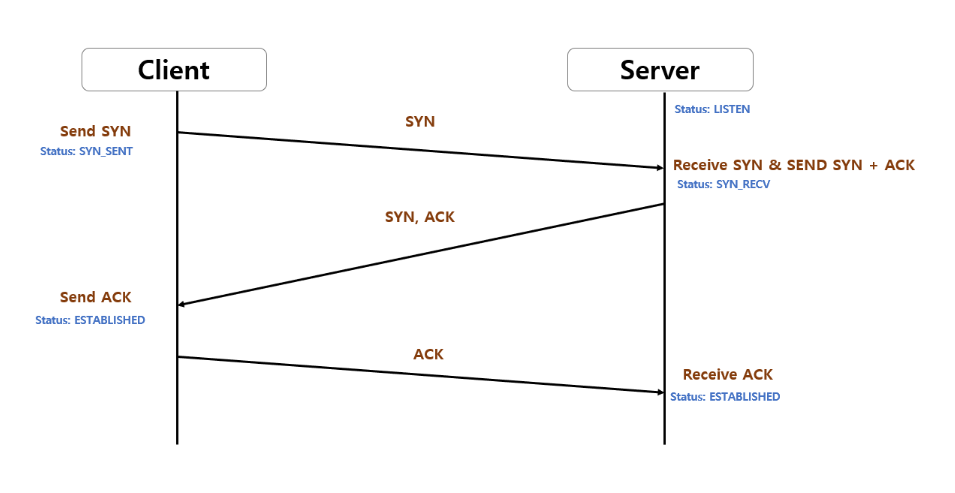

## TCP와 UDP

OSI 7계층에서 전송계층(Transport layer)에 속하는 데이터 전송 프로토콜이다.

### TCP (Transmission Control Protocol)

데이터가 반드시 전달되는 것을 보장하는 프로토콜로 다음 특징들을 갖는다.

- 연결지향(Connection-oriented) 으로 2개의 호스트가 통신을 하기 전 연결이 이루어져야 한다.
- 높은 신뢰성(Reliability) 과 순서대로 전송하는 것(In-order delivery) 을 보장한다.
- 흐름 제어(Flow control) 를 통해 송신자의 데이터 양을 조절한다.
- 혼잡 제어(Congestion control) 를 통해 네트워크 상황을 감지하고 송신자의 데이터 양을 조절한다.
- 에러 감지(Error detection) 를 통해 잘못 전송되었을 경우 재전송한다.
- 전 이중(Full duplex) 방식 으로 두 호스트 모두 송신자와 수신자가 될 수 있다.
- 바이트 스트림(Byte stream) 을 사용하여 데이터를 연속적인 바이트로 보고, 세그먼트(Segment) 라는 단위의 패킷으로 쪼개서 보낸다.
- HTTP, FTP, SMTP, TELNET 등에서 사용된다.
- 3-way handshaking

  TCP가 호스트 간에 연결을 설정하는 방법으로 SYN/ACK 패킷을 통해 이루어진다. SYN 패킷은 동기화(SYNchronize)를 의미하는 패킷이며 ACK 패킷은 확인(ACKnowledgement)을 의미하는 패킷이다.

  

  - LISTEN

    서버가 클라이언트의 연결요청을 기다리고 있다.

  - SYN_SENT

    클라이언트가 능동적으로 서버에게 연결요청을 하자고 시퀀스 번호를 생성하여 SYN 패킷에 담아 보낸다.

  - SYN_RECEIVED

    SYN 패킷을 받은 서버는 자신만의 시퀀스 번호를 생성하여 SYN 패킷에 담고 클라이언트의 SYN 패킷에 있는 시퀀스 번호에 1을 더해서 ACK 패킷에 담아 같이 보낸다.

  - 클라이언트 ESTABLISHED

    SYN+ACK 패킷을 받은 클라이언트는 ACK 패킷의 시퀀스 번호를 보고 자신이 보낸 시퀀스 번호와 차이가 1임을 확인한다. 차이가 1이라면 제대로 연결되었다고 판단하고 서버의 SYN 패킷에 있는 시퀀스 번호에 1을 더해 ACK 패킷에 담아 보낸다.

  - 서버 ESTABLISHED

    클라이언트의 ACK 패킷을 받고 그 안의 시퀀스 번호가 보냈던 SYN 패킷의 시퀀스 번호 + 1이라면 연결이 되었다고 판단한다. 이후부터 본격적인 통신을 할 수 있게 된다.

- 4 way handshake (연결의 종료)

  - 클라이언트가 연결을 종료하겠다는 FIN플래그를 전송한다.

  - 서버는 확인메세지 ACK를 보낸 후, 자신의 통신이 끝날 때까지 기다린다.

  - 서버의 통신이 끝났으면 연결이 종료 되었다고 클라이언트에 FIN 플래그를 전송한다.

  - 클라이언트는 확인했다는 메세지 ACK를 보냅니다.

  - TIME_WAIT 과정

    만약, Client에서 세션을 종료시킨 뒤 도착하는 패킷이 있다면 해당 패킷은 Drop되고 데이터는 유실되게 된다.
    이러한 현상을 방지 하기 위해 Client는 Server로부터 FIN을 수신하더라도 일정시간동안 세션을 남겨놓고 잉여 패킷을 기다리는 TIME_WAIT과정을 마지막으로 거치게 된다.

### UDP (User Datagram Protocol)

TCP와 달리 데이터의 신뢰성을 보장하지 않는 프로토콜이며 다음 특징들을 갖는다.

- 비연결형(Connection-less) 으로 연결을 설정하고 해제하는 과정이 없다.
- 신뢰성이 없고 전송되는 데이터의 순서를 보장하지 않는다.
- 흐름제어, 혼잡제어가 없다.
- 에러감지는 헤더의 체크섬(Checksum)을 이용한 정도밖에 없다.
- 패킷의 단위가 데이터그램(Datagram) 으로 경계가 분명 하여 수신자는 송신자가 보낸 그대로의 크기로 받게 된다.
- 서버와 클라이언트는 유니캐스트(1:1), 브로드캐스트(1:N), 멀티캐스트(1:M)가 가능하다. (N은 전체, M은 일부)
- TCP에 비해서 하는 작업들이 굉장히 적기 때문에 속도가 빠르다.
- DNS, DHCP, 비디오/오디오 스트리밍 등에 사용된다.
