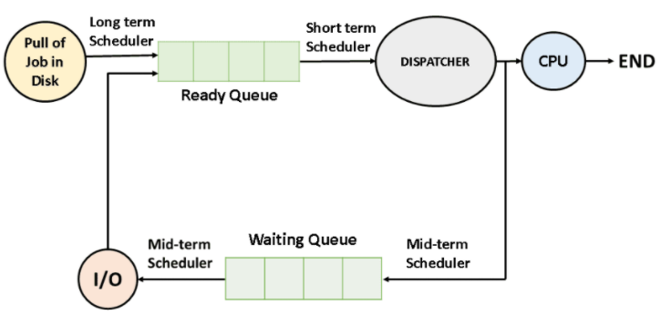
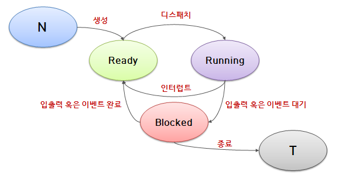
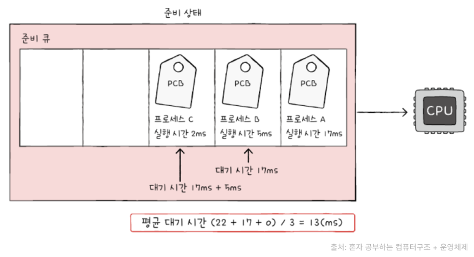
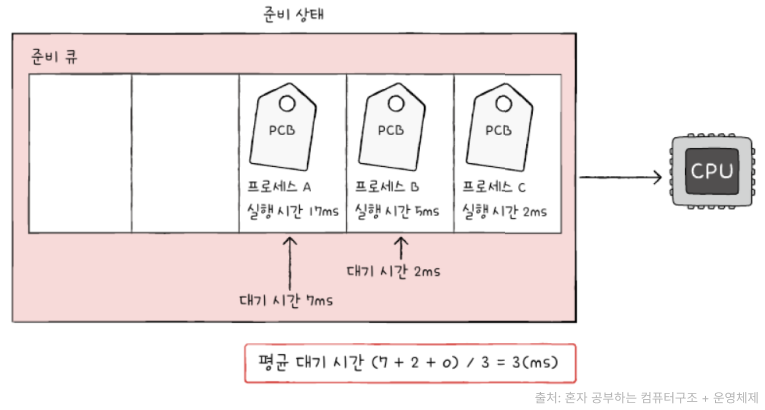
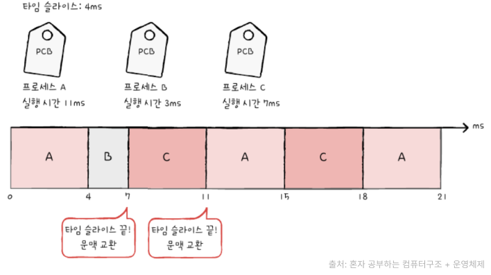
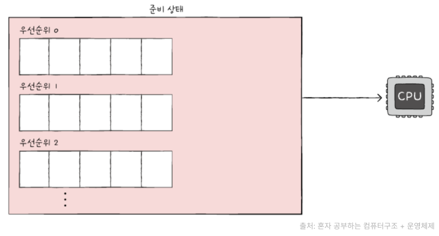
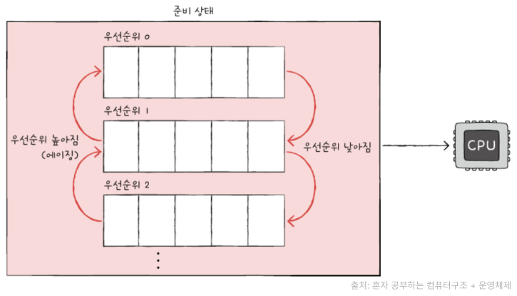

## CPU Scheduling

- OS가 CPU를 사용하려고 하는 프로세스들 사이의 우선순위를 관리하는 작업으로, 자원을 어떤 프로세스에 얼마나 할당하는지 정책을 만드는 것

- 프로세스들에게 **자원을 최대한 공평하게 배분**하며 처리율과 CPU 이용률을 증가시키고, 오버헤드, 응답시간, 대기시간을 최소화하기 위한 기법

- 선점형 스케쥴링 과 비선점형 스케쥴링이 있음

- 메모리에 여러 개의 프로세스를 올려놓고(다중 프로그래밍) ,CPU의 가동시간을 적절히 나누어(시분할) 각각의 프로세스에게 분배하여 실행

### 프로세스 상태 전이

- 생성(New) 제일 첫번째로 New에서 Ready로 전이되는 과정입니다. 프로세스가 생성되고 나서 생성

- 디스패치 디스패치란 준비 상태에서 실행 상태로 전이되는 과정을 말하며, 이는 작업 스케줄러가 해당 프로세스를 선택하여 실행되어지는 것으로, 이때 실행된 프로세스가 CPU를 점유하게 됩니다.

- 인터럽트 인터럽트 신호를 받게되면, 실행중이던 프로세스는 준비 상태로 전이되고, 우선순위가 높은 프로세스를 실행 상태로 전이시킵니다.(프로세스는 각각 우선순위를 부여받고, 우선순위에 따라 프로세스가 준비 상태로 전이되거나, 실행 상태로 전이됩니다.)

- 입출력 혹은 이벤트 대기 CPU를 점유하고 있는 프로세스가 입출력 처리를 해야만 하는 상황이라면, 실행되고 있는 프로세스는 실행 상태에서 대기/보류 상태로 바뀝니다. 그리고 대기 상태로 바뀐 프로세스는 입출력 처리가 모두 끝날때까지 대기 상태로 머뭅니다. 그리고 실행 상태이던 프로세스가 대기 상태로 전이됨과 함께, 준비 상태이던 또다른 프로세스가 실행 상태로 전이됩니다. 또한 대기 상태인 프로세스는 우선순위가 부여되지 않으며 스케줄러에 의해 선택될 수 없습니다.

- 입출력 혹은 이벤트 완료 입출력 처리가 끝난 프로세스는 대기 상태에서 준비 상태로 전이되어 스케줄러에게 선택될 수 있게 됩니다. 추가로 프로세스를 종료시킬 때에도 Blocked상태를 거칠 수 있다는 사실을 기억해 두시길 바랍니다.

### 비선점 vs 선점형 스케줄링

|   CPU 스케쥴링    |                                          종류                                           |
| :---------------: | :-------------------------------------------------------------------------------------: |
| 비선점형 스케쥴링 |  FCFS(First Come First Served), SJF(Shortest Job First Scheduling), 우선순위 스케줄링   |
|   선점 스케쥴링   | RR(round robin scheduling), SRT(Shortest Remaining TimeSRT), 다단계큐, 다단계 피드백 큐 |

#### 비선점형 스케쥴링

- 프로세스가 입출력 요구 등으로 **CPU를 자진 반납할 때까지 CPU에 의한 실행을 보장**해주는 스케줄링입니다. 작업 실행 시간 전체 또는 한번의 CPU 배당에 적용됩니다.

- 모든 프로세스에 대한 요구를 공정하게 처리할 수 있지만, 짧은 작업을 수행하는 프로세스가 긴 작업 종료 시까지 대기해야할 수도 있습니다.(convey 현상)

- 처리 시간 편차가 적은 특정 프로세스 환경에 용이

##### 선입 선처리 스케줄링(First Come First Served Scheduling)

- FCFS 스케줄링
- 준비 큐에 삽입된 순서대로 프로세스들을 처리하는 비선점형 스케줄링 방식
- 프로세스들이 기다리는 시간이 매우 길어질 수 있습니다.

\*프로세스 A(17ms 동안 CPU 이용), 프로세스B(5ms 동안 CPU 이용), 프로세스B(2ms 동안 CPU 이용) 차례로 준비 큐에 삽입된다면 프로세스 C는 2ms를 실행하기 위해 22ms(17ms + 5ms)라는 시간을 기다려야 합니다(호위 효과).

##### 최단 작업 우선 스케줄링(Shortest Job First Scheduling)

- SJF 스케줄링
- 준비 큐에 삽입된 프로세스들 중 CPU 이용 시간의 길이가 가장 짧은 프로세스부터 실행
- 비선점형 스케줄링 알고리즘(선점형으로 구현될 수도 있다.)

##### 우선순위 스케줄링(priority scheduling)

- 프로세스에 우선순위를 부여하고, 가장 높은 우선순위를 사진 프로세스부터 실행 (우선순위가 같은 프로세스들은 선입 선처리로 스케줄링)
- 넓은 의미에서 최단 작업 우선 스케줄링, 최소 잔여 시간 우선 스케줄링은 우선순위 스케줄링의 일종
- 준비 큐에 먼저 삽입되었어도 우선순위가 높은 프로세스들에 의해 실행이 연기될 수 있다(기아현상 / starvation). 이를 방지하기 위해 오랫동안 대기한 프로세스의 우선순위를 점차 높이는 에이징 기법이 있습니다.

#### 선점형 스케쥴링

- 시분할 시스템에서 타임슬라이스가 소진되었거나 인터럽트 혹은 시스템 호출 종료로 인한 여파로 높은 우선순위의 프로세스가 현 프로세스보다를 강제로 중단시키고 CPU를 회수하는 스케쥴링 방식ㅇㅂ니다.

- 비교적 응답이 빠르다는 장점이 있지만, 처리 시간을 예측하기 힘들고 높은 우선순위 프로세스들이 계속 들어오는 경우 오버헤드를 초래
  (기아현상 / starvation) 이를 방지하기 위해 오랫동안 대기한 프로세스의 우선순위를 점차 높이는 에이징 기법이 있습니다.

- 실시간 응답시간, Deadline 응답환경 등 우선순위가 높은 프로세스를 빠르게 처리해야할 경우 등에 유용

##### 라운드 로빈 스케줄링(round robin scheduling)

- 선입 선처리 스케줄링에 타임 슬라이스(각 프로세스가 CPU를 사용할 수 있는 정해진 시간)라는 개념이 더해진 방식
- 정해진 타임 슬라이스만큼 돌아가며 CPU를 이용하는 선점형 스케줄링

큐에 삽입된 프로세스들은 삽입된 순서대로 정해진 시간만큼 CPU를 이용하고, 정해진 시간을 모두 사용하고도 프로세스가 완료되지 않으면 다시 큐의 맨 뒤에 삽입됩니다. 이 때 문맥 교환이 발생합니다.
타임 슬라이스가 지나치게 크면 선입 선처리 스케줄링과 같아 호위 효과가 생길 수 있고, 지나치게 작으면 문맥 교환에 발생하는 비용이 커질 수 있습니다.

##### 최소 잔여 시간 우선 스케줄링(Shortest Remaining TimeSRT)

- SRT(Shortest Remaining Time)스케줄링은 최단 작업 우선 스케줄링과 라운드 로빈 알고리즘을 합친 것과 같습니다.
- 정해진 타임 슬라이스만큼 CPU를 사용하되, CPU를 사용할 다음 프로세스는 남아있는 작업 시간이 가장 적은 프로세스를 선택

##### 다단계 큐 스케줄링(multilevel queue scheduling)

- 우선순위 스케줄링의 발전된 형태
- 우선순위별로 준비 큐를 여러 개 사용하는 방식
- 프로세스들이 큐 사이를 이동할 수 없다.

프로세스 유형별로 우선순위를 구분하여 실행하는 것이 편리해집니다. 또한 큐별로 타임 슬라이스를 여러 개 지정할 수도 있고, 큐마다 다른 스케쥴링 알고리즘을 사용할 수도 있습니다.

##### 다단계 피드백 큐 스케줄링(multilevel feedback queue scheduling)

- 다단계 큐 스케줄링의 발전 형태
- 가장 일반적인 스케줄링 알고리즘
- 어떤 프로세스의 CPU 이용 시간이 길면 낮은 우선순위 큐로 이동, 프로세스가 낮은 우선순위 큐에서 너무 오래 있었으면 높은 우선순위 큐로 이동시킬 수 있습니다.

### 참고자료

- [CPU Scheduling](https://github.com/esperar/estudy/blob/master/%EC%A0%95%EB%B3%B4%EC%B2%98%EB%A6%AC/cpus.md)
- [CPU 스케줄링](https://velog.io/@yeol/CPU-%EC%8A%A4%EC%BC%80%EC%A4%84%EB%A7%81)
