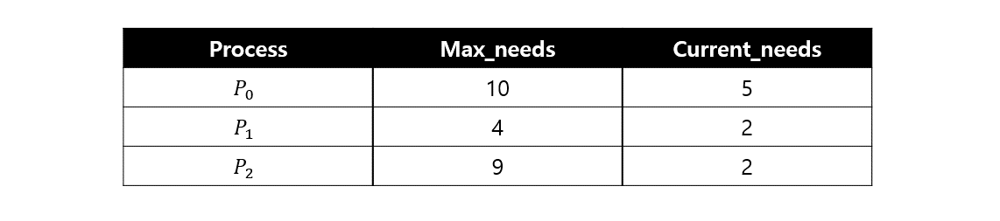

## 데드락(Deadlock)

OS에서의 데드락(교착 상태)이란 시스템 자원에 대한 요구가 뒤엉킨 상태를 의미합니다. 일련의 프로세스들이 서로가 가진 자원을 기다리며 block된 상태로 무한 대기에 빠진 상황합니다.

### 데드락 발생 조건

- 상호 배제 (Mutual Exclusion)

  한 번에 프로세스 하나만 해당 자원을 사용할 수 있고, 다른 프로세스는 요청된 자원이 해제될 때까지 대기

- 점유 대기 (Hold and Wait)

  자원을 가진 프로세스가 다른 자원을 기다릴 때 보유 자원을 놓지 않음

- 비선점 (No preemption)

  한 프로세스가 자료를 사용하는 중에는 커널이 빼앗아서 다른 프로세스에 배분할 수 없음

- 순환 대기 (Circular wait)

  각 프로세스는 순환적으로 다음 프로세스가 요구하는 자원을 가지고 있음

이 조건 중에서 한 가지라도 만족하지 않으면 교착 상태는 발생하지 않는다. 이 중 순환대기 조건은 점유대기 조건과 비선점 조건을 만족해야 성립하는 조건이므로, 위 4가지 조건은 서로 완전히 독립적인 것은 아닙니다.

### 데드락 예방

#### 데드락의 발생 조건 4가지 중 하나라도 발생하지 않으면 데드락이 발생하지 않기 때문에 각 조건을 부정하여 발생 가능성 차단

- 상호 배제 해결

  공유 불가능한 상태를 해제하면 동기성 문제가 발생할 여지가 있어 현실적으로 불가능함

- 점유 대기 해결

  자원을 가진 상태에선 다른 자원을 기다리게 하지 않는 방법으로 여러 자원이 필요하다면 모든 자원을 얻을 수 있는 경우에만 자원을 요청하여 일부만 얻은 경우 반납하는 방법으로 바꿀 수 있지만, 자원의 활용률과 성능이 저하되고 starvation이 발생할 수 있습니다.

- 비선점 해결

  선점이 가능하다면 CPU의 경우는 문제가 없겠지만 프린트 등을 스위칭하면 문제가 발생하고, Save&Restore가 가능한 자원에서만 가능합니다.

- 순환 대기 해결

  앞의 세 가지보다는 적용할 여지가 있습니다. 모든 자원에 번호를 매기고 오름차순으로 자원을 요청하는 등 한쪽 방향으로만 자원을 요구한다. 이 역시 자원의 활용률 저하 문제가 있습니다.

4가지 조건을 하나를 부정하려 해도 비용이 발생하기에 데드락으로 인한 비용보다 시스템 저하 비용이 작은 군사, 의료, 항공우주 등의 분야에서나 사용함이 좋습니다.

#### 데드락 회피 교착상태 회피는 데드락을 지원 요청에 대한 잘못된 승인에서 기인한다고 판단

- 안정 상태

  프로세스들이 요청하는 모든 자원을 데드락 없이 차례대로 모두에게 할당할 수 있는 상태

- 안전 순서

  자원 할당, 실행, 종료 시 데드락이 발생하지 않는 순서

  cycle이 없음을 의미

  단점 : 구현 시 할당 기능 & 이용 가능한 자원의 수와 프로세스가 요구하는 자원의 수 등 사전 정보를 요구

- 안전한 할당을 하여 circular-wait을 회피해야 합니다. 불완전한 할당은 데드락 발생의 가능성이 있습니다.

- 은행원 알고리즘

  자원의 타입이 여러 개인 경우에 적용, 프로세스가 자원을 요구할 때 자원을 할당한 뒤 안정 상태로 남게 되는지 사전에 검사하여 교착상태 회피

  단점 : 할당하는 자원이 일정하고 최대 자원 요구량을 알아야 하며 항상 불안정 상태를 회피해야 하므로 자원 이용률이 낮습니다.

### 데드락 검출 및 복구

- OS가 주기적으로 교착상태가 발생했는 지 검사

- 주기가 짧으면 오버헤드가 커짐, 길면 복구 가능성 낮아짐

- 탐지 알고리즘

  - Signal Instance의 경우 자원할당 그래프 활용

  - Multiple instance의 경우 은행원 알고리즘 활용

- 복구 기법

  - process termination

    한 번에 모든 프로세스 혹은 한 개씩 종료

    - 한 번에 데드락이 걸린 모든 프로세스 중단

      연산 중이던 프로세스도 모두 일시 중단되어 중간 결과가 폐기됨

    - 하나씩 중단시키며 탐지 알고리즘으로 데드락 탐지/회복

      오버헤드 문제

  - resource Preemption

    선점 비용이 최소인 victim 프로세스를 선택하여 자원을 빼앗음

### 데드락의 무시

- 교착상태 필요조건 4가지를 충족하더라도 데드락은 드문 현상임에 착안
- 드물게 발생하는 데드락을 처리하기 위한 비용은 비효율적이라 판단하여 데드락에 아무런 조치도 하지 않음
- 시스템에서 데드락이 발생한 경우 프로그래머가 직접 process를 죽이는 행위로 대응

### 참고자료

- [데드락(Deadlock)](https://github.com/esperar/estudy/blob/master/%EC%A0%95%EB%B3%B4%EC%B2%98%EB%A6%AC/%EB%8F%99%EA%B8%B0%ED%99%94.md#%EB%8D%B0%EB%93%9C%EB%9D%BDdeadlock)
- [[운영체제] 교착상태 4가지 조건](https://velog.io/@dl_edge/%EC%9A%B4%EC%98%81%EC%B2%B4%EC%A0%9C-%EA%B5%90%EC%B0%A9%EC%83%81%ED%83%9C-4%EA%B0%80%EC%A7%80-%EC%A1%B0%EA%B1%B4)
