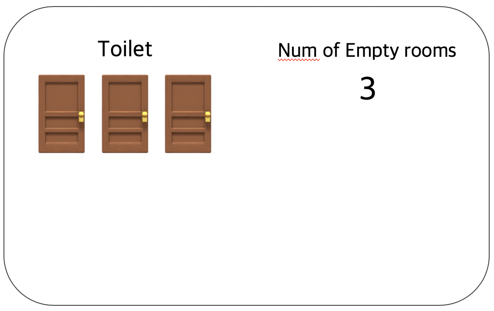
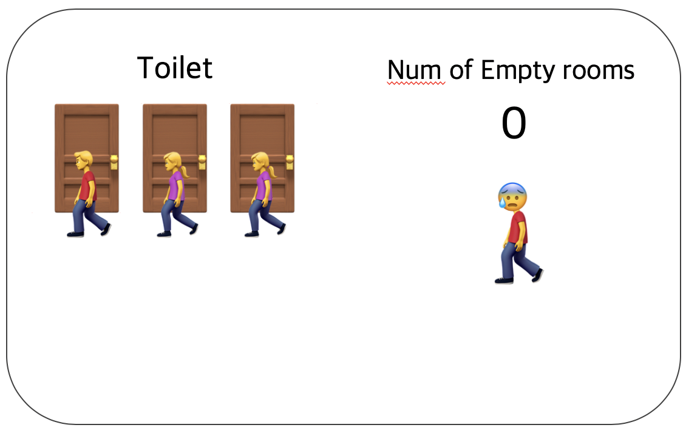
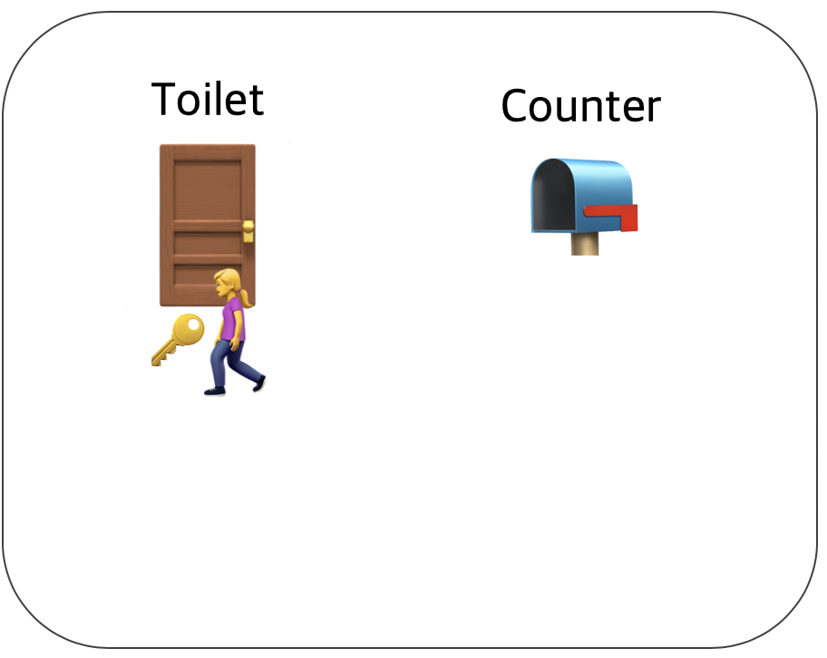
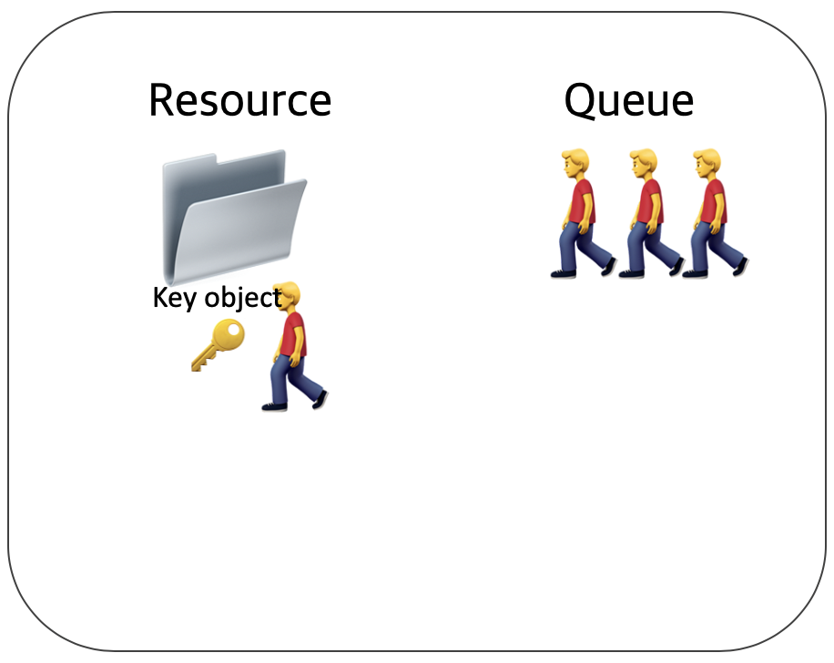

## Semaphore, Mutex

### 세마포어(Semaphore)

공유된 자원의 데이터에 대한 최대 허용치 값을 두어 프로세스나 스레드의 동시 접근을 것을 막는 것 입니다.
공유 리소스에 접근할 수 있는 프로세스의 최대 허용치만큼 동시에 사용자가 접근하여 사용할 수 있습니다.

각 프로세스는 세마포어 값을 확인하고 변경할 수 있습니다. 세마포어를 사용하는 프로세스는 그 값을 확인하고, 자원을 사용하는 동안에 그 값을 변경함으로써 다른 세마포어를 사용하는 프로세스나 스레드들이 기다리게끔 해야합니다.

세마포어는 여러개의 화장실이 있는 식당과 비슷합니다. 화장실에는 여러개의 칸이 있으며 화장실 입구에는 현재 화장실의 빈 칸 개수를 보여주는 전광판이 있습니다.

모든 화장실칸에 사람이 들어갈 경우 빈 화장실칸은 0이 됩니다. 빈 칸의 개수가 1이 될 때까지 다음 사용자는 기다려야 합니다.

여기서 화장실이 공유자원이며 사람들이 스레드 혹은 프로세스 입니다. 그리고 화장실 빈 칸의 개수(설정한 한계치)는 현재 공유자원에 접근할 수 있는 스레드와 프로세스의 개수를 나타냅니다.

### 뮤텍스(Mutex)

공유된 자원의 데이터를 여러 프로세스나 스레드가 접근하는 것을 막는 것입니다.
임계영역을 가진 스레드나 프로세스의 Running Time이 서로 겹치지 않도록 각각 단독으로 실행하는 기법입니다.

뮤텍스는 화장실이 하나밖에 없는 식당과 비슷합니다. 화장실을 가기 위해서는 카운터에서 열쇠를 받아가야 합니다.

다른 사용자들은 열쇠가 없으면 화장실을 갈 수 없으며 카운터에서 대기합니다. 화장실을 이용을 끝낸 사람이 카운터에 키를 반납하게 되면 카운터에서 대기하던 다음 사용자가 키를 가지고 화장실을 사용할 수 있습니다.

여기서 화장실은 공유자원, 화장실 키는 공유자원에 접근하기 위한 오브젝트, 사람들은 프로세스 혹은 스레드 입니다.

즉 뮤텍스는 화장실 키에 해당하는 오브젝트가 있으며 이 오브젝트를 소요한 자만이 공유자원에 접근할 수 있습니다.

### 참고 자료

- 
