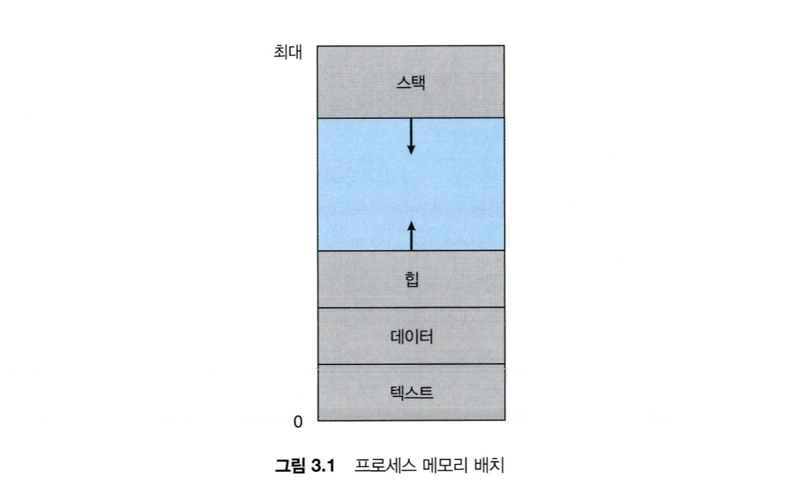

## 프로세스와 스레드의 차이점은?

프로세스는 메모리 상에서 실행중인 프로그램을 말하며, 스레드는 이 프로세스 안에서 실행되는 흐름 단위를 말합니다. 프로세스는 최소 하나의 스레드를 보유하고 있으며, 각각 별도의 주소공간을 독립적으로 할당 받습니다.(code, heap, stack)
스레드는 이중에 stack만 따로 할당받고 나머지 영역은 스레드끼리 서로 공유합니다.

### 프로세스의 주소공간

- Stack 영역

  함수의 호출과 관계되는 지역 변수와 매개변수가 저장되는 영역입니다.
  Stack 영역의 값은 함수의 호출과 함께 할당되며, 함수의 호출이 완료되면 소멸합니다.
  메모리의 높은 주소에서 낮은 주소의 방향으로 할당됩니다.
  재귀 함수가 너무 깊게 호출되거나 함수가 지역변수를 너무 많이 가지고 있어 stack 영역을 초과하면 stack overflow 에러가 발생합니다.

- Heap 영역

  런타임에 크기가 결정되는 영역입니다.
  사용자에 의해 공간이 동적으로 할당 및 해제됩니다.
  주로 참조형 데이터 (ex. 클래스) 등의 데이터가 할당됩니다.
  메모리의 낮은 주소에서 높은 주소의 방향으로 할당됩니다.

- Data 영역

  전역 변수나 Static 변수 등 프로그램이 사용할 수 있는 데이터를 저장하는 영역입니다.
  어떤 프로그램에 전역 / static 변수를 참조하는 코드가 존재한다면, 이 프로그램은 컴파일 된 후에 data 영역을 참조하게 됩니다.
  프로그램의 시작과 함께 할당되며, 프로그램이 종료되면 소멸합니다.
  단, 초기화 되지 않은 변수가 존재한다면, 이는 (그림에는 표현되지는 않았지만 BSS 영역에 저장됩니다.)

- Text (Code) 영역

  프로그램이 실행될 수 있도록 CPU가 해석 가능한 기계어 코드가 저장되어 있는 공간으로, 프로그램이 수정되면 안 되므로 ReadOnly 상태로 저장 되어있다.

### 요약

- 프로세스

  컴퓨터에서 연속적으로 실행되고 있는 컴퓨터 프로그램
  메모리에 올라와 실행되고 있는 프로그램의 인스턴스 (독립적엔 개체)
  운영체제로부터 시스템 자원을 할당받는 작업의 단위
  즉, 동적인 개념으로는 **실행된 프로그램을 의미**합니다.

  - 할당받는 시스템 자원의 예

    CPU시간
    운영되기 위해 필요한 주소 공간
    **Code, Data, Stack, Heap의 구조로 되어 있는 독립된 메모리 영역**

  - 특징

    프로세스는 각각의 독립된 메모리 영역(Code , Data, Stack , Heap의 구조)을 할 당받습니다.
    기본적으로 프로세스당 최소 1개의 스레드 (메인 스레드)를 가지고 있습니다.
    각 프로세스는 별도의 주소 공간에서 실행되며, 한 프로세스는 다른 프로세스의 변수나 자료 구조에 접근할 수 없습니다.
    한 프로세스가 다른 프로세스의 자원에 접근하려면 프로세스 간의 통신을 사용해야 합니다. (IPC)
    ex ) 파이프, 파일 , 소켓 등을 이용한 통신방법 이용

- 스레드

  프로세스 내에서 실행되는 여러 흐름의 단위
  프로세스의 특정한 수행 경로
  프로세스가 할당받은 자원을 이용하는 실행 단위

  - 특징

    스레드는 프로세스 내에서 각각 **Stack만 따로 할당받고 Code, Data, Heap 영역은 공유**합니다.
    스레드는 한 프로세스 내에서 동작되는 여러 실행의 흐름으로, 프로세스 내의 주소 공간이나 자원들을 같은 프로세스 내에 스레드끼리 공유하면서 실행됩니다.
    각각의 스레드는 별도의 레지스터와 스택을 갖고 있지만, **힙 메모리는 서로 읽고 쓸 수 있습니다.**
    한 스레드가 프로세스 자원을 변경하면, 다른 이웃 스레드도 그 변경 결과를 즉시 볼 수 있다.

### 프로세스의 문제점은?

- 프로세스 생성에 큰 오버헤드가 있습니다. (프로세스를 생성할때 많은 시간이 소요)
- 프로세스 컨텍스트 스위칭의 비효율성, 오버헤드가 큽니다.
- 프로세스 사이에 통신이 어렵다는 점이 있습니다. (IPC 사용)

### 스레드의 출현 목적은?

- 프로세스보다 크기가 작은 실행 단위 필요
- 프로세스의 생성 및 소멸에 따른 오버헤드 감소
- 빠른 컨텍스트 스위칭
- 프로세스들의 통신 시간, 방법 어려움 해소

### 스레드 주소공간에 대해서 설명?

하나의 스레드가 동작하기 위해 총 6개의 공간이 있습니다.

- 사적공간

  스레드 코드 공간, 스레드 전용 전역변수 공간, 스택 공간

- 공유공간

  데이터 공간, 힙 공간

- 커널 스택

### 참고자료

- [프로세스와 스레드의 차이점](https://zeroco.tistory.com/75)
