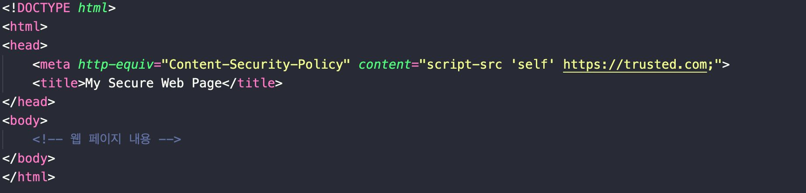

## CSP

### 콘텐츠 보안 정책(CSP) 구현

- CSP (Content Security Policy)는 웹사이트에서 실행될 수 있는 콘텐츠의 출처를 제한하는 보안 정책입니다.

- 이 정책은 웹사이트를 XSS와 같은 Cross Site Scripting 공격으로부터 보호하는 데 중요한 역할을 합니다.

### 콘텐츠 보안 정책(CSP) 구현

- CSP는 HTTP 헤더를 통해 구현됩니다.

- 웹 서버는 ‘Content-Security-Policy’ 헤더를 통해 어떤 종류의 자원이 실행되거나 로드 될 수 있는지 명시합니다.

- 스크립트 소스를 신뢰할 수 있는 도메인으로 제한

### 참고자료

- [원티드 챌린지]()
