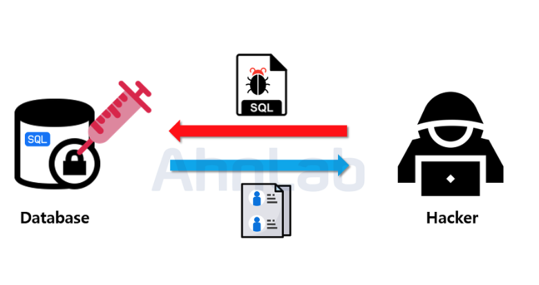
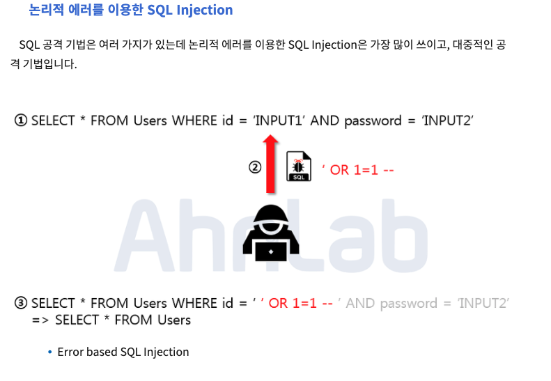
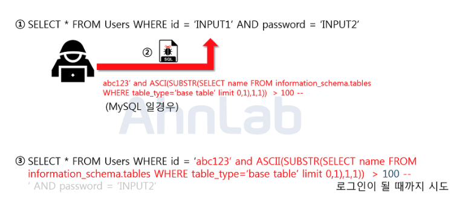

## SQL Injection

악의적인 사용자가 보안상의 취약점을 이용하여, 임의의 SQL 문을 주입하고 실행되게 하여 데이터베이스가 비정상적인 동작을 하도록 조작하는 행위 입니다.
인젝션 공격은 OWASP Top10 중 첫 번째에 속해 있으며, 공격이 비교적 쉬운 편이고 공격에 성공할 경우 큰 피해를 입힐 수 있는 공격입니다.

### 공격 종류 및 방법

- Error based SQL Injection

위의 사진에서 보이는 쿼리문은 일반적으로 로그인 시 많이 사용되는 SQL 구문입니다. 해당 구문에서 입력값에 대한 검증이 없음을 확인하고, 악의적인 사용자가 임의의 SQL 구문을 주입하였습니다. 주입된 내용은 ‘ OR 1=1 -- 로 WHERE 절에 있는 싱글쿼터를 닫아주기 위한 싱글쿼터와 OR 1=1 라는 구문을 이용해 WHERE 절을 모두 참으로 만들고, -- 를 넣어줌으로 뒤의 구문을 모두 주석 처리 해주었습니다.

매우 간단한 구문이지만, 결론적으로 Users 테이블에 있는 모든 정보를 조회하게 됨으로 써 가장 먼저 만들어진 계정으로 로그인에 성공하게 됩니다. 보통은 관리자 계정을 맨 처음 만들기 때문에 관리자 계정에 로그인 할 수 있게 됩니다. 관리자 계정을 탈취한 악의적인 사용자는 관리자의 권한을 이용해 또 다른 2차피해를 발생 시킬 수 있게 됩니다.

- Union based SQL Injection

  Union 명령어를 이용한 SQL Injection.
  SQL 에서 Union 키워드는 두 개의 쿼리문에 대한 결과를 통합해서 하나의 테이블로 보여주게 하는 키워드 입니다. 정상적인 쿼리문에 Union 키워드를 사용하여 인젝션에 성공하면, 원하는 쿼리문을 실행할 수 있게 됩니다. Union Injection을 성공하기 위해서는 두 가지의 조건이 있습니다. 하나는 Union 하는 두 테이블의 컬럼 수가 같아야 하고, 데이터 형이 같아야 합니다.

  

  위의 사진에서 보이는 쿼리문은 Board 라는 테이블에서 게시글을 검색하는 쿼리문입니다. 입력값을 title 과 contents 컬럼의 데이터랑 비교한 뒤 비슷한 글자가 있는 게시글을 출력합니다. 여기서 입력값으로 Union 키워드와 함께 컬럼 수를 맞춰서 SELECT 구문을 넣어주게 되면 두 쿼리문이 합쳐서서 하나의 테이블로 보여지게 됩니다. 현재 인젝션 한 구문은 사용자의 id와 passwd를 요청하는 쿼리문 입니다. 인젝션이 성공하게 되면, 사용자의 개인정보가 게시글과 함께 화면에 보여지게 됩니다.

  물론 패스워드를 평문으로 데이터베이스에 저장하지는 않겠지만 인젝션이 가능하다는 점에서 이미 그 이상의 보안위험에 노출되어 있습니다. 이 공격도 역시 입력값에 대한 검증이 없기 때문에 발생하게 되었습니다.

- Blind SQL Injection

  **Boolean based SQL**
  Blind SQL Injection은 데이터베이스로부터 특정한 값이나 데이터를 전달받지 않고, 단순히 참과 거짓의 정보만 알 수 있을 때 사용합니다. 로그인 폼에 SQL Injection이 가능하다고 가정 했을 때, 서버가 응답하는 로그인 성공과 로그인 실패 메시지를 이용하여, DB의 테이블 정보 등을 추출해 낼 수 있습니다.

  

  위의 그림은 Blind Injection을 이용하여 데이터베이스의 테이블 명을 알아내는 방법입니다. (MySQL) 인젝션이 가능한 로그인 폼을 통하여 악의적인 사용자는 임의로 가입한 abc123 이라는 아이디와 함께 abc123’ and ASCII(SUBSTR(SELECT name From information_schema.tables WHERE table_type=’base table’ limit 0,1)1,1)) > 100 -- 이라는 구문을 주입합니다.

  해당구문은 MySQL 에서 테이블 명을 조회하는 구문으로 limit 키워드를 통해 하나의 테이블만 조회하고, SUBSTR 함수로 첫 글자만, 그리고 마지막으로 ASCII 를 통해서 ascii 값으로 변환해줍니다. 만약에 조회되는 테이블 명이 Users 라면 ‘U’ 자가 ascii 값으로 조회가 될 것이고, 뒤의 100 이라는 숫자 값과 비교를 하게 됩니다. 거짓이면 로그인 실패가 될 것이고, 참이 될 때까지 뒤의 100이라는 숫자를 변경해 가면서 비교를 하면 됩니다. 공격자는 이 프로세스를 자동화 스크립트를 통하여 단기간 내에 테이블 명을 알아 낼 수 있습니다.

- Time based SQL

  Time Based SQL Injection 도 마찬가지로 서버로부터 특정한 응답 대신에 참 혹은 거짓의 응답을 통해서 데이터베이스의 정보를 유추하는 기법입니다. 사용되는 함수는 MySQL 기준으로 SLEEP 과 BENCHMARK 입니다.

  

  위의 그림은 Time based SQL Injection을 사용하여 현재 사용하고 있는 데이터베이스의 길이를 알아내는 방법입니다. 로그인 폼에 주입이 되었으며 임의로 abc123 이라는 계정을 생성해 두었습니다. 악의적인 사용자가 abc123’ OR (LENGTH(DATABASE())=1 AND SLEEP(2)) – 이라는 구문을 주입하였습니다. 여기서 LENGTH 함수는 문자열의 길이를 반환하고, DATABASE 함수는 데이터베이스의 이름을 반환합니다.

  주입된 구문에서, LENGTH(DATABASE()) = 1 가 참이면 SLEEP(2) 가 동작하고, 거짓이면 동작하지 않습니다. 이를 통해서 숫자 1 부분을 조작하여 데이터베이스의 길이를 알아 낼 수 있습니다. 만약에 SLEEP 이라는 단어가 치환처리 되어있다면, 또 다른 방법으로 BENCHMARK 나 WAIT 함수를 사용 할 수 있습니다. BENCHMARK 는 BENCHMARK(1000000,AES_ENCRYPT('hello','goodbye')); 이런 식으로 사용이 가능합니다. 이 구문을 실행 하면 약 4.74초가 걸립니다.

- Stored Procedure SQL Injection(저장된 프로시저 에서의 SQL Injection)

  일련의 쿼리들을 모아 하나의 함수처럼 사용하기 위한 것입니다. 공격에 사용되는 대표적인 저장 프로시저는 MS-SQL 에 있는 xp_cmdshell로 윈도우 명령어를 사용할 수 있게 됩니다.
  단, 공격자가 시스템 권한을 획득 해야 하므로 공격난이도가 높으나 공격에 성공한다면, 서버에 직접적인 피해를 입힐 수 있는 공격 입니다.

- Mass SQL Injection(다량의 SQL Injection 공격)

  2008년에 처음 발견된 공격기법으로 기존 SQL Injection 과 달리 한번의 공격으로 다량의 데이터베이스가 조작되어 큰 피해를 입히는 것을 의미합니다. 보통 MS-SQL을 사용하는 ASP 기반 웹 애플리케이션에서 많이 사용되며, 쿼리문은 HEX 인코딩 방식으로 인코딩 하여 공격합니다. 보통 데이터베이스 값을 변조하여 데이터베이스에 악성스크립트를 삽입하고, 사용자들이 변조된 사이트에 접속 시 좀비PC로 감염되게 합니다. 이렇게 감염된 좀비 PC들은 DDoS 공격에 사용됩니다.

### SQL Injection

- 입력 값에 대한 검증

  SQL Injection 에서 사용되는 기법과 키워드는 엄청나게 많습니다. 사용자의 입력 값에 대한 검증이 필요한데요. 서버 단에서 화이트리스트 기반으로 검증해야 합니다. 블랙리스트 기반으로 검증하게 되면 수많은 차단리스트를 등록해야 하고, 하나라도 빠지면 공격에 성공하게 되기 때문입니다. 공백으로 치환하는 방법도 많이 쓰이는데, 이 방법도 취약한 방법입니다. 예를 들어 공격자가 SESELECTLECT 라고 입력 시 중간의 SELECT가 공백으로 치환이 되면 SELECT 라는 키워드가 완성되게 됩니다. 공백 대신 공격 키워드와는 의미 없는 단어로 치환되어야 합니다.

- Prepared Statement 구문사용

  Prepared Statement 구문을 사용하게 되면, 사용자의 입력 값이 데이터베이스의 파라미터로 들어가기 전에 DBMS가 미리 컴파일 하여 실행하지 않고 대기합니다. 그 후 사용자의 입력 값을 문자열로 인식하게 하여 공격 쿼리가 들어간다고 하더라도, 사용자의 입력은 이미 의미 없는 단순 문자열 이기 때문에 전체 쿼리문도 공격자의 의도대로 작동하지 않습니다.

- Error Message 노출 금지

  공격자가 SQL Injection을 수행하기 위해서는 데이터베이스의 정보(테이블명, 컬럼명 등)가 필요합니다. 데이터베이스 에러 발생 시 따로 처리를 해주지 않았다면, 에러가 발생한 쿼리문과 함께 에러에 관한 내용을 반환해 줍니다.
  여기서 테이블명 및 컬럼명 그리고 쿼리문이 노출이 될 수 있기 때문에, 데이터 베이스에 대한 오류발생 시 사용자에게 보여줄 수 있는 페이지를 제작 혹은 메시지박스를 띄우도록 하여야 합니다.

- 웹 방화벽 사용

  웹 공격 방어에 특화되어있는 웹 방화벽을 사용하는 것도 하나의 방법입니다. 웹 방화벽은 소프트웨어 형, 하드웨어 형, 프록시 형 이렇게 세가지 종류로 나눌 수 있는데 소프트웨어 형은 서버 내에 직접 설치하는 방법이고, 하드웨어 형은 네트워크 상에서 서버 앞 단에 직접 하드웨어 장비로 구성하는 것이며 마지막으로 프록시 형은 DNS 서버 주소를 웹 방화벽으로 바꾸고 서버로 가는 트래픽이 웹 방화벽을 먼저 거치도록 하는 방법입니다.

### 참고자료

- [웹 해킹 공격 (XSS, CSRF, SQL Injection etc)](https://velog.io/@dudgus1670/XSS-CSRF-SQL-Injection)
