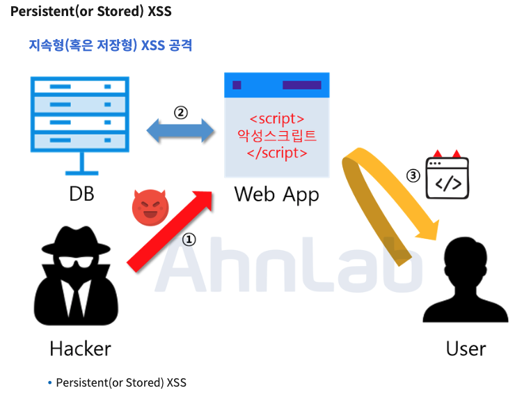
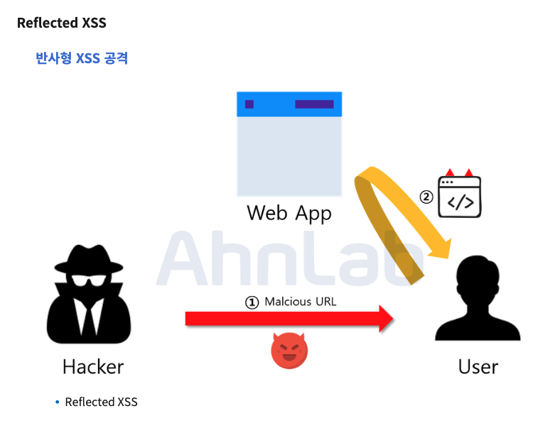
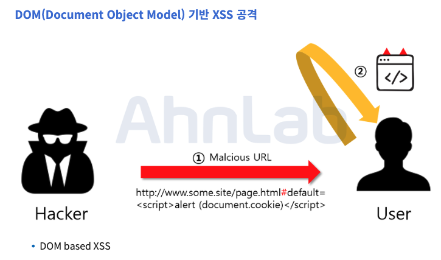
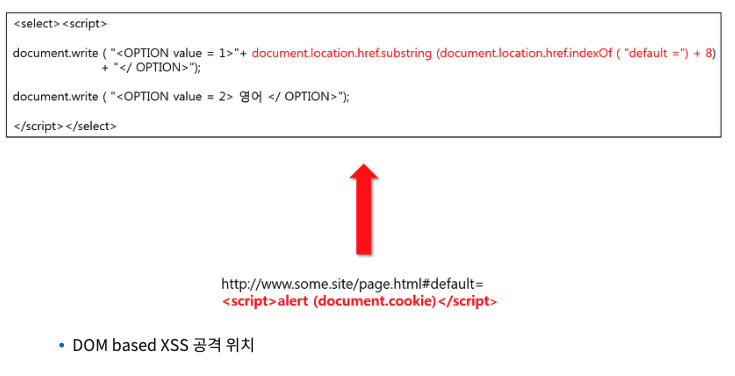

## XSS(Cross Site Scripting, 크로스 사이트 스크립팅)

웹사이트 관리자가 아닌 사람이 웹사이트에 악성 스크립트를 삽입할 수 있는 취약점을 이용한 공격기법입니다.
사용자로부터 받은 입력을 제대로 검증하지 않을 때 나타나며 로그인 세부 정보와 쿠키를 탈취하는 방식으로 사용자의 정보를 가져가거나 비정상적인 기능을 실행할 수 있습니다.

- 저장 XSS (Stored XSS)

영구적 XSS 공격은 해커는 웹 애플리케이션에서 XSS 취약점을 파악하고, 악성 스크립트를 삽입하는 방식으로 진행됩니다.

삽입된 스크립트는 데이터베이스에 저장이 되고, 악성 스크립트가 존재하는 게시글 등을 열람한 사용자들은 쿠키를 탈취당하거나 다른 사이트로 리디렉션되는 공격을 받게 됩니다.

악성 스크립트가 데이터베이스에 저장되어 지속적으로 공격을 실시하기 때문에 많은 피해가 발생할 수 있다는 것이 영구적 XSS 공격의 특징입니다.

영구적 XSS 공격이 가장 많이 발생하는 곳은 게시판이며, 게시판 외에도 사용자가 입력한 값이 데이터베이스에 저장이 되고 저장된 값이 그대로 프론트엔드에 표시되는 곳에서 공격이 발생할 가능성이 높습니다. 일반적으로 XSS 공격은 사용자의 입력 값을 검증하지 않기 때문에 발생한다고 할 수 있습니다.

영구적 XSS가 위험한 이유는 사용자가 링크를 클릭하도록 유인할 필요가 없다는 것입니다. 해커가 할 일은 피해자가 악성 코드가 삽입된 웹사이트에 접속하기만을 기다리는 것뿐입니다.

- 반사 XSS (Reflected XSS)

피해자에게 입력 받은 검색어를 그대로 표시하는 곳이나 피해자가 입력한 값을 오류 메시지와 함께 보여주는 곳에 악성 스크립트를 삽입하며, 스크립트는 서버가 피해자의 입력 값을 포함해 응답을 전송할 때 실행됩니다.

반사형 XSS 공격은 피해자가 직접 스크립트를 실행하도록 유도하기 때문에 1회성 공격이라고 할 수 있습니다. 해커가 주입한 악성 스크립트는 해당 서버를 반사해 오류 메시지나 검색 결과를 통해 피해자의 화면에 표시될 수 있습니다.

악성 스크립트는 링크를 클릭한 사용자의 쿠키 값을 해커에게 전송하도록 설정되어 있습니다. 사용자는 버튼 또는 링크를 클릭함으로써 악성 스크립트를 실행하게 되며, 이 경우 악성 스크립트에 감염된 웹사이트에 입력한 모든 정보가 노출됩니다.

- DOM 기반 XSS (DOM XSS)

웹페이지를 여는 즉시 생성되는 문서 객체 모델(Document Object Model, DOM)은 사용자가 서버와 상호 작용하지 않고도 페이지의 모든 콘텐츠에 액세스할 수 있도록 돕는 프로그래밍 인터페이스입니다. DOM 기반 XSS 공격은 피해자의 브라우저에 초점을 맞춘 것이 특징인 공격입니다.

악의적인 스크립트가 포함 된 URL을 사용자가 요청하게 되어 브라우저를 해석하는 단계에 발생하는 공격입니다. 악의적인 스크립트로 인해서 클라이언트 측 코드가 원래 의도와는 다르게 실행됩니다. DOM based XSS 공격은 다른 XSS 공격과는 다르게 서버 측에서 탐지가 어렵다는 점입니다. 위의 그림을 보면 해커는 http://www.some.site/page.html URL 과 함께 # 이라는 특수문자를 사용하고 있습니다. **이 특수문자는 # 이후의 값은 서버로 전송되지 않는 기능을 가지고 있습니다.**

사용자의 요청에 따라 HTML을 다르게 해석하는 부분에 공격이 가능합니다.

반사형 및 영구적 XSS는 응답 페이지 HTML에서 악성코드가 분명하게 나타나기 때문에 위험 징후를 발견할 수 있지만, DOM 기반 XSS는 웹사이트의 코드를 조사하지 않고는 취약점을 발견할 수 없습니다. 이 때문에 전문 기술 지식을 갖추지 않은 이상 DOM 기반 XSS 공격에 당하기 쉽습니다. 웹사이트를 클릭하기 전 코드를 확인하는 사람은 많지 않기 때문입니다.

### 위험성

- 쿠키 정보 및 세션 ID 획득
- 시스템 관리자 권한 획득
- 악성코드 다운로드
- 거짓 페이지 노출

### 대응안

- 입/출력 값 검증 및 무효화

  XSS 공격은 입력값에 대한 검증이 제대로 이루어지지 않아 발생하는 취약점입니다.
  때문에 사용자의 모든 입력값에 대하여 서버측에서 필터링을 해 주어야 합니다.
  주로 스크립트를 실행하기 위한 특수문자를 필터링 하며, <, >, ", ' 등의 문자가 있습니다
  스크립트를 실행할 때는 기본적으로 `<script>` 태그를 사용하니 < 를 &lt; 로 바꾼다거나 하는 방법으로 무효화시킬 수 있습니다.

- 보안 라이브러리 사용

  입/출력이 스크립트를 실행하는지에 대한 필터를 구현한 기존 라이브러리를 사용할 수 있습니다.

### 참고자료

- [웹 해킹 공격 (XSS, CSRF, SQL Injection etc)](https://velog.io/@dudgus1670/XSS-CSRF-SQL-Injection)
